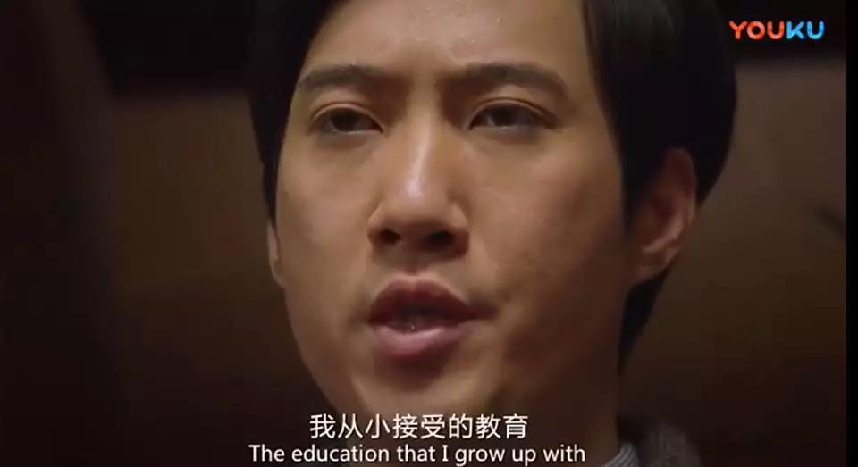
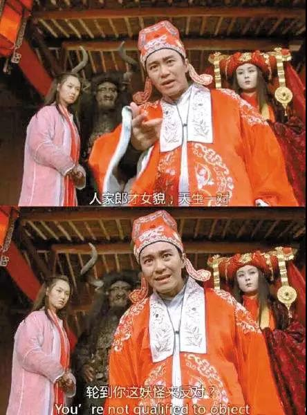

##正文

如果说中国互联网“百度黑”最集中的地方，恐怕莫过于知乎了。

2016年，21岁的魏则西在知乎一则【你认为人性最大的恶是什么】的问题下，写下了自己求医历程，他被百度搜索骗到一家莆田医院，一番花言巧语之下散尽家财，错过治疗时间的他在电脑桌前默默等死。

一个半月后，魏则西去世，他的知乎账号上留下了一句：【百度，当时根本不知道有多么邪恶】，成为了百度的一曲丧钟。

从此之后，在知乎用户们的集体努力下，李彦宏创业十八年以来打造的男神形象轰然倒塌，知乎也成为了 百度负面消息汇聚的集散地，甚至在知乎搜“百度”两个字，满屏幕全部都是专业度很高的负面评价。

因此，在广大知乎用户们的眼中，高素质的知乎，绝不可能接受总在作恶的百度。

 

 

不过，情怀在金钱面前往往都是无力的。

就在昨天，一贯高逼格的知乎宣布，完成总额 4.34 亿美元的F轮融资，而这笔国内互联网文娱金额最大的融资，则是由百度和快手联手完成。

知乎发酵的魏则西事件三年后，百度拿着人血馒头的钱，终于入主了骂了他三年的知乎。

而拿到钱之后，曾经以骂百度为政治正确的知乎，也将对李彦宏换一个称呼，那就是金主爸爸。

 

 

而且，除了作恶的百度之外，在知乎主体用户眼中，“五线村镇人口”为主的快手老铁们入股知乎，也同样令人瞋目结舌，知乎配快手，仿佛就像美女配野兽。

 

因此，“人在美国，刚下飞机，年薪百万，实名反对”的知乎精英们，这一刻突然发现要被自己最看不起的小镇“老铁”们控股，此刻的内心几乎是崩溃的。

 

于是，精英们一个个都在“实名反对”。

 

可惜他们再怎么反对，也无法阻止这段“联姻”。

 

毕竟“百万年薪”相对于快手和百度的几十亿的投资来说，实在是不值一提，而且知乎亏了这么多年，想继续走下去就必须要拿到钱，曾经的“小甜甜”用户，都必须要变成“牛夫人”。

 

当然，政事堂不认为百度的入股会对知乎造成的直接影响。

腾讯作为连续四轮投资知乎的“老铁”在本轮继续跟投，算一下股份，“马爸爸”才是知乎的第一大金主。

而且，腾讯如果本轮再拿下领投的话，将很容易变为控股知乎，这与腾讯长期以来的投资策略向左，所以才在这一轮的投资中，让出了领头的位置。

即使本轮领投的快手，也是金主马爸爸入股的企业，而百度的这一轮不过是“跟投”，对于知乎来说，并没有变更的实际控制权，只是多了两个合作伙伴而已。

而且，目前知乎的四个行业股东之中，腾讯、搜狗、快手、百度之间也有着非常复杂的关系。

仅以本次投资的知乎来说，搜索方面，百度和提供知乎搜索服务的搜狗是老对手；在百度知乎合作的小程序领域，与大金主腾讯更是有着直接的竞争；而同时拿了腾讯和百度投资的快手，也在短视频和知识问答领域跟知乎有着全面的竞争。

更不要说百度体系内的百家号、百度经验、百度百科等拳头产品都是知乎的直接竞争对手........

所以，光靠着一笔投资就想改变如此繁杂的利益关系，恐怕是痴人说梦。

 

当然，从商业的角度来看，这次投资不过是在危机之中各方不得不迈出的一步。

如今，整个中国互联网的用户红利已经过去，谁也无法再继续廉价获取流量，中国“年薪百万”的群体早都注册了知乎，普及智能手机的“小镇老铁”也都早已把视频玩的麻溜。

而对于百度来说，随着微信、微博、头条以及众多新闻客户端纷纷对百度关闭了大门，曾经靠着免费抓取信息的百度如今也是无米下炊。

因此，快手百度投资知乎的背后，本质是“败者组”的几家公司再抱团取暖，通过共建共享，去开拓新的市场寻求增量，并能够给资本市场将一个更美好的故事。

毕竟，尤其是目前正值国内的互联网寒冬，早年蜂拥而起的互联网基金纷纷都在进入退出期，很多企业都很难融到资，原本计划今年上市的知乎和快手都没有了动静，更不要说曾经的中国互联网一哥百度，如今更是跌的连他爹都快不认识了。

当然，这都只是次要原因。

能够让原本矛盾冲突剧烈的各方，坐到一起抱团取暖化解内部冲突，最根本的原因，就是外部有一个足够强大的敌人。

随着今日头条张一鸣的最近一轮融资，将估值做到了700亿美金之上，头条系这个新型的庞然大物正在各个赛道进行全面的突击。

且不说头条系对知乎搞了一个悟空问答，花了不少钱对知乎大V们大肆挖墙脚。

抖音凭借着在一二线城市的垄断，把快手按在三四线城市出不来；今日头条的信息流把百度的广告收入蚕食近半，近期推出的搜索更是要把百度往绝路上逼；而和头条与腾讯之间的全面战争，更是更是打了谈、谈了打，断断续续了一年。

因此，知乎在互联网寒冬中，仍能从同样缺钱的快手和百度手中融到如此巨额的资金，“政治”因素要远远的大于“经济因素”。

就像原本乱成一团，相互攻讦的中日欧三大经济体，随着特朗普上台后的全面出击而达成联盟合作那样，快手、百度、腾讯也通过对知乎的投资，组建了一个的“复仇者联盟”。

只不过上一次“复仇者联盟”围剿的是马云，而这一轮围剿的，是两年前的联盟成员张一鸣。

 

所以呢，如果将国际时事与互联网相比较一下就会明白。

百度和快手投资知乎，并不会让知乎百度化或者知乎快手化，随着资本的涌入、盟友的加入，以及最终对手的明确，根据经验，未来知乎用户们将要面对的，将是知乎头条化.......

 

##留言区
 

