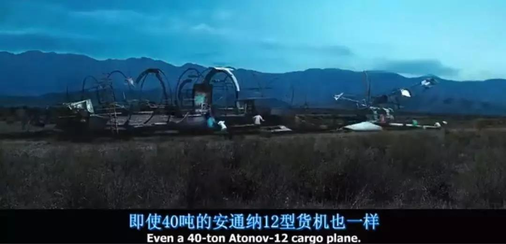
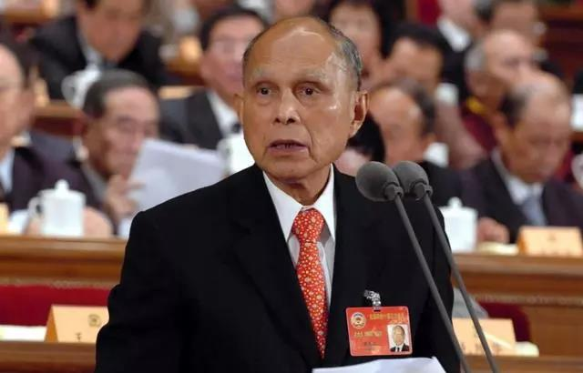
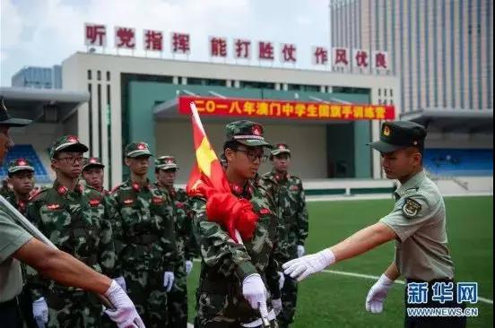

##正文

1950年，随着朝鲜战争的爆发，西方国家对刚刚诞生的新中国进行全面封锁禁运。港英当局随即也加入其中，组织起了武力缉私队，防止港岛成为禁品流入大陆的通道。

西方的封锁对仓促入朝的志愿军造成了巨大的打击，相比于后勤保障完善的美军，我军非战斗减员严重，很多战士没有倒在战场上，却因为缺医少药长眠在了后方。

而与前线物资紧张相对应的，则是众多海外爱国商人为祖国采购的医药由于封锁无法运回国内。

此时，看着同胞们一个个的倒下，一位祖籍广东番禺的香港人挺身站了出来，他用临时拼凑的船队，将前线急需的药品、纱布、医疗器材等物资，尤其是刚发明的青霉素源源不断的送到了第一线，极大的降低了志愿军战士们的伤亡。

这位爱国商人的名字，叫做霍英东。

 

在1950年到1953年的3年间，霍英东和他的员工们没有一天休息过，白天要联络、落货，晚上开船、送货，每天只睡三四个小时。

为了顺利把货物运到对岸的蛇口，霍英东不仅要通过各种方式避开盯着他的港英当局，还要打通海关、水警、稽查等各个环节。

 

本土相比都是小事儿，霍英东还要躲着盘踞在万山群岛的专门盯着他的国民党军队。

 

甚至霍英东的旗舰“黑猫”号，在1952年11月20日遭遇港英水警和工商署缉私船精心组织的武力追捕中，也不得不通过撞击自沉来了一个“死无对证”。

 

在三年的抗美援朝战争中，一场暗战也在水面下涌动，但是，这条宝贵的生命线一天都没有耽误过，因为上到霍英东下到码头的工人都明白，有一天不运货，就会有无数的同胞因此而倒下。

而随着朝鲜战场的规模不断扩大，霍氏船队的规模也越来越大，一船又一船禁运的医药用品不断运往内地，让霍英东成为了这场保家卫国战争中的无冕之王。

可以说，如果可以将这三年的事迹拍成电影，绝对比《战争之王》要精彩得多。

 

但是，真正的爱国者，必然要付出代价的。

冒着掉脑袋风险，为大陆同胞送救命药的霍英东，绝不会承认自己向中国政府运输违禁的医药用品，于是，随着霍英东船队规模的不断增长，“霍英东靠走私起家”一直广为流传。

在这顶帽子之下，港英政府的官式活动甚至慈善活动都拒绝霍英东，将其排除在上流社会之外，而美国领事馆更是列出“黑名单”，不允许美国企业跟霍家做生意。

而且，在夹缝之中的霍英东想做任何生意都会遭遇阻挠，被港英政府打压欺负了几十年，连搞个房地产都被赶出了地产界，在香港本土生意几乎无法展开。

但是，对于外界扣给他走私的帽子以及因此产生的种种非议，霍英东一直始终保持沉默，从不做过多的解释，直到香港回归祖国之后，这位年近80的老爷子终于在接受采访时袒露心迹：

“有件事大概应该要讲清楚，当年我不是走私。”

 

祖国自然也不会忘记这位共和国的隐形守护者。

2000年10月25日，北京，在纪念抗美援朝50周年的盛会上，主席台上除了一位位胸前挂满勋章的戎装将领外，还坐着一位身着西装出席的老人家，他就是霍英东。

而且，虽然在港英政府的打击之下，霍英东在香港的生意几乎停滞，但在改革开放之后，大陆不仅对其全面开放，让霍氏家族享受了改革开放的红利。

甚至这位国家政协副主席死后也是荣耀备至，按照“国葬”来举行，灵柩上盖着国旗，多位国家领导人前来送别。

 

中国人不会忘记点滴的恩情，对那些在建国初期和改革开放前期我们最困难的时候伸手援手的爱国商人们，我们都会滴水之恩涌泉相报。

就像与霍英东联手投资葵涌1至4号货柜码头的世界船王董浩云，也同样被港英政府万般刁难。但就在他生意陷入危机的1986年，中国政府毅然出手，通过霍英东向董浩云输血1.2亿美元。

要知道，当时在各个方面都急需外汇的中国政府，国库里也只有20亿美金。

而且，虽然董浩云的名字很多人可能不熟悉，但是他的儿子，香港第一人特首董建华，相信是无人不知无人不晓了。

所以，随着中国的改革开放，多位香港的爱国商人们凭借着大陆的发展红利迅速崛起并非偶然，因为他们大多曾在大陆最困难的时候伸出过援手，雪中送过炭。

这一点，中国不会忘记，共产党不会忘记，中国人民更不会忘记。

但是，现在很多的香港青年却忘记了。

“香港的明天会更好”的承诺，是对那些热爱祖国的同胞们讲的，中国的发展红利分享是对那些认可祖国的青年。

只要紧跟着祖国，就会像当年的那些当年香港的爱国商人们一样，获得超额的回报。

而香港隔壁个澳门就是最近一个很好的例子。

据世界银行数据统计，在澳门99年回归后的15年里，澳门人均GDP以每年40%的增速翻了六倍，直到2014年后全球博彩业务的下滑，其迅猛的增长势头才一度放缓。

16年之后，澳门从大陆寻找了新的经济增长点，经济又得以飞速发展。

 

很多人都不知道，澳门现在已经是人均GDP排名第二的国家或地区了。

而且，按照目前的发展势头来看，闷声发大财的澳门只要再“苟”两年，就将超越欧洲心脏卢森堡，成为全球人均GDP最高的地区。

 

要知道，在97年香港回归的时候，澳门的人均GDP仅是香港的一半，但是在澳门回归之后，其人均GDP飞速仿佛安上了火箭一般的飞速增长，如今人均GDP已经是香港的接近两倍了。

反之，香港回归后，其人均GDP增速只有8%，还没有这些年大陆的平均GDP增速快。

没办法，相比于大陆游客和资本纷纷汇聚于澳门，在香港青年们一场场的反对下，大陆的游客和资本却在被迫撤离。

要知道如今连世仇的日本每到十一都在“喜迎国庆”，而香港的废青们却在叫嚣让大陆游客滚回去。

 

问题在哪里，对比澳门就会明白，还是在香港青年的教育上面。

回归之后，澳门的小孩从幼儿园开始就接受国民教育。一年级的学生即已普及了国旗及澳门特区区旗等知识。

而且，所有澳门学校均每日升挂国旗，具备设施条件的学校每周更会举行升旗仪式，很多活动场合都会见到学生自发性唱国歌。澳门各大中小学普遍把升挂国旗、奏唱国歌作为体现国家主权和民族尊严的重要仪式。

 

甚至在学校里，老师们也会用实实在在的例子来教育学生：

当咸潮来临时，邻近省市的同胞宁愿自己喝咸水，也要保证我们的淡水供应；我们发电有问题，广东省给我们输电；副食品等等，都是靠内地源源不断地供应……

在学校的时候，澳门的老师们就让即将走出社会的年轻一代明白，单靠澳门自己很难实现美好生活，与大陆同胞一起发展才能享受到更多的红利。

而澳门回归二十年以来，正是凭借着与大陆紧密的联系，经济得以迅猛发展，人均从香港的一半变成了香港的两倍。

反之，香港这么多年来，青年们接受的教育对祖国缺乏整体的认知，更何谈老一代爱国商人的热情，结果就是经贸领域与大陆越走越远，自然就搭不上中国经济发展的顺风车。

甚至就在昨天，部分暴徒带头在香港国际机场进行非法集会，记者付国豪因被发现有一件“我愛警察”T恤衫，被暴徒们捆绑住后进行殴打。

面对将自己包围了的暴徒，被绑住的付国豪毫无畏惧，大声得喊出：“我支持香港警察，你们可以打我了。

如此暴行实在令人愤恨，仿佛时间又回到了60多年前的朝鲜战场，英雄儿女被包围后，高呼的“向我开炮”。

政事堂相信，付国豪的这一顿打不会白挨，大陆和香港的市民也会看清楚这一小撮暴徒的真实面目。

 

蝗虫也被俗称蚂蚱，今年8月初已立秋，就像俗话说的，秋后的蚂蚱蹦跶不了多久了，香港的问题，相信也快要解决了。

而这一次解决之后，两岸应该从教育领域入手，像澳门一样逐步推动爱国主义教育，只有这样，香港才会崛起更多新的霍英东，让香港同胞们享受到更多的祖国发展红利。

##留言区
 

