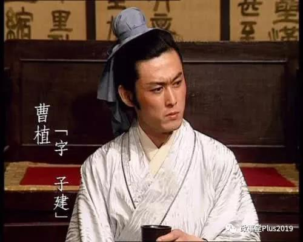

##正文

 

七步诗来源于南朝宋·刘义庆《世说新语·文学》：

>文帝尝令东阿王七步中作诗，不成者行大法；应声便为诗曰：“煮豆持作羹，漉菽以为汁；萁在釜下燃，豆在釜中泣；本自同根生，相煎何太急！”帝深有惭色。

如果你没读过历史，靠百度百科去理解的话，会有如下的解释：

>用萁煎其豆来比喻同胞骨肉的哥哥曹丕残害弟弟，表达了对曹丕的强烈不满，生动形象、深入浅出地反映了封建统治集团内部的残酷斗争和诗人自身处境艰难，沉郁愤激的思想感情。
>百度百科

 

不得不说，如果曹植写诗或者曹丕读诗要靠百度百科，那么曹植恐怕早就被曹丕砍了。

因为曹丕是一个非常小心眼，做起事情毫无顾忌的人。

譬如魏国重臣，曹氏亲族的曹洪因为早年不借给曹丕钱，等曹丕上位后，找了个借口就想要将其处死，丝毫不顾曹洪是曹魏政权创业的原始第一大股东；也不估计曹洪曾多次舍命相救自己亲爹曹操，逼迫汉献帝退位，是曹魏政权最大的大功臣（没有之一）；还不顾及曹洪家族与颍川家族的紧密联姻关系；更丝毫不顾及曹魏刚刚篡汉，曹洪作为曹氏宗族一号人物，直接影响了曹丕政权最为倚重的曹氏宗室的态度。

又譬如甄氏，就是那个当年曹丕从曹操手中抢到的妹子，也是曹丕儿子魏明帝曹睿的亲妈。可就因为不得宠而在诗中流露出一些怨恨，便被曹丕遣使赐死，死后还将其被发覆面，以糠塞口，根本不顾及甄氏背后河北大族们的态度，以及河北河南门阀之间的制衡，甚至都不顾及宝贝储君儿子曹睿怎么想。

知道了曹丕连曹氏宗族中最为倚重的曹洪都敢杀，连自家老婆都能下得去手，就会明白真性情的曹丕根本不考虑后面可能引发的一系列洪水滔天。

因此，面对曹植这个最有威胁的竞争对手，曹丕如果有机会，绝对毫不犹豫的痛下杀手。

而有了这个历史背景，我们再来看这个被百度百科说成“对曹丕的强烈不满”七步诗。

曹丕可是跟曹操、曹植一起并列为当时最顶级的文学家，拥有非常高的诗词造诣，因此曹植的七步诗之中，**如果有一丝让曹丕隐约感觉到了曹植的不满或者怨恨，能对老婆痛下杀手的曹丕，分分钟就会让曹植下去跟曹操黄泉相会。**

可以说，“天下才有一石，曹子建独占八斗”的超级天才曹植在百度百度里面，简直是脑子进水故意找死。

反之，跳出百度，只要略懂历史就算会明白，在当时的语境当中，曹植的七步诗中，**每一个字满满的都是求生欲。**

##留言区
 

