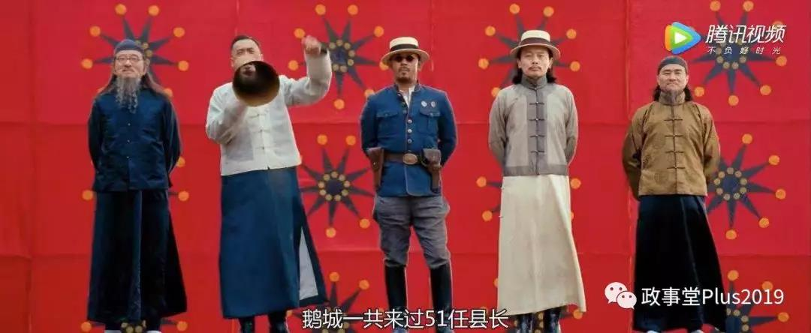
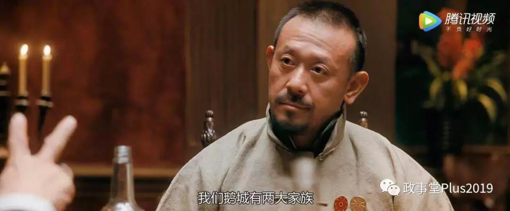
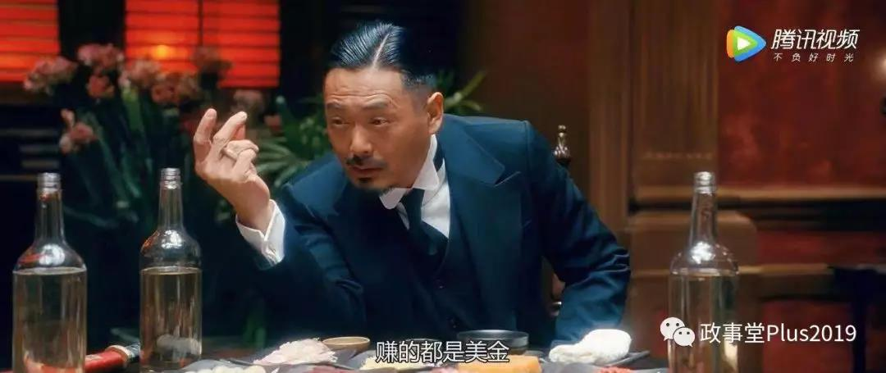
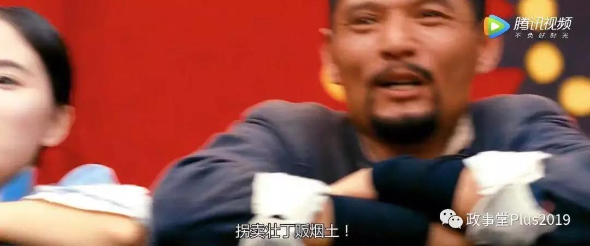
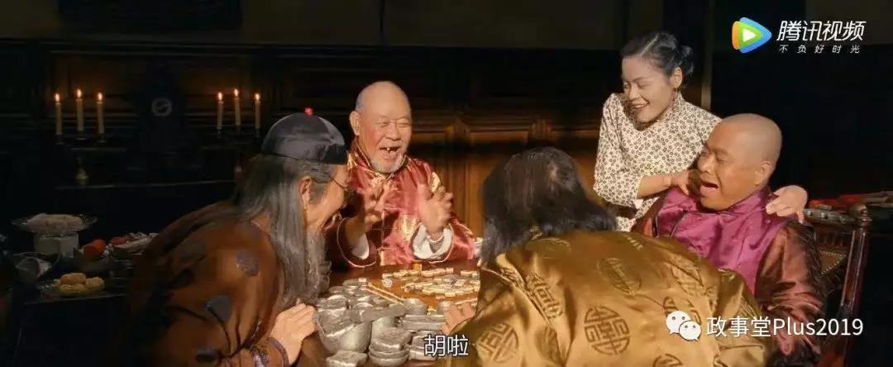
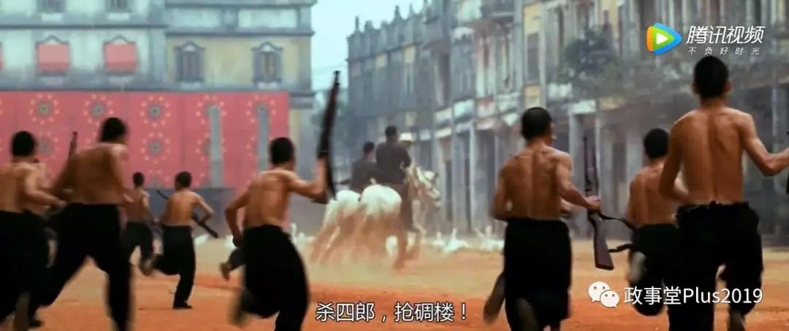
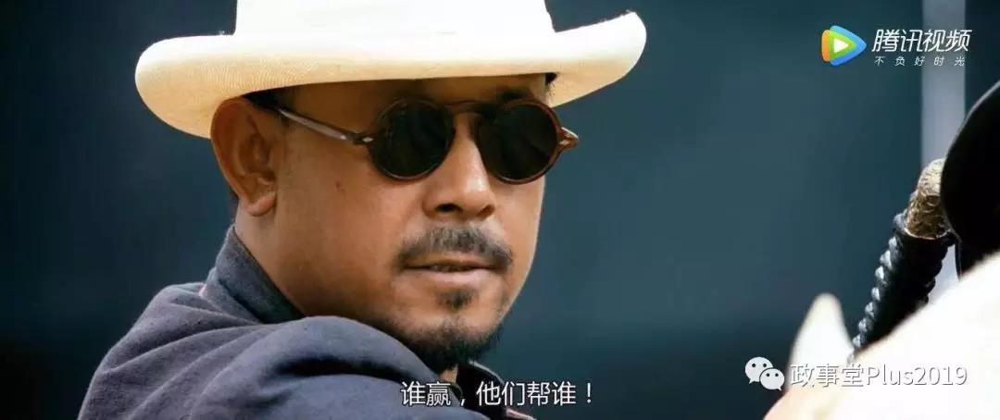
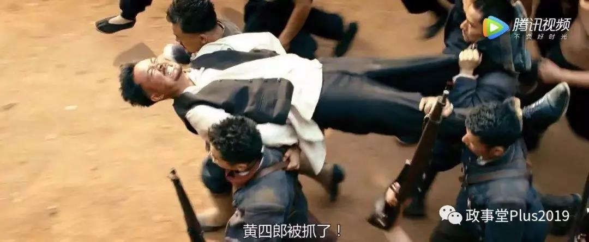

##正文

姜文《让子弹飞》这部神剧中，藏了非常多的彩蛋，最近跟大家分享几则。

要明白《让子弹飞》故事背后的故事，首先要理解鹅城错综复杂的各股势力。

而正好县长带兵出城剿匪前，鹅城的几股重要势力都集中站了出来。

 

中间一号位二号位是县长张麻子和汤师爷，三号位是刘督统在鹅城贩卖烟土的代理人黄四郎，四号位和五号位是在鹅城替刘督统贩卖人口的城南两大家族。

因此，鹅城的这一战，明面上是张麻子斗黄四郎，本质上是在跟刘督统在鹅城的“三条腿”来斗争，只不过斗争的重点是黄老爷这条“大腿”。

 

 

而鹅城另外的两大家族，其实也是依靠着刘督统的庇护，做着“拐卖人口”这种见不得人的暴利生意。

 

 

 

由于两大家族强大的势力强大，甚至被黄四郎视为心头之患，连续多次用张麻子“借刀杀人”。

所以，张麻子在回城收拾黄四郎的时候，也对鹅城两大家族埋下了伏笔。

譬如在最早的讨黄的檄文中，张麻子就把“拐卖壮丁”这个两家家族的屎盆子，扣在了“贩卖烟土”的黄四郎头上，希望能够对两大家族进行统战。

 

 

而且，这两大家族的老爷子在后面的剧情中，姜文还特意给他们露了三次脸。

第一波张麻子发银子的时候，给的镜头是鹅城城南两大家族的父子们，拿着发的银子一起打麻将。

 

第二波张麻子发枪和子弹的时候，给的镜头是鹅城城南两大家族的父子们，背着枪拿子弹作为筹码打麻将。

 

可以说，在**张麻子和黄四郎的最初两轮博弈过程中，赚得最爽的就是这鹅城两大家族。**

等到第三波，张麻子把手握的子弹都打了出去的时候，城南两大家族的二代子弟们都坐不住了，认为这次是动真格的了，“张麻子和黄四郎之间，至少要死一个。”

 

 

这些镜头可不是白给的。

张麻子在第一次攻打碉楼的时候，虽然给鹅城的民众和两大家族发了银子发了枪，一群鹅城的群众跟着他一起去杀四郎抢碉楼，看起来势头非常盛。

 

但是真要到了黄老爷的碉楼下面，跟上来的只有一群鹅。

 

原因很简单，张麻子虽然有民众的支持，但是并没有获得鹅城两大家族的支持，**并没有在鹅城形成绝对的优势。**

这也让张麻子认识到了：**谁赢，他们帮谁！**

 

两大家族不帮张麻子的原因其实很简单。

与黄四郎同样依靠刘督统的他们知道，黄四郎一定会去找刘督统搬援兵，而附近郭旅长的骑兵三天之内就能够杀过来，一旦形成混战，站队张麻子的鹅城两大家族势必要跟刘督统翻脸。

而靠着把人贩卖到America修铁路作为主要生意的鹅城两大家族，绝对不可能跟刘督统翻脸，**所以无论张麻子怎么利诱，两大家族们，在这一场的博弈中，都不会轻易的进行表态。**

更不要说，就像前两轮那样，张麻子和黄四郎斗得越厉害，两大家族就越能通吃通赢，**所以他们在这段时间，都是希望拖着不表态。**

但是，随着张麻子非常睿智的，装作砍了黄四郎之后，事情发生了变化。

 

对于鹅城两大家族来说，这次是张麻子抢在郭旅长来之前干掉了“黄四郎”，那么刘督统那边就不会找两大家族的麻烦，而且随着黄四郎的完蛋，刘督统也需要在鹅城寻求新的代理人。

更不要说，看到了张麻子对黄四郎都要搞成不死不休，**两大家族也认识到可能面临的巨大危机，激发了巨大的求生欲。**

因此，在最后这一轮张麻子带领的冲锋队里面，不仅仅是鹅城的民众，**更有着控制鹅城各行各业的两大家族的团体。**

这才使得张麻子与黄四郎的博弈之中，占据了绝对的优势。然后黄四郎树倒猢狲散，武智冲和胡千先后倒戈，在鹅城盘踞百年的黄四郎家族彻底失败。

 

这部大戏看的观众们都非常的爽，不过喜剧的背后，往往都是悲剧的内核。

鹅城的革命胜利了，黄四郎死了，但是继承黄四郎椅子的，不是让民众站起来的张麻子，也不是鹅城的百姓。

而是同样贩卖人口，依靠着刘督统的城南两大家族.......

 

##留言区
 

