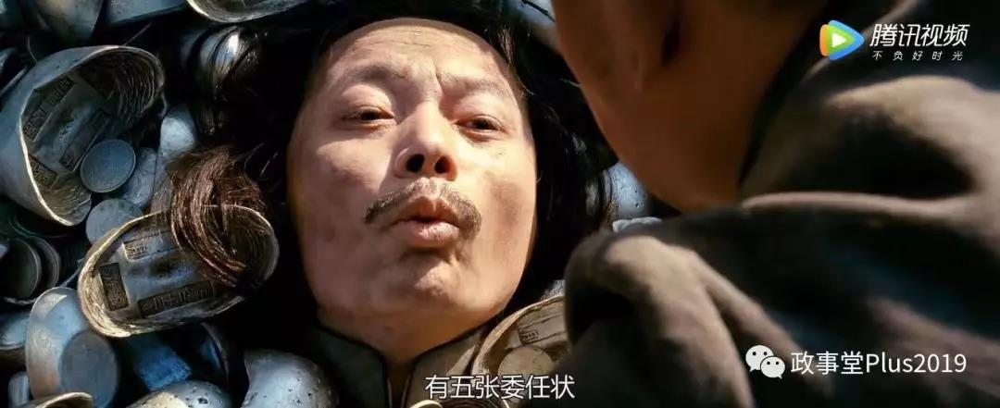

##正文

电影《让子弹飞》中，张麻子在大决战时端黄四郎碉楼，看似一气呵成，但实际上走的却是步步惊心，甚至可以说是一场悲剧。

尤其是在一片欢声笑语中，很少有人会发现，在影片的后期，张麻子实际上已经陷入了内忧外患的四面楚歌之中。

而想要深刻理解这部电影，首先要明白张麻子真正的对手是谁，就像那位教员说过的：“**谁是我们的敌人，谁是我们的朋友，这是革命的首要问题。**”

就像上一篇文章中介绍的，仔细看电影就会发现，明线上的大反派，是黄四郎，但暗线中却隐藏了一个真正的大反派，刘都统。

 

北洋时期，都统（督军）是一个省的最高军事长官。一般来说，大省为督军，小省为都统，均为该省军政的实际控制者，各省的土豪和县长都要向他们交钱，而省长不过是台前的“师爷”。

了解了这个历史背景，我们就会明白，马邦德上任的委任状，虽然是萨南康省主席巴青泰签署的，但是收钱把鹅城县长卖给马邦德的人，却是萨南康省的实际控制者的刘都统。

 

甚至护送马邦德上任的铁血十八星路军，也是刘都统麾下的正规军。（十八星是武昌起义胜利的标志，也是中华民国陆军军旗）

 

了解了这个历史，我们再回头看。

鸿门宴上说的刘都统“三条腿”，分别是贩卖烟土的黄四郎，以及拐卖人口的城南两大家族，他们在刘都统的庇护之下靠着非法勾当大发横财。

因此，整个鹅城从流水的县长马邦德，到铁打的老爷黄四郎，再到城南两大家族，实际上都是在跪着向刘都统要饭，这也是为什么马邦德能对黄四郎一清二楚。

 

于是，下面这一张鹅城各股主要势力齐聚的一张图，可以说刘都统的走狗们把张麻子包围了......政治层面张麻子处于绝对的劣势。

 

而军事层面上，张麻子也没有优势，且不说黄老爷碉楼内的胡千和碉堡外的武智冲，以及城外的假麻子伏兵，总兵力远在张麻子之上，可怕的是，张麻子团队内部也早已被腐化。

早在出兵剿匪之前，张麻子团队的师爷马邦德就已经跟黄四郎勾搭起来了，屁股兜里揣了刘都统给的五张委任状。

 

而这五张委任状，前面有过铺垫，都是黄四郎花钱买的。

 

更不要说张麻子团队中后期加入的花姐，实际上是黄四郎一早就安排好的卧底。

 

 

这位“小凤仙”不仅通过了美人计策反了张麻子团队中负责带队伍的老三，甚至花姐又和喜欢嫖娼的师爷马邦德联手，又把老四和老五也拉了进去。

这是为啥黄四郎给了马邦德比原先承诺三张委任状更多的五张，这也是为啥师爷马邦德这么一个外人，却学会了麻匪团队的吹口哨。

 

因此，虽然张麻子的军事团队看似很强，但真正站在大哥这边的，只有老二和老七。

而老二被汤师爷泄露给黄四郎提前干掉了，老七也在出城剿匪的过程中，差点被灭口，从此也长了一个心眼，最后跟大哥分道扬镳........

嗯，铺垫了这么多，大家回顾一下就会发现，**整个鹅城，从刘都统、郭旅长、黄四郎、城南两大家族、花姐、老三、胡千、武智冲、假麻子，几乎各股势力都站在了张麻子的对立面上。**

而且，面对鹅城之外的假麻子，张麻子凭借着强悍的武力可以反杀，但是在**鹅城这个弹丸之地上，张麻子却无法展开手脚。**

因为由于被黄四郎们长期污化，一心为百姓的张麻子，名声在鹅城百姓心目中是被妖魔化了的。

 

更不要说，张麻子之前以麻匪名义撒的银子，也被黄老爷手下的黑衣蒙面人给破坏了，导致了鹅城被蒙蔽的民众也不会站在张麻子这边。

 

 

所以，**这一战，张麻子只带了四个人进城，而绝不能动用鹅城之外的力量。**

**他只能借着鹅城县长的名义和权力，利用鹅城各股势力之间的矛盾，来实现自己的战略目的。**

在劣势之下并非不能取胜，当年小米加步枪也能赶走飞机大炮，政治层面胜利的秘诀就像当年教员说的：“搞政治，就是把拥护我们的人搞得多多的，把反对我们的人搞得少少的。”

所以，无法亲自带部队进鹅城的张麻子，**合理的利用了自身团队内部的矛盾以及鹅城内部各股势力之间的冲突**，把鹅城除了假麻子和黄四郎之外的各股势力，**都变成了自己暂时的盟友，然后都下注在自己这边。**

最终，让大部队直接推了黄四郎的碉楼，取得了绚烂的胜利。

 

不过，看似美好的大结局背后，张麻子毕竟是借用别人的势力去清除对手，因此，就必须要有大量的妥协。

所以，**他不能像一个愤青那样，要去跟背后的刘都统和郭旅长拼个你死我活；也不能去收拾那些为祸鹅城数十年，拐卖人口的城南两大家族；还不能收拾花姐老三这些内部倒戈的成员；甚至连武智冲这种拉开小六子胸膛的侩子手，张麻子都不能复仇。**

 

可以说，这一仗打下来，细细品味之下，攻陷碉楼并非一场大胜利，甚至还有这一些悲情的色彩，并没有彻底得消灭黄四郎，让他跑了。

 

没办法，面对刘都统和黄四郎们制定游戏规则，就得按照他们规矩来。

但是张麻子却可以用自己擅长的路线，一点点**把朋友变得多多，把敌人变得少少**。这一次端掉黄家炮楼不过是一次历练，积累我们对抗刘都统们的经验，团结更多的朋友。

毕竟，“鹅城”之后还有“康城”等着去收复。

**为了祖国的统一，就像片中说的，我们必须玩得起，还得玩得赢！**

 

 

##留言区
 

