##正文

让子弹飞中，藏了一个非常隐秘的彩蛋，如果没有发现彩蛋，大部分人会认为这是一部喜剧电影。

可是，如果发现了这枚彩蛋，就会知道这不仅是一部悲剧，甚至可以说是一部烧脑的恐怖电影。

这个彩蛋，就是黄四郎送给张麻子的那两颗钻石。
 
 

 

按照美好结局的理解，这颗钻石是张麻子送给马邦德的老婆孩子，结果他俩被假麻子锯了，假麻子拿到了钻石。

 

 

 

但是，姜文却用一个彩蛋，讲了另一个伏线千里的故事。

在张麻子送马邦德老婆钻石之后，镜头马上就转到了花姐的妓院之内，老二老三花姐三个人在玩“肉的bicycle”，被黄四郎撞见了。

 

 

“毕竟是自家媳妇嘛”......

姜文的老婆自然不会演什么大尺度的动作，不过在一片昏暗暧昧的红色灯光中和奇特的姿势上，姜文已经把故事讲了，老二老三花姐三个人正在“中国人民大学学习”呢.....

 

毕竟，就在上一个场景中，姜文特意介绍了团队成员的取向。老二如果出手，那么趴在桌上的，会是她男人.....

 
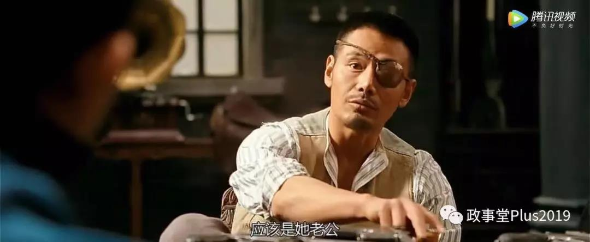

嗯，就在这个基情满满的时候，黄四郎进来了，双方一度剑拔弩张。

 

可花姐送给了黄四郎一个箱子，黄四郎打开之后脸色突变，立刻就放弃了干掉老二老三的计划。

 

 
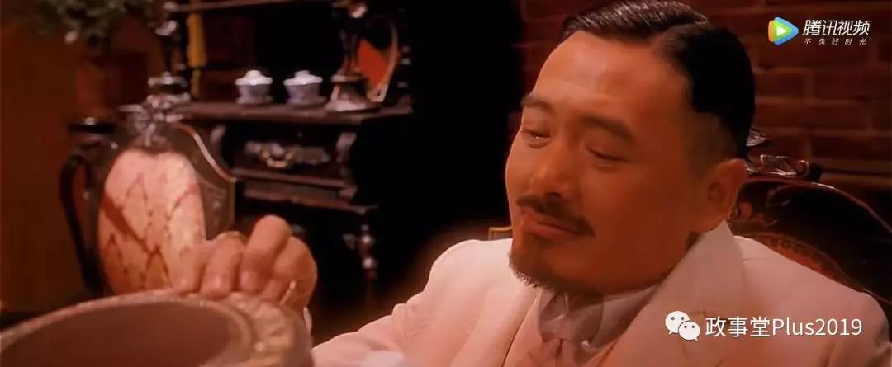

原因很简单，这个盒子里面，放的就是黄四郎的宝贝钻石。

那么，这个钻石是怎么到了花姐手里呢？

其实片中给了线索，最初张麻子假装醉了，把钻石给马邦德的时候，老色鬼马邦德转手就把钻石给县长夫人展现“真本事”。

 

县长夫人当年就和花姐一样，都是妓女，在跟著名嫖客马邦德在一系列的交换之后，俩人形成了一个利益的共同体。

 

 
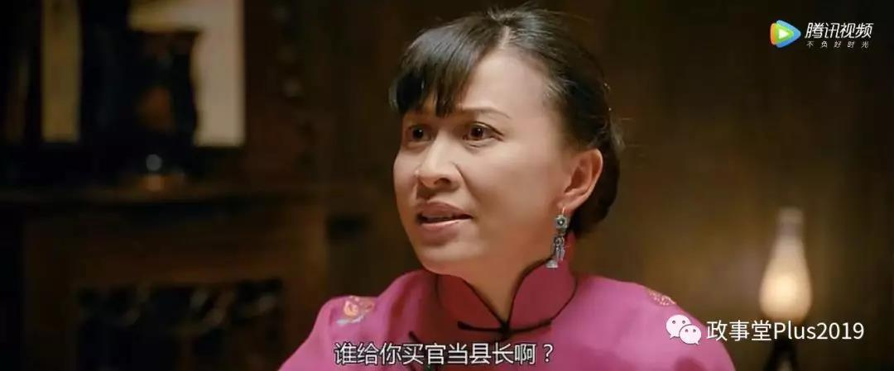

看看马邦德对女人的毫无节制就会知道，他在进了鹅城之后，肯定很快也就找上了花姐的妓院。

 

于是，在被黄四郎杀了老婆之后，马邦德又通过把钻石给花姐，形成了一个新的政治同盟。

而花姐把钻石装在盒子里面还给黄四郎，则表示我已经收服了张麻子团队的重要成员，因此黄四郎也就放弃了火拼。（不过此时黄四郎尚不知道具体策反的是谁）

黄四郎的撤退，也让老二和老三一脸懵逼。

 

对此，电影里面一个细节可以验证，之前黄四郎让胡万突击的时候，对于钻石是极为渴望的，要求胡万“杀鸡取卵”，必须拿回钻石。

但是之后黄四郎的几次突袭中，对胡千和假麻子却从没有说他那宝贵的钻石。

 

而且，马邦德送花姐的钻石，也对应了让子弹飞众多“未解之谜”中的两个。

一个是在雨夜闲话的时候，马邦德对黄四郎说，“我不该拿你的钻石送人”，另一个是汤师爷临死前，对张麻子说的掏心窝子的话，“那谁，你还记得嘛？”

 

 

马邦德的这两段，指的就是他把钻石送给了花姐。

因此，这一条暗线，是花姐把钻石给了黄四郎，最后的时候，钻石再回到马邦德夫人孩子手里，被假麻子获得。

这里面就给了一个新的线索，那就是黄四郎又把钻石给了马邦德。

这个其实不难理解，钻石作为本剧最有价值的物品，每一次的转换持有人，都是各方势力之间达成盟友关系的一种证明。

就像张麻子在鸿门宴中收了黄四郎的钻石作为两个人达成协议的订金，这次的钻石转移，意味着马邦德已经跟黄四郎在一场新的鸿门宴之中，达成了新的协议。

这个协议就是马邦德配合黄四郎干掉张麻子，黄四郎给马邦德五张委任状，让马邦德带着银子和张麻子的兄弟们，马走康城从容上任。

对于这笔交换，电影中有多个细节可以验证。

之前黄四郎一直都把张麻子称呼为县长，甚至看到县长带着麻匪面具发钱都不认为他是张麻子，在派人去省城调查县长的时候，也只是判断县长不姓马。

 

 
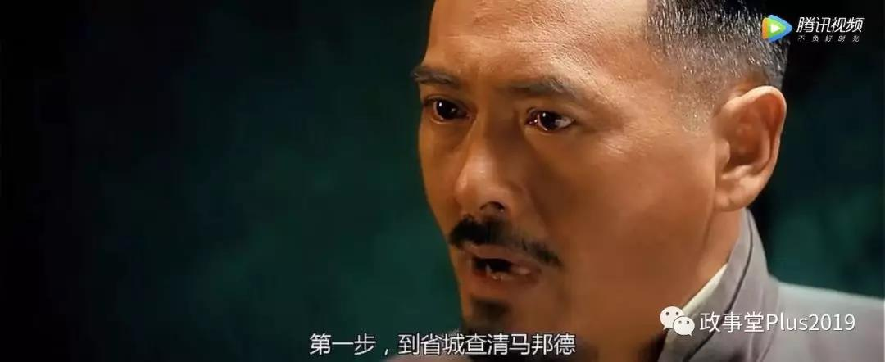

 

但是在张麻子干掉了假麻子，带队回来的时候，“县长”在黄四郎嘴里却变成了“张麻子”，很显然有人告诉了黄四郎，县长就是张麻子。

 

同样，在出发前，马邦德告诉张麻子自己手里的委任状，是康城而不是鹅城，也是姜文的一个暗示。

 
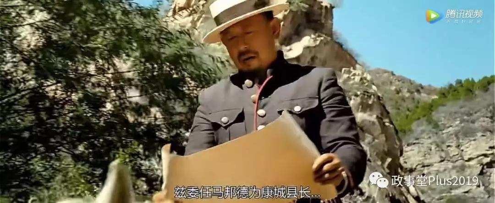

黄四郎和两大家族不可能不知道鹅城委任的县长名字，更不要说黄四郎还派人去了省城核对马邦德。

 

因此只可能是马邦德来的时候，拿的是鹅城委任状，走的时候，黄四郎给的是康城委任状。

 
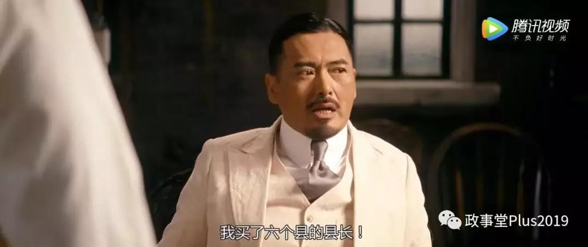

 

那么，马邦德屁股兜里面那些多余的四张委任状是来做什么的呢？

当然是用来收买张麻子的兄弟们了。

所以，张麻子在出城的时候，已经是九死一生，在花姐的牵线之下，师爷和老三之间已经形成了同盟，并将老四和老五拖下了水，意图就是干掉张麻子，大家带着钱和委任状跑路。

关于马邦德和老三之间的关系，片中有很多细节可以验证，譬如早期老三对汤师爷马邦德是非常的不屑。

 

但是后期都非常的客气，只有老二对师爷不客气。

 
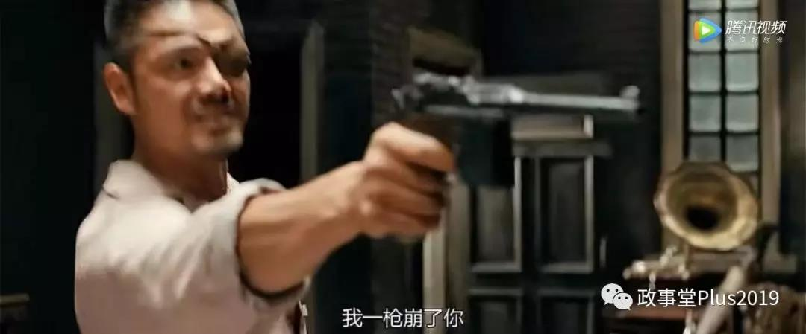

 

而随着老二被老大安排前去接应队伍，这次跟着张麻子出征的兄弟们，没被收买的只有老七了，不过，他也在城外野战的时候被打了黑枪。

 

老七并不傻，也看出了老三他们和花姐的勾当，片尾时，老七还能够偷偷告诉张麻子花姐的秘密。

 

 

之后悄然离去，没有跟着老四老五一起上老三的火车。

 

可以说，姜文花了这么多的细节，就是为了表示，老三老四老五已经被花姐和马邦德收买了，串通一气。

当然，最关键的证据，就是马邦德学会了吹麻匪的口号，并在关键时刻吹出了“老大死了”这个关键的信号。

 
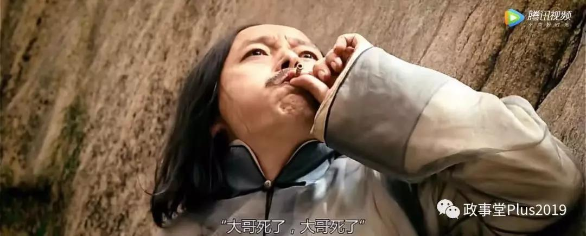

所以，早就勾搭上老三老四老五的马邦德，在临死前良心发现，让张麻子不要回鹅城，因为他知道张麻子的兄弟们都被黄四郎收买了，回去斗就是死路一条。

 

 

那么，在这一场出城大战，九死一生的张麻子是怎么逆袭呢？

这里面有两个关键点。

张麻子团队里面，老三的地位非常重要，在夜袭碉楼和抢劫等多次战斗中，都是老三带队。

 

也就是说，张麻子主要团队的带头人就是老三，策反老四老五的人也是老三。（当然，干掉老大这事儿，老三是不会告诉老四老五，只是告诉他们要跑路）

所以，被突袭之后，张麻子第一时间就取消了老三的指挥权，让肯定没有被花姐办了的处男老五来指挥部队。

 
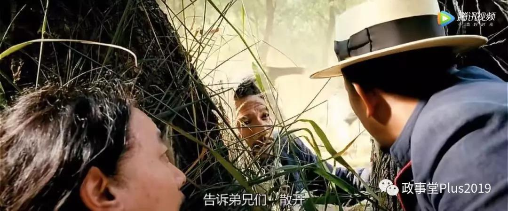

当然，这里面也埋了一个伏笔。

老三之前在打劫的时候，带着大哥的九筒面罩就让张麻子很生气，甚至在拉花姐入伙的时候，也是他出主意并跟其他的兄弟们事先通气，把张麻子气得够呛。

 

 
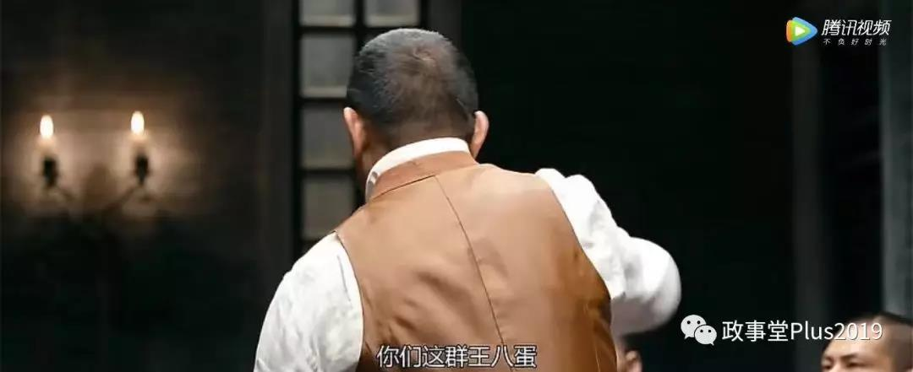

所以，张麻子早就对老三有所怀疑，被突袭后马上就让老五接过指挥权，而不是像以往那样，由自己来吹哨子并冲在第一线，目的，就是防止吹哨声和露脸，导致自己像老七那样被自己人暗算。

当然，做这些只是拖延时间，让张麻子能够实现顺利反杀的，其实归功于“理想主义”的黄四郎，他机关算尽，撕毁承诺，试图对整个张麻子团队一网打尽。

黄四郎让假麻子埋的地雷，并不是给张麻子准备的，而是给张麻子团队那些准备带着银子跑路的内鬼们准备的，试图用这个大地雷来个一锅端，然后拿回自己的银子。

 

因此，盘算着先引起团队内战，再一网打尽的黄四郎并没有信守对马邦德与老三的承诺，不仅放纵假麻子杀了马邦德的老婆和儿子，也杀了老三的好基友老二。

 

 

而就是张麻子这一战的转折点。

老二的惨死，让准备倒戈的老三突然反应过来，黄四郎不过是在利用他，所以，原本出工不出力，甚至准备打黑枪的老三，立刻火力全开，跟着张麻子一鼓作气做掉了假麻子。

 
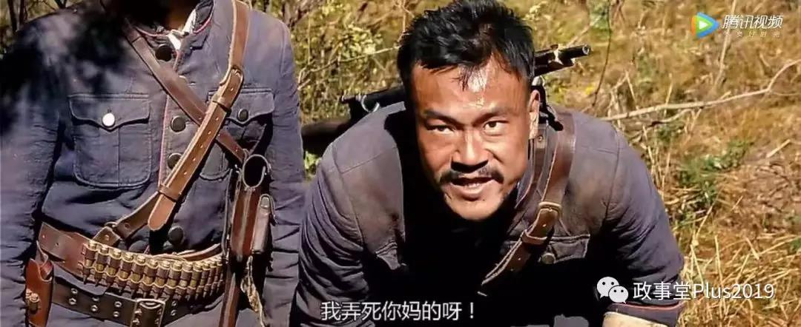

 

最终，几乎孤身一人的张麻子，愣是从危机四伏的绝境中杀了出来。

也许，此刻张麻子最应该感谢的人，应该是那个被绑着的老二。

面对一群暴徒的围殴，老二英勇的喊出了，“我支持大哥，你们可以打我了！”
 
 

##留言区
 
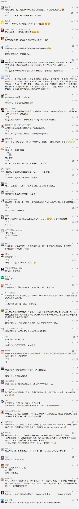
