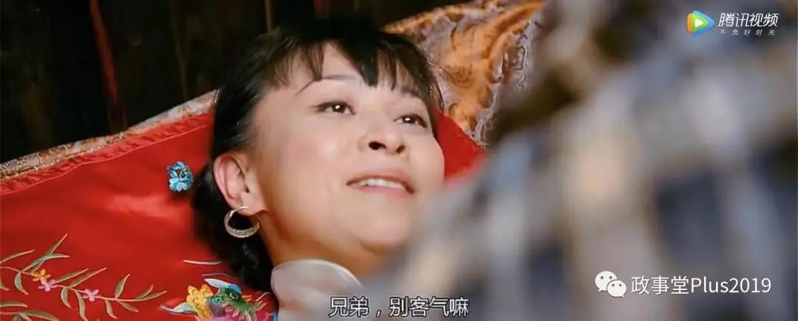
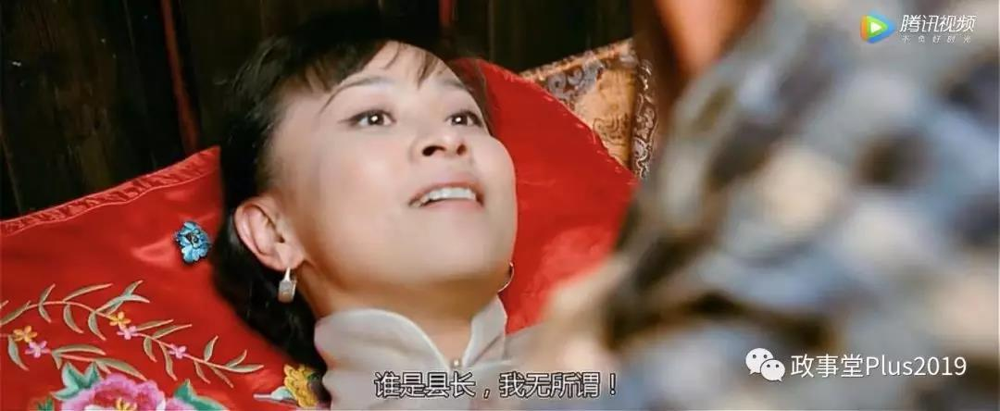
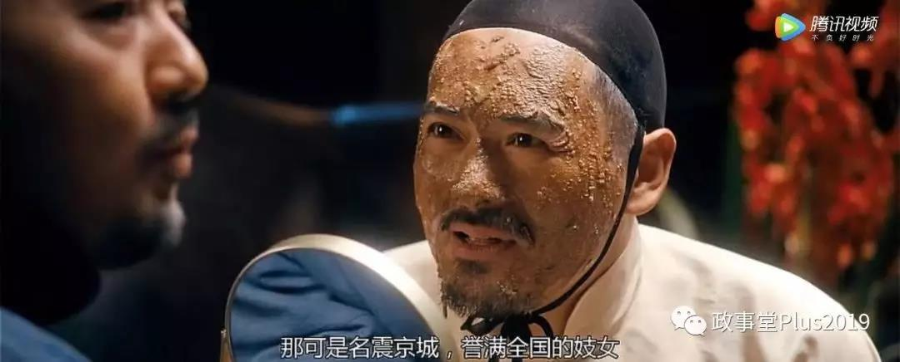
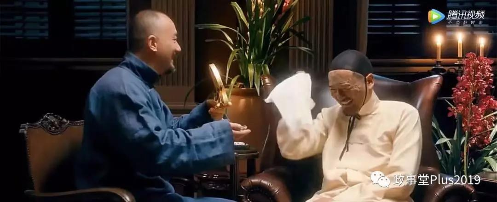
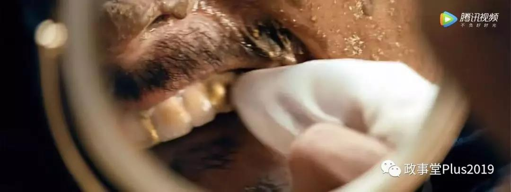
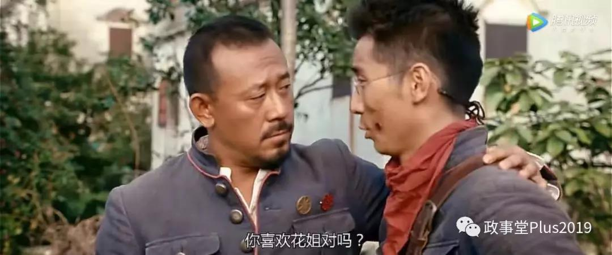
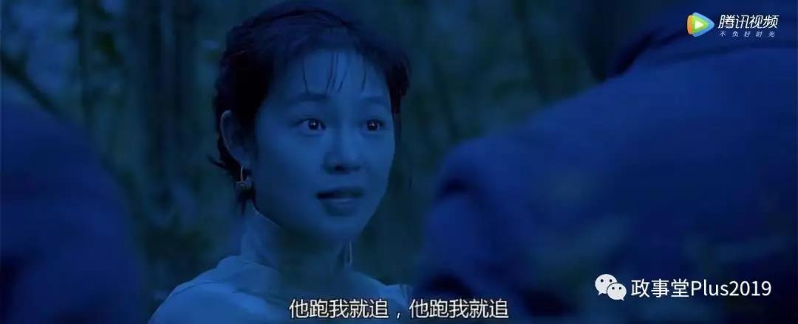
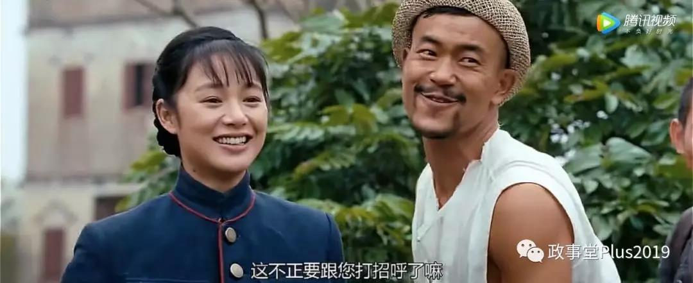
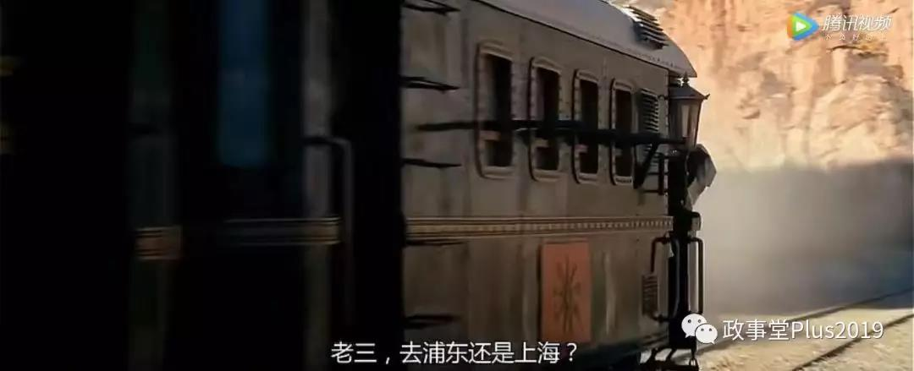

##正文

本文阅读前，需要至少阅读《《让子弹飞》中最大的彩蛋》这篇文章。

《让子弹飞》中，在影片一开始，在吃着火锅唱着歌的火车上，埋伏了一个小彩蛋。

马邦德命令汤师爷写诗的时候，县长夫人对汤师爷那是各种的刁难，一连串的“屁”，搞的汤师爷狼狈不堪，看起来两个人的关系特别差。

 

 

可是，就在县长马邦德给护送他的铁血十八星路军将士讲话的时候，汤师爷却偷偷的亲了县长夫人一口，然后两个人你侬我侬的打闹了起来。

 

可以说，这几秒的一个细节，不仅把把马邦德、汤师爷、县长夫人三个人的错综复杂关系展现得淋漓尽致，也告诉了观众们，电影里很多人物关系是藏在那些虚化的场景里。

譬如相对应的一个细节，县长夫人几次躺在床上等待张麻子的时候，都是化妆状态，而且身下还垫着喜庆的红垫子，用尽各种语言来挑逗张麻子。

 

 

但是当她听到马邦德说张麻子烂醉如泥，晚上不能来睡觉后，马上就卸妆了。（注意服饰、耳环以及床单）

 

 

可以说，县长夫人一直都在等着把县长张麻子给“办”踏实了......

不过县长夫人对县长的“恩爱”都是假象，就跟在火车上一样，在县长不在的时候，夫人也会把师爷给“盘了”。

 

所以，每次县长夫人房间里面进男人，背景音乐都会恶趣味的配上发春的猫叫，没办法，“与多名男性发生并保持关系”就是县长夫人的生存之道。

她会在各个势力之间进行下注，赌任何有可能胜利的一方，就像夫人说的，“只要我是县长夫人，谁是县长，我无所谓”。

 

而理解县长夫人，对于理解花姐有着非常重要的意义。

《让子弹飞》中有两个挺深刻的寓意，一个是伪装成汤师爷的马邦德，“**谎话说多了自己会信以为真，面具戴久就会长在脸上”。**

而另一个寓意，则是随着故事的发展，花姐成长为县长夫人，老三成长为黄四郎，**“长大之后，我就变成了你”。**

姜文的电影中，每个人都代表着一个群体，随着窑姐县长夫人的惨死，另一位妓女花姐，也成为了“只想当县长夫人”这个群体的代表。

毕竟花姐是导演的老婆，戏份那可是相当足的，电影针对花姐和他的男人们，做了五个彩蛋。

1、花姐第一次在黄老爷家出场，胡万就盯着花姐，胡千调侃花姐，在黄老爷和胡千大笑的时候，导演给了平时喜欢笑的胡万，一个严肃而不高兴的镜头。

 

 

 

这在暗示花姐和火车上的县长夫人一样，搞定了老板的“挚爱”，黄家二号人物大管家胡万。

2、花姐跟老二老三一起玩肉的bicycle，以及后面花姐说的，“我们三个活活被张麻子拆散了”，这几段已经明示了花姐同样搞定了张麻子团队的二号人物老三。

 

 

3、就像昨天文章写的，花姐让张麻子团队的师爷马邦德心甘情愿把钻石送给了她，考虑到钻石的价值和寓意，暗示花姐不仅搞定了张麻子和黄四郎团队中的二号人物，连真县长的马邦德也搞定了。

 

 

可以说，花姐这个鹅城的交际花，手腕不可谓不强。

4、电影介绍了黄四郎对“赝品”是相当的精益求精，连两个人的牙齿有不相似的，也要拔了俩人一起来镶金牙。

 

 

 

但花姐还是很自信的通过打开衣服看身体，找到了两者的不同，意味着她不仅跟黄四郎非常亲密，甚至也有可能跟赝品也发生过关系。

 

5、老七最后问张麻子是不是也喜欢花姐，由于之前老三喜欢花姐是尽人皆知的，这次老六还问这个，暗示老四老五哥俩，也都被花姐拿下了。

 

好了，如果明白了这些人物之间的复杂关系，就会明白，为什么花姐先把替身带走，最后会把替身交给张麻子了。

首先，由于花姐跟多位主角的复杂关系，使得花姐知道老三和马邦德都准备带着银子反水跑路。

所以，花姐在剿匪之前，通过一场逼宫，要加入麻匪，准备跟着老三和马邦德一起走，当小凤仙一般的“县长夫人”，不留在鹅城继续当妓女。

 

但是，老三认为这一战太危险了，毕竟要打黑枪，所以老三同意了张麻子的建议，让花姐来控制赝品。

 

但是，张麻子前脚刚走，知道张麻子必败的花姐后脚就带着赝品走了，准备与干掉张麻子的老三等人会合。

所以，张麻子就出城回城这么半天的功夫，赝品就从枪法极好的花姐手里“消失”了。

 

那么，为啥最后花姐又把赝品交出来了呢？

就像老三和花姐对话说的那样，她俩对于是否交出赝品是有着巨大争执的，但是在最后的时刻，妥协了，两个人决定支持张麻子，交出赝品。

 

 

因为最后的这场决战中，张麻子团队在老二死后，基本上是孤家寡人了，而老三几乎已经成为了能够左右战局的第三股势力。

对于老三来说，团队缴获假麻子的枪械和数百万两的剿匪银子，都是非常大的筹码，如果张麻子对黄四郎久攻不下，老三很容易反水并和黄四郎达成停战，体面的带着钱和部队离开鹅城。

不过，张麻子在开始他一系列行动之前，早就预料到了老三的脑后的反骨，第一件事情就是把老三以找花姐的名义支开，使得丧失了老三作为主心骨的“谋反”团队中的老四和老五，只能听大哥的。

 

而张麻子回鹅城之后，第一天送银子第二天送枪，第三天把子弹都打没了，在老三回来之前，把原本属于老三手上的筹码都打没了。

这一套三板斧对于老三来说是致命的。

这意味着如果张麻子最后输了，他和花姐手上将除了替身之外，一点筹码都没有，到时候跟黄四郎将毫无谈判的能力，按照黄四郎的性格，老三明白，他们最后很有可能会像马邦德那样被除掉。

因此，张麻子送钱送银子，不仅仅是在鼓动民众，更是逼着决定着胜负手的老三和花姐，不得不交出替身，跟自己站在一个阵营来进行最后一搏。

毕竟，虽然张麻子手里的枪和银子都没有了，但是黄四郎碉堡里面还有的是银子和武器，所以老三和花姐只能选择失之东隅收之桑榆，把赝品交出来，跟着张麻子搏一把。

可以说最后的这一战，张麻子通过调虎离山、撒钱、撒枪、杀赝品等一系列的骚操作，把城南两大家族、老三、花姐等各股势力，都绑在了自己的战车之上，然后发动起了群众推了碉楼，这位孤家寡人可以说赢得非常侥幸。

不过，虽然张麻子端了黄四郎的碉楼，可被张麻子“绑架”的花姐和老三们，早就跟张麻子离心离德，在胜利之后坚决抛弃张麻子，奔向新世界。

 

因此，最后唱着“长亭外古道边”的火车上，历史又形成了一个循环。

革命虽然胜利了，但老三成长为了新的县长，老四老五成长为了新的师爷，花姐成长为了新的县长夫人，张麻子曾经的部队，也变成了吸大烟的铁血十八星路军，由马拉着火车逆行驶向“浦东”。

 

没办法，人都是要长大的，

挥斥方遒的少年们终究都会变成自己曾经讨厌的模样。

这也许就是历史的一种宿命。

不过，这宿命偶尔也会被打破。

当所有人都选择长大的时候，

还有一个人选择继续他的初心......

 

##留言区
 

