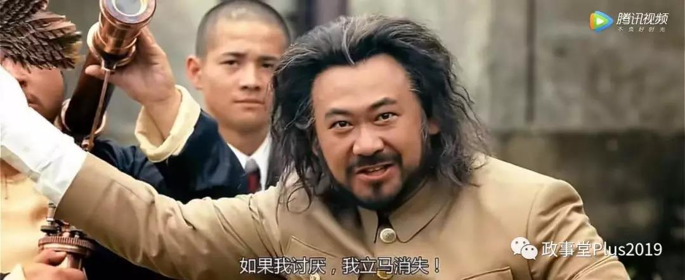

##正文

今天的文章，将给近期的让子弹飞系列做一个结尾。

作为老读者，相信很多人都能发现，我既将姜文的让子弹飞解读了一遍，也把小渔村的未来推演了一遍。

而近期这一系列文章的目的，无外乎三层，首先是给予大家胜利的信心，告诉大家我们会赢，其次是分析如何一步步的取得胜利，最后是告诉大家，革命尚未成功，同志仍需努力。

今天，正好赶上周末，跟大家把该系列的脉络重新梳理一下。

本系列的第一篇文章，实际上是8月9号的文章《瓮中捉鳖》，这篇文章从宏观上解释了县长张牧之能够取胜的关键。

无论是时评还是影评，很多人都会犯一个致命错误，那就是把一股势力视为铁板一块，所以，大家也都会默认黄四郎真的是刘都统的一条大腿。

 

但实际上，任何堡垒都是从内部攻克的那样，刘都统和黄四郎之间也有着巨大的矛盾。

就像鸿门宴上黄四郎透露的，这么多年黄四郎一直都在利用假麻子打劫自己的货，“十回有八回都被劫了”，而这些货和利润，原本都应该是上缴给刘都统的。

 

而且，针对于同样向刘都统上供城南两大家族，黄四郎也总是利用麻匪绑票与出钱剿匪等方式搜刮他们的钱。

 

搜刮钱本身不是问题，问题是黄四郎不仅利用这笔钱去收买五角大楼的郭旅长，甚至还买下了六个摇摆县的县长。

 

因此，对于刘都统来说，县长张牧之最多是占了点自己贸易上的便宜，但黄四郎却是卧榻之下的心腹大患。

 

所以，如果我们换做刘都统的视角，来看待县长与黄四郎之间的这一场博弈，就会明白刘都统的最佳博弈策略，就是坐山观虎斗。一方面借助县长张牧之削弱黄四郎，另一方面则在过程中学习与黄四郎斗争的经验。

刘都统麾下郭旅长的骑兵，并没有如黄四郎所愿，在三天之内如期到达，也是情理之中。

对此，电影中也给与了验证，张麻子第一天发银子，第二天发枪，第三天带着一群鹅去碉楼........直到第四天，鹅城众人一起瓜分了黄家的财产，郭旅长的骑兵仍然还在路上悠然.....

所以，从宏观的战略角度，如果没有刘都统的放水，郭旅长的骑兵一旦如期而至，县长张牧之根本没有机会在这一局端了黄四郎在鹅城的碉楼，他只能选择继续“忍耐”。

 

 

好了，讲了为什么会赢，那么在接下来则具体说明我们应该通过什么方式来赢。

虽然刘都统的部队不会入鹅城替黄四郎战斗，但是县长张牧之在山里的部队虽然近在咫尺，但也很难调入鹅城，说白了，大家在鹅城之外的所有动作，都是在给自己壮声势。

因此，鹅城这一战本质上，是要让鹅城内部的各股势力进行站队，获得多数支持的一方，以取得最后的胜利。

而鹅城之内，中间势力分为两股，一股是偏向于县长的城南两大家族，一股是偏向于黄四郎的团练武智冲。

因此，根据这两股势力，县长张牧之的动作也是不一样的。

针对于希望能够将位置传给儿子的城南两大家族，县长许诺端下黄四郎碉楼之后，把两把椅子给他们的儿子，是收买他们最好的手段。

 

针对于还指望继续在鹅城耀武扬威的武智冲来说，一方面进行极限施压，另一方面许诺既往不咎，继续让他们拥有铁杆庄稼，使用胡萝卜加大棒的政策，则是最有效的手段。

 

 

因此，随着郭旅长的骑兵迟迟不到，以及县长张牧之撒了银子撒了枪，看准风向的城南两大家族公开表示鹅城不堪再摘，武智冲们也搬出了黄家碉楼辞退了黄家的下人。

 

要知道，城南两大家族和武智冲们的站队，才是县长张牧之能够取得多数的关键，毕竟这帮人掌控了鹅城的各个方面。

而且，鹅城这一战并不是比拼武力，是看哪一方能够在舆论占据上风，获得更多人支持的一方，最终依靠民心和民意击溃对方。

 

所以，县长张牧之宣传领域上的最佳策略，

一个是大书特书黄四郎安排世纪大盗张麻子，勒索绑架城南两大家族，然后将赎金揣进了自己的腰包。

另一个是大书特书鹅城金融危机的时候，黄四郎联合刘都统把武智冲们搜刮得裤衩都不剩了，全靠县长力挽狂澜。

这样，才能收拢更多的城南两大家族以及更多的武智冲站在县长这一边。

之后，再通过高密度的打子弹，迫使控制着县长在鹅城队伍的花姐和老三们交出“赝品”，跟着县长一起砥砺奋进，赶在刘都统可能的干涉之前，大家一起直接端掉黄四郎的碉楼，取得最终的胜利。

 

用了小一周的时间，《让子弹飞》的系列影评终于写完了，相信结局已经注定，政事堂的读者们可以搬着小凳吃着瓜，看着子弹再飞一会儿。

近期让子弹飞系列回顾：

让子弹飞之城南两大家族

让子弹飞之张麻子的斗争策略

让子弹飞之最大的彩蛋

让子弹飞之历史的循环

最后再说几句，这一个多月以来，相信很多读者们会发现，我所有文章的思路都是一脉相承。

因为作为一个民族主义者，我思考的一直都是如何才能捍卫国家和民族的利益。

##留言区
 

