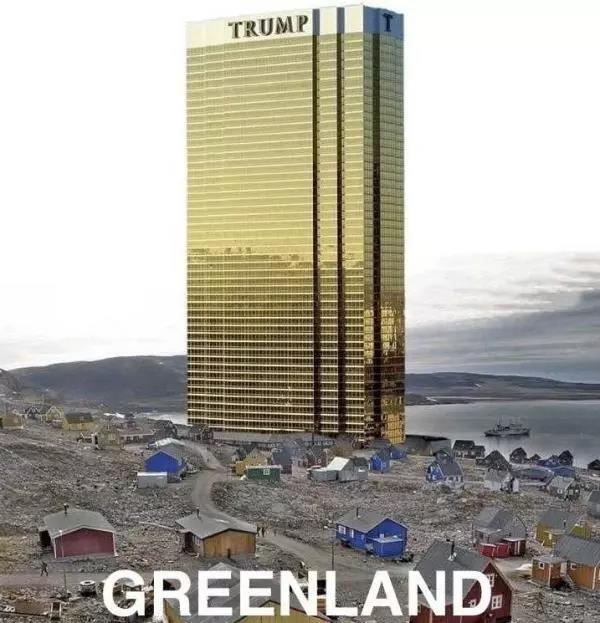

##正文

喜欢搞世纪交易的特朗普，最近又搞了一个大新闻，试图从丹麦政府手中收买世界第一大岛格陵兰。

要知道，自二战民族主义建国潮之后，全球就再也没有过领土的购买交易，特朗普如此天马行空的“地图开疆”设想，自然遭遇了各路媒体的群嘲。

 

不仅欧美的媒体在讥讽这位自以为是的总统，连丹麦政府上下也集体加入围观的行列，以“关爱智障”的语气劝说特朗普，格陵兰是丹麦的非卖品。

 

这下可把习惯了在推特上“日记强国”的特朗普气得够呛，人生中第一次“地图开疆”就被群嘲了，于是直接在推特上取消了原因于9月2号访问丹麦会见女王和首相的行程。

 

而就在特朗普宣布取消访问前数小时，美国驻丹麦大使仍在发“推文”迎接特朗普，于是，西方媒体又开启了新一轮对特朗普的群嘲，气得特朗普自己都在推特上发了一则PS的图片来自嘲。

 

当然，外行看热闹，内行看门道，当一群人都在用力嘲讽一个人的时候，往往说明了那个人做的事情很可能是对的，那群人的奋力嘲讽，不过是因为被动了蛋糕。

翻开历史我们就会发现，由于地缘政治的原因，美国对于丹麦的格陵兰岛一直都是垂涎三尺，一百多年前就向丹麦提出过对格陵兰的领土主张。

那时，丹麦只能跟日记强国的老蒋那样，向国际社会大呼救命。

 

可惜，一战爆发，美国以德国威胁为借口，对丹麦发出最后通牒，丹麦只好将丹属西印度群岛以2500万美元卖给美国，才让美国搁置了对格陵兰的领土主张。

 

到了二战时期末期，取代英国成为全球霸主的美国又开始惦记起了格陵兰，再次提出用1亿美元强买，于是丹麦又只能像日记强国的老蒋一样，再次向国际社会大呼救命。

 

可惜，随后冷战爆发，美国又一次故伎重演，用苏联的威胁为借口要求购买格陵兰岛，丹麦只能妥协，允许把格陵兰北部变成了美军永久性的军事基地，让美军拥有了“治外法权”。

 

说白了，这一个世纪以来，无论哪一任总统在台上，美国就是披着民主外衣，对丹麦搞“今日割五城，明日割十城”的把戏，一点点的进行蚕食。

而这一次，美国则是故技重施，再一次打起了“东方某大国威胁论”，试图逼着丹麦在格陵兰问题上再一次吐血。

 

要知道，格陵兰岛作为全球最大的岛屿，拥有着非常丰富的稀土与能源资源，而且，随着北冰洋冰块的加速融化，格陵兰将成为北极航道和抢占北极资源最佳的桥头堡。

 

但是，拥有格陵兰岛这个巨大宝藏的丹麦，却在全球经济和军事排名连世界杯32强都进不去，此刻就是匹夫无罪怀璧其罪，各股势力都盯着试图咬下来一块肉。

不过，此时台上的美国总统，并不愿意配合国内建制派通过胡萝卜加大棒的一点点蚕食，而是不顾及吃相的表示：

我全都要！

 

所以，这种不顾吃相的做法，可把一大群盯着格陵兰的恶狼们气得够呛，他们便在特朗普出访欧洲前夕，把特朗普对格陵兰有兴趣的消息释放了出来，然后再把特朗普集体批判一番，说得仿佛特朗普是准备白玩。
 
 

其实，对于特朗普来说，他无论是高呼要买格陵兰，还是选择放丹麦政府的鸽子，不过是习惯性的漫天喊价，然后等着对方落地还钱。毕竟，特朗普这些年以来的一系列动作都是有迹可循的，他习惯于把原有的利益分配打乱，以期达成一个对其自身有利的交易。

不过，政事堂看来，这次格陵兰的交易，特朗普可能要吃瘪了，因为特朗普式的交易如果想要达成，有两个关键点，至少要满足其一。

一个关键，是他的交易对手，必须拥有最终决策权。

譬如像朝鲜和俄罗斯这样的交易对手，特朗普不仅关系融洽，而且总能达成共识。同样，像日本、朝鲜这些儒家文化圈的民主国家，由于政府的权力集中，也能做到一个声音对外。但是，像欧盟，世贸组织这样的多边的谈判对手，特朗普很难找到能拍板的谈判对手，根本无从谈起，也会表现的特别敌对。

另一个关键，则是交易的结果要尽可能少的损害能左右特朗普的利益集团。

譬如对美国后花园的墨西哥和加拿大，经济几乎完全依赖于美国，也没有过多的外部力量干涉，所以特朗普比较容易能够达成协议。但是，像朝核、伊核这样涉及到美国军方、能源集团以及安理会五常，由于协议达成会导致某些强大的相关方受损，因此总会出现不断的问题，也有出现大量的手段来反制特朗普。

所以，回过头来看从丹麦手中购买格陵兰，丹麦没有一个能做主的人，而一群比肩特朗普的饿狼也在盯着格陵兰，因此丹麦绝无可能与特朗普达成协议。

反之可以对比日韩，几乎同时满足两个关键的国家，只要加把劲，就能够达成特朗普的交易条件。

只不过，为了达成交易，他们一方面需要转移危机，间接引发了近期的日韩内讧，另一方面也需要开拓新的市场来弥补对特朗普妥协。于是也出现了在日韩内讧的情况下，中日韩自贸区反而升温的有趣场景。

而对于那些只满足一个关键点的国家来说，在特朗普的压力之下，则会出现很多有趣的变化。

譬如，政府权力不集中的国家往往会诞生强势的领导人，而某些被特朗普与其对手同时盯上的国家，则会在左右摇摆之后，最终倒向胜利的一方。

也许，这就是特朗普上台后，他给全球地缘政治带来的最大变化。

##留言区
 

