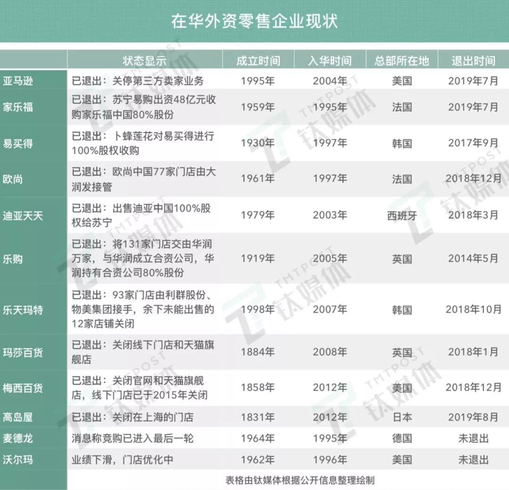

##正文

昨天，炙热的上海迎来了一波新的浪潮，新开业的大型商超Costco将周围三公里堵了个水泄不通，无数的消费者不得不通过步行完成的最后一公里。

而且，这还不算完，经历了停车三小时、结账两个小时的排队，令大家普遍觉得，逛个超市比逛迪士尼还辛苦。

而庞大的人流更是瘫痪了附近的交通，使得上海有关部门直接叫停了Costco的营业，第一天开业后的三个小时，就只出不进了.....

 

当然，得益于中国市场的火爆，Costco当日股价也刷新上市以来新高。于是，Costco在中国能否复制其在全球取得的成功，也成为了舆论热议的重点。

在政事堂看来，所有成功的背后，必然都是踩中了历史的进程，Costco能否在中国取得成功，在于他能否复制其美国成功的历史进程。

譬如从历史的角度来看，Costco和他的老对手山姆会员店，他们能够飞速发展的根源，并不是因为其做对了什么，而是因为苏联跨台了。

在上世纪80年代后期，由于美国最大的竞争对手苏联迅速衰败，不再成为美国的威胁，美国的资本家们也就不再需供养庞大的中产阶级并支付巨额的薪资。

这也使得80年代后期开始，美国的贫富差距迅速拉大，很多过着富庶生活的中产阶级无法再享受到高速的发展红利，不得不开始精打细算。

于是，像Costco和山姆会员店这些为代表的用牺牲部分时间，来换取更低价格的大型远郊商超得以迅速崛起。

所以，从宏观的层面上来看，随着中国在2016年开始了去杠杆，过去凭借着炒房炒股的大量中产阶层也同样无法再像过去那样躺着挣钱，必须要开始精打细算。

就像几年前在法国扫货的中国大妈们这两年开始销声匿迹，路虎捷豹等英国汽车被性价比超高的日系汽车吊打，整个中国的消费趋势都迎来了巨大的转变。

这也使得1996年就进入到中国市场，Costco最大的竞争对手山姆会员店，之前一直毫无起色，但是在2016年之后不仅财报漂亮，而且也开始了疯狂的战略扩张。

而这个疯狂扩张的背后，则是在2016年之后，山姆会员店在国内的竞争对手中，除了主打性价比的山姆会员和麦德龙之外，全部认输出局。

 

而且，考虑到一方面中国将全面开启城市化，将诞生庞大的中产阶级，而另一方面，中国过去两位数的高速增长已经成为了过去式，中产阶级将更关注性价比。

可以说，中国精打细算的中产阶层，未来还会大规模的增加。

所以呢，中国的那些财经媒体就不用去替Costco思考未来，这种全球顶级的超级巨头，获得政策信息以及对经济的预判，都远不是个人能够比拟的。

而且从历史的进程来看，Costco如果再晚入中国的话，中国市场庞大的红利，怕是市场都要被他的宿敌，山姆会员店全部抢到手中了。

所以呢，别看每迎接一个客户，Costco至少就得损失1000块钱，但是中国未来庞大精挑细算的中产阶级，能够让Costco再一次复制其美国取得的巨大成功，这次的造势是一个非常划算的买卖。

不过，虽然Costco的确站在了历史进程的风口之上，但是政事堂并认为他想完全复制其在美国的成功并不容易。

一方面，中国有着中国的国情，无论是之前的安利还是后面来的优步，都无法避免国内强大的“刷单”能力，最后不得不选择按照中国的模式来重新调整业务线，这需要花费大量的时间。
 
 

而另一方面，相比于中国正在大规模的推进城市化的历史进程，中国强推的数字化历史进程，相比则更为重要。

就像随着2009年，阿里巴巴推出双十一开始，全中国的线下零售业都开始了大幅的下滑，而随着阿里和腾讯在移动支付之后开始了线下电商的跑马圈地，国际电商巨头们如果没有与中国的电商巨头达成合作，基本上只有滚蛋的份儿了。

所以呢，绝大部分媒体都没有搞明白，Costco在中国的竞争对手不再是以家乐福之类的商超，而是在阿里系和腾迅系赋能下的线上电子商务与线下的结合体。

譬如Costco几乎可以说是零售业的蒙古铁骑，是无可比拟的存在，但就再厉害的蒙古铁骑遭遇到火枪技术成熟之后，不改进就必然会被历史所淘汰。

所以，就像Costco的老对手沃尔玛已经主动跟腾讯京东建立起了全面合作，未来Costco想要赶上中国的这一波红利，光靠赔钱卖茅台卖爱马仕是没用的，能否搭上中国的电商巨头才是他们在中国活下去的关键。

##留言区
 

