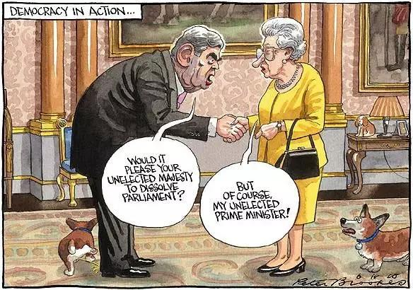

##正文

一个失去往日荣耀的庞大帝国，

一个年迈的老佛爷，

一个等待了多年继位的皇子，

一个不断更换首相的内阁，

一大笔赔偿等着支付，

一个不平等条约等着签字，

一大群民众在蠢蠢欲动......

嗯，这不是庚子年的大清帝国，而是如今的“大英帝国”。

而大英帝国今天又搞了一个大新闻。

刚刚上任的英国首相鲍里斯，在刚刚结束七国集团峰会之后，便在8月28日向女王提出请求，要求议会从9月第二周起休会直至10月14日，并获得了女王批准。

由于英国议会的暑假休到九月的第一周，此次休会意味着英国女王将被丞相大人“挟天子以令诸侯”，将议会被迫“解散”至脱欧协议的最后时刻之前。

因此，英国无协议脱欧几率大增，导致英镑应声暴跌，兑美元跌回到1.219。

而被首相胁迫的女王此次也是有苦说不出，由于英国脱欧的支持几乎是一半对一半，她的任何表态都是对一半的臣民的背叛，甚至在野的工党已经因此开始呼吁废除君主制了，但是也只能跟着首相一路走到黑。

而此时，将女王“绑架”了的首相鲍里斯更是没有了退路，必然要在脱欧的问题上死磕到底。

 

那么，接下来的局势会如何变化呢？

英国不同于很多上世纪才建国的现代国家，是有着漫长历史的，因此还要从历史说起。

虽说现代的三权分立、代议制等民主国家制度都是发源于大英帝国，但英国从上至下都没有像其他的民主国家那样，刻意追求过这些制度。

因为从历史的角度来看，如今英国的一系列制度，都是国王、贵族、资本家、教会、职业官僚、军队、中产阶级、工人、农民等英国所有的政治势力，通过一轮轮充斥着鲜血的政治博弈过程中得出来的。

甚至在博弈的过程中，连英王查理一世都被送上了断头台。

所以呢，英国的政治制度实际上是建立在一个极其复杂的平衡之上建立的，各股势力之间相互制衡，使得任何一股势力的过分强大，都会遭遇到其他各股势力的打压，也就使得任何一股势力都无法凌驾于其他势力。

譬如说，英国的两党制就像在中国历史上，皇帝几乎都会给太子（执政党）制造一个强大的竞争对手（在野党），而英国的三权分立，也与中国历史上外戚、太监、朝臣的分治有着异曲同工之妙。

因此，在这种漫长历史中形成的极其复杂的制衡之下，大英帝国的执政者们，往往都是一群擅长“装糊涂”的高手，来维系着各股力量之间的平衡。譬如，首相所有的行政命令，女皇都不会公开反对，而女皇有什么想法，派个人过去跟首相暗示一下，首相也会“了然”。
 
 

可是，这种数百年来建立的平衡与默契，随着此次首相鲍里斯动用女皇的权威压制对手而被直接打破了。

相比于美国这种历史很短，制度还是搬过来的国家，民众对于这种复杂的制衡系统很难理解。

而中国人民就不一样了，在我们漫长历史长河中，历朝历代都会形成一个制衡的系统，而制衡被破坏之后，中央的各股势力必然会开始肆无忌惮的权力争夺，而地方上的实权派也会磨拳擦掌寻求机会。

从秦朝的胡亥改诏，到西汉的王莽篡权，到东汉的外戚专政，再到晋朝的八王之乱，隋朝的杨广篡位，唐朝的安史之乱.......

几千年的历史经验告诉我们，一套复杂的制衡系统一旦被打破，政治家们的默契不再，那么各路野心家们都会挣脱束缚，参与到了权力的争夺当中，大家都会拼了命的借助外力来倾扎对方。

而借助的外力又会进一步的破坏系统的平衡，导致撕逼的进一步激烈，迫使所有的实权派都会主动或被动的参与其中。

所以呢，政事堂看来，虽然鲍里斯此举的出发点是好的，能排除掉国内的反对派，让欧盟成为唯一的对手，取得更好的谈判结果。

但是，英国的平衡体系已经经历了数百年，大量的问题都在一个个的补丁包中被化为无形。因此，一旦平衡被打破，潘多拉魔盒也随之打开。

所以未来，“七国之乱”、“八王之乱”、“九子夺嫡”等传统戏码搞不好就会在大英帝国上演，保守党和工党之间的党争必然会激化变成宋末明末的逢对方必反，甚至保守党内部也可能会出现巨大的分裂。

更悲剧的是，英国国内的各股势力也将蠢蠢欲动，苏格兰和北爱尔兰也会借助各种内部或外部的力量寻求独立，到之后联合王国可能面临的就是一场解体。

就像2016年前首相卡梅隆发起“脱欧”公投，把原本窝在精英层之间博弈的权力交出去之后，引发了巨大动荡，鲍里斯此次的豪赌，更将进一步割裂大英帝国的各股政治力量，造成局面的更加不可控。

最终，这个全球历史最悠久的搅屎棍，十有八九会被自己给搅成一锅粥，成为各路野心家争霸的舞台。

明年就是庚子年，留给老佛爷的时间已经不多了......

当然，“大英帝国”也不是没有出路，建议英国的政治家们赶紧学习东方传承下来的政治智慧，好好研究研究什么叫做“一国两制”。

具体的做法，早就写在了当年你们签字过的联合公报里面。

##留言区
 

