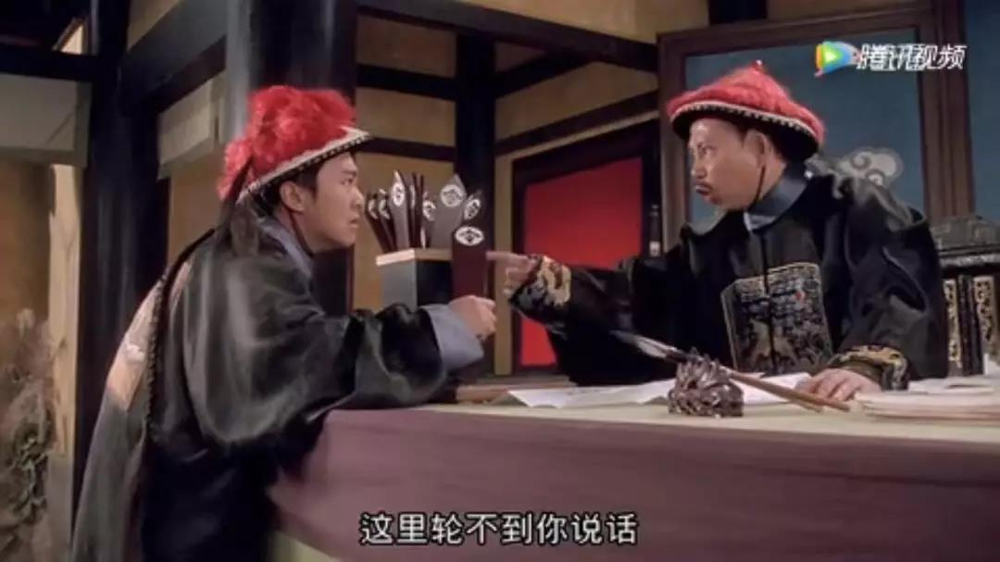
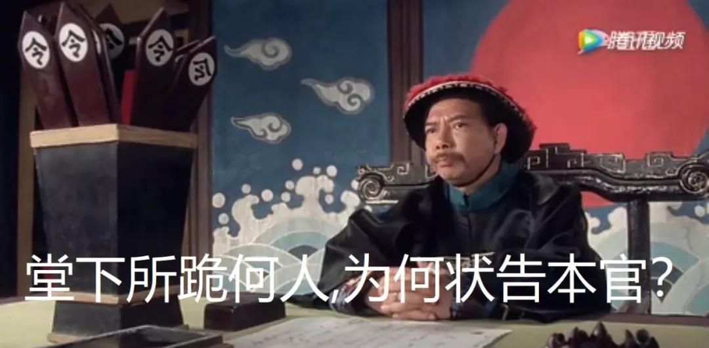

##正文

据彭博社昨日的报道，一群美国人找到特朗普，拿着一堆一百多年前清政府发行的债券，建议用这些债券作为贸易谈判的筹码来对中国施压。

其中一位基金管理者计算，考虑到通货膨胀、利息和赔偿费用，中国应支付超过1万亿美元.......

 

由于这新闻说的有板有眼，很多人都开始担心特朗普又有了新的筹码。

其实，这类官司在中美刚刚建交的时候已经打过了。

1911年5月20日，清政府以湖广铁路的名义，向英国汇丰、法国东方汇理、德国德华和美国花旗等银行借款600万英磅。借款以厘金和盐税为担保，年利5厘，半年付息一次。

不过随着1937年日本全面侵华，这笔债券变成了“次级债”，国民政府无力再偿付。

而随着1949年国民党政权跑到了台湾，大陆又执行了“打扫屋子再请客”的政策，这笔“次级债”又便成为了“纪念券”，只能在收藏家之间流通了。

 

直到1979年中美建交，一群拿着“纪念券”的美国人便跳了出来，对中华人民共和国提出起诉，要求偿还本息，美国地方法院竟还受理了此案。

1979年11月13日，美国地方法院向中华人民共和国发出传票，指名由中国外交部长收，限在20天内答辩，否则将“缺席判决”。

当然，中国政府怎么会搭理美国的一个地方法院呢？国务院直接照会美国，声明中国作为一个主权国家，根据国际法享有主权豁免，不受任何外国法院的管辖。

 

不过，拎不清事儿的美国地方法院还是开庭审理了这个案子，作出了“缺席判决”，要中国政府偿还原告4000多万美元。最后还声称，如果中国政府对判决置之不理，将扣押中国在美国的财产，以强制执行判决。

当然，这事儿就像“乌克兰提议取消俄罗斯在联合国的一票否决权，却被俄罗斯一票否决”那样，中国政府根本没搭理美国的地方法院，直接照会美国政府，表示如果美国无视国际法，强制扣押中国在美国的财产，那么中中方将保留采取相应措施的权利。

 

于是，“司法独立”的美国法院以“无权管辖”为由撤销了原来的判决，并“拒绝受理”相关案件，最终，本案以撤诉告终。

而美国政府对于此类诉讼不予支持的背后，是在中美刚刚建交之后，双方就进行了一系列的谈判，对相互冻结对方的巨额资产签订了协议，两国相互归还冻结的20多亿美元资产，并偿还中间的差额。

所以呢，1979年之前中美所有的债权债务，随着相互解冻资产，都已经一笔勾销，如果美国再有人追溯以往，那么中国作为回应也将追溯以往。

在这个原则之下，所有相关的起诉也都无法得到美国政府的支持，大量的案例都以起诉方失败而告终。

因此，这些满清时代遗留下来的债权，没有了实际的意义，也就只能成为收藏品，近年来在网上甚至都有大量的出售。

不过，骗子在哪个国家都是有的，就像国内每年都会打掉几十个以解冻在美国的“民族资产”为幌子的骗钱团体，这些诈骗团伙声称凑钱之后，便可以好向美国人讨债，从此大家都能过上奢华的生活。

同样，美国也有一大批人贩卖这种早已失效的“美国民族资产”，骗子们声称一旦凑齐了起诉者，那么大家就可以像中国政府起诉，从此衣食无忧......

于是，也就有了彭博新闻里面说的，那些被骗群众跑到了美国白宫找总统“上访”。

当然，不要嘲笑美国人，2008年中央某部位还曾收到一封快递，自称要向国家捐赠孙中山被封印的民族资产，甚至两年前还有数万老人在北京鸟巢体育馆，参加所谓“民族资产解冻大会”.......

不得不说，全球骗子的套路几乎是一模一样的.......

 

由于骗子实在是无法赶尽杀绝，以至于国内都有了“我，秦始皇，打钱”的梗。

所以呢，我们也不能怪特朗普被骗，毕竟当年连溥仪也都遭遇过这类诈骗，当年这位末代皇帝逊位之后，便收到了一封诈骗信，写信人自称是俄国沙皇，说他现在逃到美国，打算建立一个联盟来帮助溥仪......

因此，我倒是建议特朗普面对这一堆大清朝借的债券，也学“沙皇”写信给溥仪问问怎么赔偿，毕竟这些债券都是他退位之前借的。

只是不知道溥仪会不会给特朗普的托梦，让这位美国总统把八国联军侵华时的战争赔偿先给还了......

 

##留言区
 

