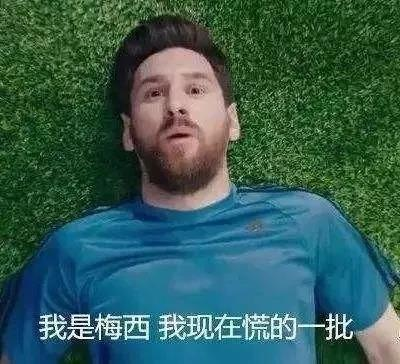

##正文

文：萧铁，顾子明

 
**A**

日前，蒙牛乳业发布了2019年的半年报，亮眼的数据与券商们的买入评级，一度令众多投资者认为股价将再创新高。

但中报披露的第二日，蒙牛股价却领跌蓝筹股，盘中一度深跌近9%，全日下跌5.83%收于31.50港元，创年内最大单日跌幅，次日，又一度暴跌5%以上，引发了市场的巨大恐慌。

说起来，蒙牛股价暴跌的原因很简单，营收和净利润虽然增加了，但其资金情况却反向而行，融资成本增加了42%，现金流减少35%，连负债率也提升了10个百分点。

财报的内容如此结构性相悖，意味着此次营收利润的大幅增长必然不可持续，香港市场上熟悉“套路”的各路资金们，便趁着半年报的利好便获利出逃了。

某种程度上来说，蒙牛也算是被资本市场教训了一次，割了一波的韭菜。

不过，对于蒙牛来说，再怎么被割，股价还是要想尽办法继续拉的，否则如何实现大规模的资本扩张呢？

而不进行资本扩张，又如何向资本市场兑现“双千亿”诺言呢？

 
**B**

2017年，蒙牛CEO卢敏放提出2020年实现双千亿（销售额破千亿、市值破千亿）目标。而截至2019年8月28日收盘，公司总市值已经约合1200亿人民币。

在蒙牛不断的资本扩张以及利好的刺激之下，“双千亿”里面，市值的三年之约早已完成，但承诺的营业额，似乎却有了困难。

从蒙牛2018年财报来看，其营收689.77亿，同比增14.7%。距离营收千亿还有300亿缺口，这就要求2019年、2020年双双实现超过20%的增速。

然而，就在冲刺双千亿目标的关键之年，蒙牛却刚刚宣布割弃优质资产君乐宝，抛舍百亿营收和一成净利润。

对，没错，一个能够独立上市、销售额近两百亿的乳液希望之星，被蒙牛卖了。

 
**C**

君乐宝作为蒙牛独立子公司的九年间，这些年发展势头非常之猛，营收从十亿元成功跨越百亿元大关。2018年其营收占蒙牛总营收的两成，净利润占一成左右。

据《国际金融报》引述业内人士“君乐宝2019年的销售额大概能有150亿元，2020年会达到约200亿元，如果顺利上市，那么这部分的股权估值就不止这么多了。51%股权给40亿，太廉价了。”

而且，相比于蒙牛近些年的资产收购来说，能够实现盈利和快速增长的君乐宝，是这一波收购公司中最优秀的。

更何况这不仅是放跑了一只会下金蛋的母鸡，从战略布局角度来看，君乐宝单飞可能会引发中国乳业格局的变化。

就在蒙牛卖君乐宝的时候，伊利正在收购困境之中的辉山，此消彼长之下，伊利和蒙牛之间的销售额差距将进一步拉大。

而就像现在主打价格优势的拼多多和COSTCO的火爆那样，在中国做生意，规模化摊平成本，用销量取胜才是硬道理。

蒙牛卖君乐宝，就像腾讯突然想要卖拼多多，不止意味着失去130亿元总营收，而是整个战略的失衡。

随着中国乳业逐步从各地的群雄逐鹿向产业化迈进，未来也很可能像各个领域中的互联网公司那样，行业老大活的滋润，老二勉强活着，老三以下半死不活。

如今国内市场上已经买不到像君乐宝这样的优质资产，等蒙牛转过脸想买君乐宝的时候，怕是130亿都买不回来。

 
**D**

哎，为什么中国乳业曾经战略上最优秀的公司，一定要“杀鸡取卵”呢？

此次蒙牛出手君乐宝有个特别的要求，是“以现金支付的方式”。

为什么要现金？因为急需花钱买赞助啊。

6月24日，可口可乐公司和蒙牛签署了奥林匹克历史上首个联合全球合作伙伴(JointTOP)协议，协议包含15亿美元赞助费，总费用高达30亿美元。

但是代价也是惨重的，30亿美元相当于蒙牛上市以来的净利润总和。

而且，蒙牛割肉君乐宝最重要的原因，很可能与母公司中粮集团的有关，毕竟中粮跟河北省政府有着巨大的合作，河北省希望这个金鸡蛋可以独立上市。

因此，这个背景之下，需要豪赌奥运的蒙牛为了打通可口可乐的关系，只能选择卖掉战略持股的君乐宝。

这个豪赌恐怕是很难合算，中国乳业在海外市场占有率极低，任何一家的成本都没办法跟欧美澳的大牧场相比，这个奥运，基本就等于是赞给国人看的。

而且，中国乳企通过砸广告谋销售的野蛮生长时代已经过去了，这次出手奥运会，效果不仅难以评估，还消耗了大量的现金资产，以至于要拿如此优质的资产换现金。

 
**E**

人们常说“君子爱财，取之有道”，其实更重要的是后面四个字“用之有方”。

在2012年到2018年5年期间，蒙牛战略并购频繁。从收购雅士利到多美滋中国，再到增持现代牧业、出手中国圣牧，有媒体称其收购行为是“饥不择食”，进而产生了接连亏损，使其业绩背上了沉重的负担。2018年，现代牧业亏损4.96亿元，中国圣牧则亏损22亿元。

一顿操作猛如虎，可见奥运赞助风波不是一时兴起，也算是惯性所致。

于是便有了蒙牛从二季度开始零售端的大力促销，这也使得今年的中报的确取得了很不错的成绩。

毕竟，通过财报的数据能把股价拉起来了，也就能够越过近期收紧的内保外贷等限制，从香港资本市场上融到资，以便于其推进海外的各种战略。

嗯，就在赞助奥运会后不到一个月，蒙牛募集了2024年到期的5亿美元债券。

 
**F**

相比于国内其他乳业企业把钱花在国内，蒙牛一贯是喜欢花US Dollar。

譬如之前世界杯期间，蒙牛签下梅西，并号称20亿用于世界杯营销。

只不过，那年的梅西“慌得一比”。

 

搞世界杯和梅西代言并没有什么问题，不过财报显示，蒙牛2018年研发费用仅为1.59亿元，都不够“梅西世界杯”的十分之一。

而与此同时，蒙牛宣称卖君乐宝的原因之一，就是君乐宝的研发开支太高了......

不知道蒙牛的管理层有没有想明白，正是君乐宝的高研发投入，才使得其近年来异军突起，在并没有大肆砸广告的情况下，于激烈的液态奶竞争中将国内所有的二线品牌甩在了身后。

这逻辑的背后，就像近年来亚马逊家乐福等外资品牌一个个被拼内功的本土品牌挤出局那样，中国的老百姓早就不觉得外国的月亮就是圆，随着信息的透明化，大家消费看的就是质量和性价比。

因此，最近两年我们能够直观地感受到，国内众多企业如今从代言人到品牌形象也都一个比一个的接地气。

可是，在现如今国际国内形势已然变化的大背景之下，蒙牛试图依然披着一副国际化外衣的策略，哎，搞不好就会重蹈那些洋品牌的覆辙。

昔日的荣光，未必意味着明日的朝阳。

##留言区
 

