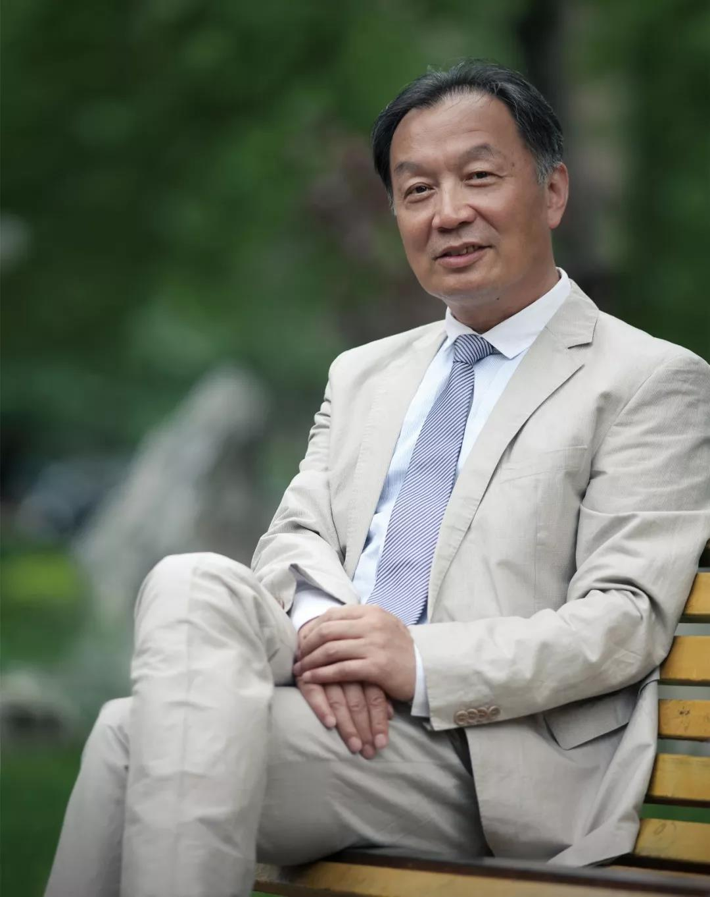

##正文

近期，美国挑起贸易争端和英国挑起脱欧，全球两大金融中心都在主动与国际秩序脱钩，代表着全球避险资金的30年美债收益率跌破了2%的心理关口，出现了长短期国债收益率曲线的历史性“倒挂”。
 
纵观全球经济史，二战结束美国称霸之后出现的七次美债长短期收益率倒挂，全球经济无一例外都遭遇了衰退。
 
而从经济周期的角度来看，美国的这一轮扩张已经连续40个季度保持正增长，成就了其历史上最长不间断经济扩张期。
 
月盈则亏，对此，掌握着全球最大对冲基金的达利欧日前公开表示，各国央行已无能力扭转即将到来的衰退，预计2020年美国大选前发生经济衰退的概率高达40%。
 
出来混，借的账总是要还的。
 
在这一场全球债务周期的末端，西方国家民粹主义带来的全球经济脱钩，不是我们能够改变的，资本主义的经济规律更不是我们能够打破的。
 
不过，与资本主义国家每逢经济危机必造成巨大伤害相比，中国的情况有着明显的不同。新中国成立以来，中央政府每一次都可以做到防患于未然，譬如从2015年开始，中国已经开始了漫长的去杠杆周期。
 
权威人士日前在重庆也表示，中国有“**充足的宏观政策工具，能够确保经济发展基本面的良好态势**”。
 
回顾最近半年多中央一系列的动作我们会发现，面对西方的降息潮与美国的贸易大棒，我们不仅没有跟着降息，甚至连房地产夜壶、5G基建与“家电汽车下乡”等众多手牌都还没有打出来.....
 
不打牌不代表没有政策，而是释放政策的时机并没有到来，无论是降息降准的货币政策，还是新旧基建的财政政策，这些引而不发的手牌，都是为了在危机真正爆发之际力挽狂澜。

 

至于如何力挽狂澜，资本主义发展这么多年，已经爆过了几十次的金融危机，西方的资本家们都有着非常成熟的解决方案。
 
就像2008年美国的那轮金融海啸，美国需要给美联储超发的货币，寻找一个巨大的蓄水池以暂时缓解危机，之后，再助推这个蓄水池高速发展经济，为超发的货币制造出对应的价值，最后，蓄水池的货币回流，美国经济回归正轨，经济开启一个新的周期。
 
看懂了这个周期，就会明白2008年的中国，就是那个蓄水池，凭借着美国资本的涌入和市场的开放，中国经济这十年来取得了巨大的发展，也与美国经济紧紧地绑定在了一起。
 
历史不会重演，但总是惊人的相似，上一轮经济危机十年之后，为了迎接下一轮的经济周期，已经成为全球第二大经济体的我们，也需要给自己寻找一个蓄水池。
 
很显然，全球已经找不到第二个开放的中国，未来最大的蓄水池只能是中国中西部广大的农村。
 
回顾我们从2017年开始的乡村振兴战略，到近期发改委推动大城市要大幅增加落户规模吸引农村人口，再到全国人大的《土地管理法》（修正案）通过，中央的这一系列战略，都代表着中国将通过对中西部村镇的开发，通过土地和劳动力流转释放的巨大红利，来应对未来的全球经济危机。
 
所以，对于我们中国人来说，应对未来随时可能会爆发的危机，不仅要尊重西方经济学的规律，更要考虑中国特殊的国情。
 
看惯了机械化大农场的美国经济学家们，不可能搞明白中国是如何利用小农经济走出危机的。
 
因此，**想要逃离危机，并抓住危机中的机遇实现跨越式的发展，只能把目光转回国内**。
 
而在中国，三农与经济问题相结合这个领域，研究最深入的，莫过于“三农问题”专家，师承杜润生老先生的温铁军教授。

 

温铁军老师创造性的提出：新中国成立以来，历次面对经济危机时，农村不仅像海绵一样吸纳了大量货币, 也像减压阀一样有效降低了全社会的通胀压力，最终，通过三农红利的释放，使得新中国度过了一次又一次的危机。
 
而自新中国成立以来，与本次危机最像的，莫过于建国之初那一次。当时，我们不仅要面对西方国家的封锁与经济脱钩，还要面对老蒋把外汇和贵金属全部带走之后，金圆券给国内留下的恶性通胀。
 
在那一场千年未有之大变局之中，我们的第一代领导集体并没有退却，他们挽狂澜于既倒，将货币引至农村，以大幅提升农村生产力的方式，不仅平复了那一轮危机实现了经济的软着陆，还借机建立起了强大的工业基础，最终实现了变“危”为“机”。
 
因此，政事堂认为，温铁军老师新近出版的最新作品——《去依附：中国化解第一次经济危机的真实经验》，将成为接下来应对危机、把握机遇过程中，最有价值的参考书之一。
 
该书全面剖析了第一代领导集体，是如何带领新中国打赢第一场也是最难的一场金融战役，保革命之果实，扶大厦之将倾的。

只有以史为鉴，方知初心何驻。
 
也许从这本书中，我们能探寻到杜润生老先生的弟子们关心困难群众的初心，也能找到我们应对危机，摆脱依附，迈向复兴的机会！

温铁军《去依附》，政事堂全网首发，京东商城9月9日统一发货。

《八次危机》：在人们通常的认识中，中国没有发生过经济危机，也不可能发生经济危机，最多只能算是经济波动，而不能算是危机。但温铁军教授认为，中国不仅发生过经济危机，而且中国自建国以来的七十年间，已经发生了至少8次经济危机，而这些危机均与国家工业化阶段性特征有关。
    
《八次危机》的主要观点是：“金融海啸”引发的全球危机，不仅是“金融化泡沫经济”所引起的，也是由“内含高成本上推”机制的西方现代政体在累积了大量的国家负债后产生的，因此中国人应引以为戒。只有复兴生态文明，维持乡土社会内部化来应对外部性风险的综合性合作与自治，才是中国免于重蹈负债过高的现代化危机的合理选择。

最后，感谢温铁军教授对政事堂读者的偏爱，亲笔签名新著作送给大家。

签名新著获取方式：
在留言区留下以下内容：写下您读过的温铁军教授的著作名称，并几句话推荐该著作。
我们会从留言中选出前50个内容相符的留言放出，其中点赞排前10位的读者，将获得温铁军教授亲笔签名《去依附》一本。
活动截止时间：2019年9月4日 10:00

##留言区
 无留言