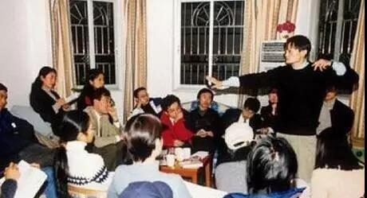
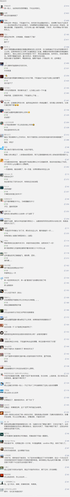

##正文

2012年1月7日下午，浦东国际会议中心三楼国际厅群星汇聚，主办方为了大造声势，不仅请来了前世贸谈判代表的龙永图，还搬来了两个月前刚刚卸任银监会主席的刘明康。

可怜大佬满席坐，不问苍生问鬼神，虽然现场大佬云集，不过聚会的话题很快就转移到了风水之上。

“风水坏了，命运也就坏了”，聚会的主讲人之一，证大投资的董事长戴老板对此侃侃而谈，甚至为了证明自己的论断，还搬出了那年因支付宝转移风波而被全球关注的马云。

 

按照戴老板的说法，

1998年之前，马云干啥都不行，可是自从买了那栋杭州湖畔花园202号的房子，好的风水让马云时来运转，开启了马不停蹄的扩张，也让他成为了中国互联网教父级的人物。

此后，相信风水的马云，更是将所有公司都注册在湖畔花园，并把湖畔花园的那间房子打造成为自己的创业纪念馆。

 

虽然马云真的相信风水，不过在这场上海金融大佬们的聚会上，戴老板如此调侃马云的背后，是因为湖畔小区，就是讲风水的戴老板自己开发的。

当然，戴老板醉翁之意不在风水，而在于地产，就在浦东国际会议中心一边谈着风水一边自夸的时候，他旗下的上海证大的土地储备已经成为了浦东数一数二的巨头了，与马云做邻居，也成为了戴老板浦东的别墅项目最好的广告语。

甚至就在聚会前不久，戴老板还以92.2亿元天价，拿下北邻老外滩，西接老城区，东望陆家嘴、南有世博会的外滩8-1地块，成为了中国新地王。这个记录，直到多年后才被新鸿基领衔的港资财阀联合体在徐家汇地块上所打破。

不过很可惜的是，2012年浦东的这一场聚会，似乎也是戴老板生命中的转折点。

在此之前，他是资本市场以及上海地界的风云人物，可以与刘明康、龙永图等超级大佬们坐在一列成为主讲嘉宾。

可之后，讲风水的他，财富就开始了一路的缩水，甚至就在几天前因非法集资，向警方投案自首。

搞了那么久风水的戴老板没把自己的风水搞好？也许，这要从很久之前说起。
 
 

戴老板名叫戴志康，出生于江苏海门，在离海门两百多公里的地方，戴志康还有一位远房叔叔。

也许是因为祖传的风水比较好，戴志康从很小就开启了开挂的人生，不同于隔壁马云当年的屡试不第，戴志康先是考入江苏省重点的海门中学，高考又进入了中国人民大学，更是在1985年进入中国“金融黄埔军校”——中国人民银行总行研究生部(五道口金融学院)学习。

在五道口学习期间，戴志康不仅结识一大批日后执掌中国经济牛耳的老师和校友，而且，他一边读着研究生，还跟着几个小兄弟们进入到刚刚成立的中信实业银行，他自己还被选中，出任行长办公室任秘书。

要知道，当时国家副主席的荣毅仁还兼任着中信银行的董事长，当时的中信银行可谓是群英汇聚。

换做一般人，肯定会留在中信积累资历和人脉，不过，戴志康并没有珍惜这个来之不易的机会，而是拉着几个中信的小伙伴一起跑到南海去创业。

当然，毫无经验的他撞了一头的包。

不过“风水好”的人生总是能遇到很多的贵人，1989年，戴志康的五道口校友到人行海南分行任行长，并兼任海南证券董事长。

很快，戴志康则被任命为海南证券的办公室主任。

两年后，在海南证券的孵化下，中国第一家公募基金出现在海南岛，而负责该基金的戴志康，从此也便成为了戴老板，这一年，他才刚刚28岁。

当然，年轻总是要付出代价的，刚刚在海南创业失败的戴老板很快又遇到了人生的第二次惨败，1993年股市大跌80%，公司募集的6000万资金赔了个精光，甚至还背负了两个亿的负债。

这种打击之下，很多人都会一蹶不振，但是戴老板很快就在校友们的帮助下重整旗鼓，回到上海成立了证大投资。并在一年后的“327国债事件”中赚的盆满钵满，得以东山再起。

每当回忆此事，戴老板总会津津乐道：“那时候管金生做空头，我们做多头，管金生一家输了几十个亿，培养了估计几百个几千个百万富翁。

其实，戴老板这一句话也把为什么哪一年管金生会输，这个困扰金融界多年的谜团解释到了精髓。

此后拿着从“327”中赚到的两千万，戴老板直接杠杆加到了两个亿，先后大肆炒作苏常柴和长虹。

就像多年以后搞地产的时候，不断用马云的风水来忽悠购房客和资本来接盘那样，那几年炒股的时候，戴老板利用媒体炒作，拉高之后轻松跑路，并在业界获得了“中国私募教父”的称号。

此后，有了资本的戴志康一路都踩在了历史进程之上，无论是1999年在互联网概念火爆前趁机埋伏网络概念股，还是2003年之前中国开启土地财政之前埋伏房地产，戴老板总能赶在政策前面，赚的盆满钵满。

当然，只要方向对了，疯狂的加杠杆并没有太大的风险，譬如用一个亿配上十个亿杀入资本市场，或者十个亿的土地用一个亿拿下来，别人看起来是富贵险中求，其实对于早已掌握政策走向的戴老板来说，这生意都是动脑子不流血。

就这样，到了2008年前后，戴老板也几乎站在了自己人生的最高点，他麾下的证大发展联合平安等金融机构成立多支信托投资计划，曾拿下新华人寿、西安国投、交通银行、上海银行、太平洋保险等金融企业的股份，一个超级的金控集团一度展露出雏形。

不过，就像俗话说的，风水轮流转。

过去，总有高手能给戴老板的投资指点一二，甚至戴老板想要融资也总有很多人会送上门来，可是到了2012年左右，戴老板的风水开始变差了，他在金融圈的人脉也不那么好使了。

就像外滩8-1地块项目中，戴老板原本试图用10亿的自有资金来撬动这个200亿的项目，可是项目刚启动，买地的第二笔银行贷款就出了篓子，迫使戴老板每天不得不交460万的滞纳金，并最终将这个地块挥泪出让。

而且，不仅很难再向金融机构融到钱，战略方面戴老板更是错误频出。

2013年开始戴老板将重心转移至南非，放出豪言，公司要投资80-100亿美元，“建设成南非的陆家嘴”，不过，曾经对资本市场极度灵敏的戴老板成功的错过了14-15年的那一波大牛市。

而到了2015年，认为“房地产对我而言已经不重要了”的戴老板，将旗下的房地产公司按照半价悉数出让，又再一次成功的错过了16-17年的那一波地产行情。

而从股市和房地产全面退出的戴老板，2016年开始全心全意搞互联网金融P2P，号称要为人民服务，并放言“没有涨百倍不算成功”。

可是到了2018年，随着国家严厉打击金融犯罪，P2P出现大规模的雷暴潮，终于，硬撑了一年之后，曾经在中国资本市场上风光无限的戴老板，选择了主动投案自首，嗯，待偿资金近200亿......这意味着戴老板没机会东山再起了。

近年来，刘汉、陈树隆、戴志康等在当年“327”国债中的赢家们一个个的栽了，每逢他们中的一人的陨落，“327国债诅咒”的说法便会被翻出来再次热议。

对此，政事堂觉得，这个“诅咒”有可能还会继续，戴老板们研究风水并没有错，因为他们的陨落还真就是一个风水问题。

准确说，这叫做“风水轮流转”。

##留言区
 

