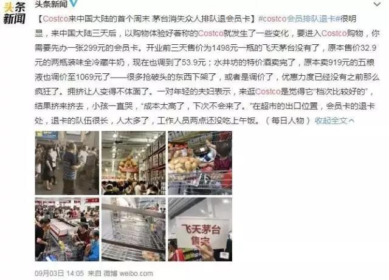

##正文

一周前，随着COSTCO进入上海引发的抢购狂潮，国内无数媒体都在热炒COSTCO先进的管理和供应链，认为其入华之后必然势不可挡。

一周后，还是这帮媒体，看着被中国消费者玩残的COSTCO被大规模的退货和退办会员卡，又开始了冷嘲热讽，认为上海人把Costco玩坏了，仿佛COSTCO又得灰溜溜的退出中国。

 

用百度搜一下COSTCO就会发现，今天一群对商业皮毛都没摸到的键盘侠们，好为人师般的指点一家几十年来在零售方面一骑绝尘的超级巨头，告诉人家要好好反思.......

大概，这就像田间的老农民聚在一起讨论皇上早饭吃窝头会更健康。

说起来，零售业至少是持续几十年的大买卖，COSTCO作为全球零售业的巨头，人家在大陆开的第一家店，这点事儿能不实现想明白么？人家每年几千万的咨询费难道都是打水漂？

零售业拼的是规模化效应，说白了就是要向苏宁国美那样，近乎于垄断的规模才有对供应链的溢价，别看COSTCO那几天茅台啥的卖得便宜，但他的进货价很可能高的离谱，就他的那点进货量，那有几个供应商能给他大折扣？

可以预见的是，COSTCO的第一家店很长一段时间都无法盈利，因此，人家前几天卖的那么便宜不是为了揽客，而是为了打响自家的品牌，让更多的消费者和供应商们熟悉自己。

算一下账就会明白，COSTCO开业前几天，由于销售时间被控制，每天也就接待万人左右，而平均每个消费者顶多也就薅几百块钱的羊毛，满打满算，COSTCO一天被薅的羊毛也就几百万。

而这几百万，带动了众多少媒体免费给他打广告啊，主流媒体帮着把他当各种先进理念炒了一个遍，可以说几乎中国大部分的中产群体，都被盯着他们的COSTCO刷了屏。

如果单纯看效果来说，看着COSTCO靠着几天的补贴就搞得全国人民耳熟能详，甚至还上了央视，恐怕烧了几十个亿的瑞幸都要自愧不如。

算一下，COSTCO如果想要让一群中产阶级用工作时间来排队，这成本得多高？搞几个折扣的爱马仕包意思意思就得了，真要是敞开了卖，上海庞大的中产阶级能把COSTCO搞吐血。

相反，COSTCO通过折扣，让那些一天劳动价值小于一千块钱的群体为了贪小便宜挤破头去排队，用低成本搞起来自家产品便宜服务号的知名度，这才是人家的套路。

或者说得更直白一点，这就跟每逢有些品牌的新手机发布之际，全国到处雇人去专卖店门口排成一条长龙是一个道理，就是为了造势宣传嘛。

而且，COSTCO这招比雇人排队的效果更好。

COSTCO的目标群体是中产阶级，而那些排队退卡的小市民恰恰都是要极力剔除的群体，由于办卡需要身份验证，实际上所有办卡又退卡的人，都上了COSTCO的“黑名单”，如果两次退卡，COSTCO可以很开心的将他们终生禁入。

可以说，这种在目标群体还没大规模进入的开业前，搞了这么一波“一网打尽”，让他们以后不用再来，能够极大的降低日后的运维成本，还能提升消费体验。

而且，某种程度上来说，无论是退卡还是退吃了一半的商品，也都是一个非常有价值的大数据，甚至未来有一天如果COSTCO跟阿里等巨头的消费和金融数据打通，不仅会员名单有价值，这份“黑名单”搞不好还能是谈判桌上一个小小的筹码。

所以呢，当你以为薅人家羊毛的时候，人家也在把你当做一个廉价的筹码。侬以为上海人把Costco玩坏了？其实Costco也在玩上海人！

##留言区
 

