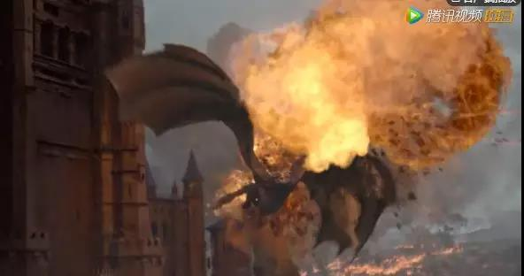
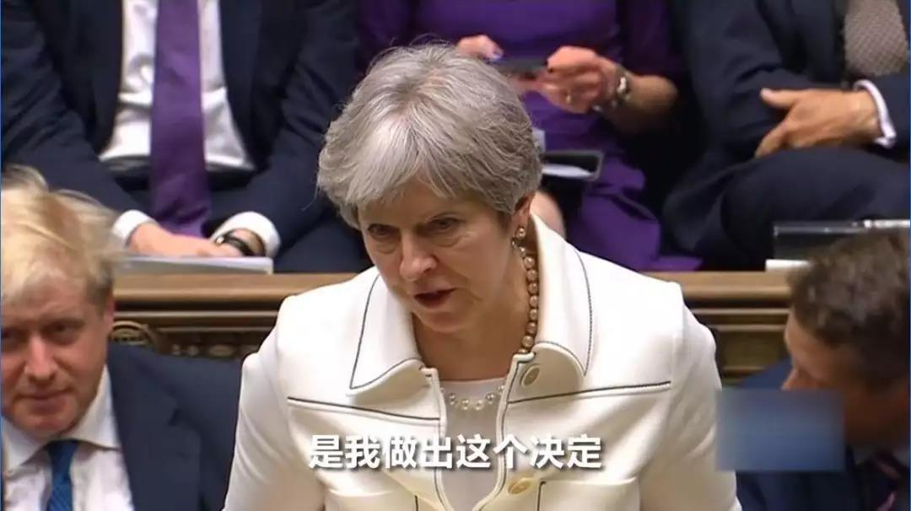
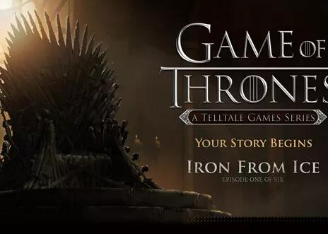
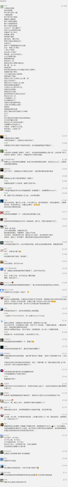

##正文

 

随着今年HBO大戏《权力的游戏》终结，很多影迷心里都空落落的，纷纷建议HBO继续把这部戏拍下去。

虽然观众们的热切希望无法被满足，不过一场现实版《权利的游戏》已经在其发源地展开，各方力量角逐之下的英国脱欧即将步入高潮。

说起来，《权力的游戏》的故事背景本就取自于英国历史上的玫瑰战争，爵位、制度、称呼，城堡、骑士、剑术……这些都具有深刻的英国中世纪痕迹。

甚至马丁老爷子连地图都懒得改，维斯特里大陆更是直接由大不列颠与爱尔兰拼接而成。

 

到了精益求精的HBO那里，不仅演员几乎都选用了英联邦国家成员，甚至几个主演的出生地和历史都完全一致。

譬如北部凛冬城Stark家族的艾德·史塔克，演员肖恩·宾就是来自英格兰北部的York郡，哥们说话几乎都不张嘴，靠鼻腔里的轰鸣散发着超强的英雄气概。

 

而西部的凯岩城Lannister家族的泰温兰尼斯特，演员查尔斯·丹斯来自英格兰西部，这位喊着“Long live the King”的老爷子则操持着Lancaster的一口英国上流社会的官腔。

 

至于绝境长城以北，那个跟雪诺啪啪啪然后现实中结婚的女野人，其演员 罗斯·莱斯利更是出生在哈德良长城以北，拥有祖传城堡的苏格兰贵族，人家现实中也是操持着一口地道的苏格兰小舌音。

 

其实，马丁大爷也不是凭空建设的维斯特洛，他不过是将诺曼入侵之后的英国各股势力换了一个名字，至于狼家和狮家的大战，也不过是玫瑰战争的两个家族改了改，把York改成了Stark，Lancaster改成了Lannister.....

至于英格兰以外，老爷子就戴着有色眼镜，把苏格兰写成了茹毛饮血的北方野人，把骑兵实力强悍的法国人变成了海峡对岸骑着马的蛮族......

而《权利的游戏》背后的政治观同样也是借鉴了英国历史上的血腥的宫斗，连续剧从第一季开始就是不断的背叛，甚至最后即将登顶的塔格利安家族，也遭遇了一个接着一个的背叛，从情报总管，到国王之手，最后更是死在了爱人的手里。

所以呢，用《权利的游戏》世界观来看待英国，就会发现英国政治的背后，也是背叛、背叛、再背叛........

就像英国首相鲍里斯约翰逊，在过去的24小时之内，就连续遭遇了三次背叛。

本来呢，面对脱欧扯了三年皮的议会，约翰逊决定利用女王的权力将议会休会，拖到10月17日，这样自己可以直接出席欧盟峰会，谈出新的“脱欧”协议。

可是，被政府夺了权的议会并没有坐以待毙，而是迅速开启了反击，他们发起的“让议会接管政府事务”的投票。

而投票还没开始，约翰逊就遭遇了他首相任上的第一次背叛。

当约翰逊与工党领袖科尔宾拉开阵仗，激烈辩论之际，保守党议员菲利普·李从保守党的席位走出来，在自民党议员们的起立欢迎之下，坐到了自民党领袖乔·斯温森的身边。

如此在议会上公开的“叛党”行为，在英国历史上都没见过，而没有心理准备的约翰逊更是吃惊得说话都结巴了。

而这次的叛党意义也是非常大的，在刚刚结束的补选后，保守党与盟友北爱民主联盟共有320个下议院席位，也就是在总共639个席位中，执政党仅有一席的优势。

随着菲利普·李的背叛，约翰逊正式丢失了议会的多数，这不仅意味着脱欧问题将更加艰难，更重要的是，丧失下议院支持的约翰逊将和去年丢了众议院的特朗普一样成为破脚鸭，在其他国内重大事宜上也将丧失决定权。

甚至那些看到党魁没有足够支持的保守党议员们，更会树倒猢狲散，在投票的时候开始谋求自身的利益。

就在被当众打脸之后，很快约翰逊又遭遇了第二次背叛。

在接下来反对党提出的正式投票中，又有一群保守党队友背叛了首相，选择“让议会接管政府事务”。

按照英国的选举制度，下议院的多数党党魁将被任命为首相，以此来代表多数党的意志，因此，多数党的党魁必然也会拥有议会的控制权。

因此，反对党想要靠投票让议会从政府手中夺权的难度，有点类似于乌克兰想要取消俄罗斯的一票否决权，只要执政党自己不放弃，根本没机会实现。

所以呢，为了防止内部出叛徒，9月1日，约翰逊就让党鞭办公室发出警告，如果有人投票赞成，那么就会遭遇被永久开除党籍这种最严厉的惩罚。

而9月2日，不放心党鞭工作的约翰逊更是放下了手头工作，逐一拜访那些党内“摇摆”的议员，来确保他们不会投出赞成票。

可是就在投票现场，令约翰逊无法想象的是，竟然有21名保守党党员“跳反”，其中包括前财政大臣哈蒙德，前司法大臣高克、前国际事务大臣斯图尔特、"下议院之父”的前财政大臣克拉克以及丘吉尔的外孙索姆斯。

索姆斯的背叛，可以说对约翰逊来说是一个致命的打击，作为丘吉尔的狂热粉丝，甚至为这位“最伟大的政治家”写过传记的约翰逊，没想到在关键时刻竟然被自己的老朋友，丘吉尔的孙子给阴了。

 

于是，被“背叛”激怒的约翰逊直接喊出了Fire them all。

 

除了菲利普·李是自己叛党之外，约翰逊将跳反的21名保守党党员悉数开除出党，并随即宣布将启动新的议会选举。

由于英国的竞选制度，使得缺乏党内支持的独立竞选人很难被选上来，因此约翰逊此举是想将这些造反的党员们剔除后，利用自己激增的支持率以补充支持自己的党员。

不过约翰逊却没有想到，自己能在24小时之内遭遇第三次背叛。

之前之前信誓旦旦向各大媒体表示强烈要求重新选举，并自诩已经为大选做好了准备的工党领袖科尔宾，作为之前一起收拾梅姨的盟友，此时却背叛了他的誓言，也成为了英国历史上第一个拒绝大选的反对党领导人。

在科尔宾的强制要求下，第二天多数工党议员离席未参与投票，最终，约翰逊的提前选举提议遭到否决，距离三分之二的同意门槛.......差了136票。

此次重启选举的失败，对于约翰逊来说不仅仅是没办法惩罚“叛党分子”，更可怕的是，这些被约翰逊开除的21名保守党党员不仅不会离开议会，还将成为接下来约翰逊提案中坚定的反对者。

而且，这些叛党大部分都是保守党的资深建制派老党员，在党内有着非常深厚的关系网，他们只是第一波跳反的先头部队，后面还有大量此时没跳的保守党建制派议员在等着看约翰逊的笑话，并等着适时给出致命一击。

 

而且约翰逊的对头不仅仅在党内，工党的科尔宾之所以放弃了梦寐以求的重新大选，还不对自己的老对手保守党建制派们痛下杀手，也是有着自己的小九九。

目前约翰逊支持率太高，重新选举工党的胜算不大，而科尔宾如果联合保守党的建制派，则有机会对约翰逊政府发起不信任投票，若投票通过，他作为反对党领袖将自动成为“看守首相”。

可以预见的是，无论是希望与欧盟达成协议的保守党建制派，还是希望留在欧洲的工党，都跟欧盟有着相当顺畅的秘密联络方式，因此无论约翰逊国内能否达成一致，两周后到了布鲁塞尔的鸿门宴上也必然是凶多吉少。

更不要说这些造反的保守党建制派，他们敢于顶着被永久开除党籍的惩罚倒戈，必然是胸有成竹能将约翰逊搬倒，到时候新的党魁会再将他们隆重迎接回保守党。

所以，面对欧盟、工党、保守党建制派的联合围剿，接下来的约翰逊可谓是九死一生，搞不好就会成为英国历史上任期最短的首相。

而约翰逊的求生之路，恐怕就是跟他的好基友特朗普一样，不顾后果发动英国人民的力量，彻底打乱英国各股势力几百年以来建立的平衡。

到时候，各路野心家们都会为了至高无上的权力相互下黑手，背叛与复仇将成为主旋律，铁王座的争夺，将会让大英帝国迎来一场史诗般的“权利游戏”。

 

##留言区
 

