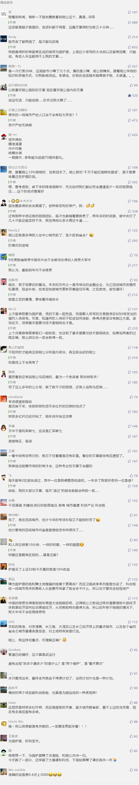

##正文

 

久旱逢甘霖，央妈终于降准了！

刚刚，央行宣布，于2019年9月16日全面下调金融机构存款准备金率0.5个百分点，此次释放资金约9000亿，其中全面降准约8000亿，定向降准约1000亿。

这一轮久违的全面降准，让无数行业的从业人员都为之振奋。

当然，他们高兴的也有点晚，毕竟在中国很多的政策都是可以“预期”的，本周沪指在预期的刺激之下实现了五连涨，差一点点就收复了3000点的大关........

那么，这次降准究竟会有多大的影响呢？

首先，要从国际的大气候来看，由于国际贸易纷争以及特朗普对美联储的施压，导致全球主要央行利率几乎全部进入了降息周期，全球央妈年内已累计降息32次。

而且，从货币掉期市场走势来看，全球的降息之路还远没有看到头。

 

但是，中国央行的“逆行”却也摆明了态度，宁可汇率破七，被美国列为汇率操纵，也不开启降息。

考虑到本月美联储有可能在特朗普的压力下继续降息，因此，从国际大周期来看，中国的降准，本质上是应对**全球降息潮的一种对冲**。

因此，中央的“**以降准换降息**”策略，意味着这一轮的调整中，**对存量经济是打击，对增量经济是促进**。

这里面举一个例子，以恒大碧桂园为代表的宇宙级地产商，“以降准换降息”之下，其庞大的存量贷款无法享受到全球化降息带来的红利，但是却可以在其造车和机器人等新领域，获取到更多的融资，甚至可以反哺地产。

其次，从国内的小气候来看，政事堂在之前的文章中解释过，我们在今年年初的时候，就把半年的财政弹药几乎都打了出去。

因此，我们再看9月4日的国务院常务会议，其中就重点提到了“加快地方政府专项债券发行”，“按规定提前下达明年专项债部分新增额度”。

其实，今天央行公布的降准，其实也是两天前国务院常务会议的重要组成部分。

因此，从国家财政的整体角度，就能更好的理解本轮降准。

一方面，专项债是不列入赤字预算的，可以是财政政策的预备队，另一方面，以万亿计的专项债是需要以银行为代表的金融机构进行大规模购入。

因此，考虑到金融机构都是有风控的，临近年底释放出来的“预算外”贷款余额，最保险的方式，就是窗口指导之下购买专项债。

也就是说，**中国稳健货币政策取向没有改变，降准的货币政策，不过是在推动专项债这个积极的财政政策，并为其提供弹药。**

考虑到货币化棚改和PPP基本都已走向终结，因此，从国内的角度来看，本轮降准是在“财政去杠杆”周期之下，**对年底财政投入剧烈下滑的对冲**，是“**以货币政策换财政政策**”。

而由于本轮的专项债限制投向土储而鼓励投向基建，因此本轮的降准，对**城市基建类是促进，对土地财政类是打击。**

这里也举一个例子，除了像菏泽等提前抢跑的之外，很多三线城市接下来由于棚改专项债被叫停，将会非常苦逼，反而很多一二线城市接下来又可以借债大搞“铁公鸡”拉动经济。

好了，看完国际国内的两个气候，我们最后再从微观的角度来看。

一方面，本轮降准是要对冲今年9月中旬的税期，另一方面，在包商银行事件后，各城市银行开始出现困难。

本次9月16日降准之后，配合的城市银行定向降准的时间点分别为10月15日和11月15日，很显然,中央并非是想要来猛药的刺激，而是希望逐步释放，并顺便缓解城市银行的问题。

而且，本轮降准的时间基本就是定在国庆前后，还要经历一轮重要的经贸谈判以及例行的“极限施压”。

所以呢，那些以为降准就是大放水的，还是要醒一醒，毕竟**这轮降准的本质，是对一系列因素的被动对冲**，大家千万不要犯周期性的错误。

当然，无论如何，本轮降准还是要释放出了大量的货币，只不过中央锁死了流向，导致了降准过程中的“**此消彼长**”。

譬如锁死了银行、信托等融资渠道的房地产，在这轮降准中除了少数强势的强龙和地头蛇之外，享受到红利只能是微乎其微。

而这一轮降准推出来的专项债禁止进入土地储备和棚改，这意味着中国两大货币的储水池中，房地产基本已经被掐死了，因此，本轮降准受益最大的自然就是股市。

对此，我们也能发现，从上一轮特朗普放炮以来，为国护盘的兄弟们拿到10%以上的受益并不难。

而随着降准政策的逐步落实，接下来释放的货币也会为以券商为代表的金融机构们提供弹药，好继续为科技产业与科创板站台，毕竟还有不少科创企业都在排着队等IPO。

而从区域的维度来看，本轮降准和专项债的指向性都非常明确，就是**配合中央的大城市以及重点区域的发展战略**。

所以，还在玩土地财政的三线以下城市将很难享受到这一轮降准的红利，而本轮最主要的受益者将是**京津冀、长三角、大湾区以及长江经济带上的重点城市，以及各个省的省会。**

随着国家大规模启动专项债和专项基建，降准释放出来的流动性很快会向中心城市汇聚，以铁公机为代表的城市基建及其配套领域，将成为新一轮城市发展的助推剂。

##留言区
 

