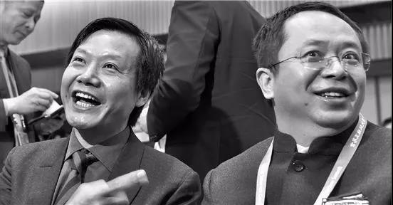
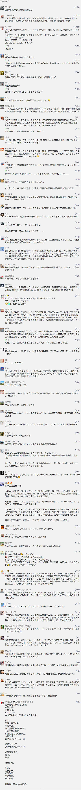

##正文

今天，是“杂交水稻之父”袁隆平老先生农历90岁高寿，对这位长沙过生日的“90后”，各大主流媒体纷纷献上了诚挚祝福。

不过，祝福之中偶尔也掺杂了一些不和谐的声音，不少相关领域的专业人士从各个领域论证袁隆平老先生并没有那么“伟大”，甚至宣称其不配称为“杂交水稻之父”。

看到这些，政事堂不禁愤然，于是今天就撰文一篇，解释一下袁隆平老先生为什么堪称伟大，以及我们为什么要着重宣传他。

面对科学家，自然就要从科学的角度先说起。

由于学科的不同，文科和理科是可以单兵作战的，就像达芬奇、莎士比亚或者牛顿、爱因斯坦，这些搞理论的大佬，靠一己之力就可以流传百世。

但是工程领域不一样，这里需要数以千万计的人一起为之奋斗。

就像中国第一艘航母的故事，苏联解体后，俄罗斯总理在乌克兰总理的陪同下来到黑海造船厂，研究把“瓦良格”建造完毕交付俄罗斯。

而此时厂长马卡洛夫此时报告道：“瓦良格不可能再完工了……”

“建造瓦良格需要苏联、党中央、国家计划委员会、军事工业委员会和九个国防工业部、600个相关专业、8000家配套厂家，总之需要一个伟大的国家才能完成它，但这个强国已不复存在了......”

同样，满足中国14亿人口的粮食事业也是一个极其庞大系统工程，就像毛泽东同志提出的“农业八字宪法”（土、肥、水、种、密、保、管、工），“八字”就像一个经典的水桶理论，以上各项缺一不可。

其中，钢筋水泥的大规模水利设施建设，引进西方的化肥生产线，农药的大规模的普及，以及农用机械化的大规模使用，从效率来看，都比育种要重要，准确来说，完成工业化才是新中国粮食产量大幅提升的关键。

 

而且，新中国成立以来也不仅仅是袁隆平先生一个人在奋战。

当年从中央到各省市上百个农科院团队都在进行研究，甚至由于中国幅员辽阔，每个地方种植的光水温肥的程度都各不相同，目前全国各地使用的杂交水稻当中，袁隆平先生团队的育种也不是主流。

因此，目前国内的主流舆论把中国粮食增产的功劳都归结于袁隆平老先生一个人的头上，不仅让不少农业科技团队感到委屈，甚至化肥、农药、水利等农业相关从业者，也会觉得不满。

那么，为什么国家还要大书特书袁隆平老先生呢？

首先，我们要明白，中国政府和人民身上最重要的使命，就是实现民族复兴，而发展现代化农业，是中国实现富强的必经之路。

纵观历史，无论是建国之初农业效率提升，为工业化提供了原始资本积累，还是改革开放期间，农业提升释放的劳动力和土地带动的生产要素流动，甚至是今年中央确定的推动大城市与城市群化，都需要现代化的农业来释放人口红利与土地红利。

因此，为了加速推动农业的现代化，按照中国几千年以来的传统，政府就必须要在农业上树立一个典型。

而很遗憾的是，作为一个后发展国家，看着以色列的滴灌和美国的飞机，无论是农药、化肥还是装备、机械.......中国的农业在工业化领域，距离西方还有很大的差距。

就像中国不会用国足来给自己代言那样，在这些尚且落后的工业化领域，我们并不适合树立典型，否则必然会遭遇到大量的抨击。

因此，我们自然就要打“不对称战争”，利用中国育种领域的优势来大书特书。

同样，就像在当年冷战时代，虽然国防事业是一项更复杂的系统性工程，但是我们并没有大力宣传西方占据优势的坦克或者飞机工程师，而是宣传了原子弹的邓稼先和导弹的钱学森。

而这也不仅仅是因为相对优势，在农业产业链中，中国虽然只有育种拥有相对优势，但是却可以像当年的两弹一星一样，作为共和国的战略防卫武器。

由于以袁老为代表的中国育种打破了西方的垄断，甚至逼得西方不得不来购买和交换专利，使得西方的粮食禁运不再能成为国际博弈的重要筹码，甚至还可以大幅压低各类粮食与化肥农药的进口价格。

更重要的是，国家树立袁老这个典型更是可以带动各类资源向农业科技倾斜。

譬如当年钱学森和邓稼先被树立为典型之后，整个国防科工的资源便开始向他们倾斜，而正是这些倾斜，缔造了令宵小闻风丧胆的“东风快递”，让那些不服的人愿意坐下来听我们讲真理。

 

同样，陈景润的哥德巴赫猜想和华罗庚的多复变函数论，虽然在国际上地位没有那么显著，但正是他们的榜样带动作用，让无数苦研数学物理比拼奥赛的70、80后们，成为了启动中国互联网时代最坚定的基石。

 

所以呢，国家大力宣传袁隆平老的背后，也是要推动更多的资本和人才向农业科技领域涌入，让老先生成为国家政策和意志的代言人。

那么，中国育种领域有很多牛人，为什么要单独宣传一个袁隆平，而不宣传团队呢？

就像网上挺火的一个段子，世界十大高峰中，绝大部分人都只能记住珠穆朗玛，人的记忆力是有限的，对于任何一个组织，绝大部分的民众都会不自觉的将其拟人化的看做一个人。

而且，在民众的思维里面，这个人身上的缺点，也会强化到整个组织身上，而这个人身上的优点，更会使得整个组织都备受荣光。

如今，随着中国的杂交水稻种子在东南亚开始了大规模的种植，甚至迪拜作为阿拉伯国家的先行者也采用了“海水稻”，可以说，杂交水稻已经成为了中国在一带一路上的急先锋。

就像开创了中美关系的基辛格博士说的，谁控制了石油，谁就控制了所有国家;谁控制了粮食，谁就控制了人类;谁掌握了货币发行权，谁就掌握了世界。

如今人民币石油已经开始启动，中国的粮食战略也是大国崛起的必经之路，要与大量的国家进行合作甚至一体化。

因此，我们的农业在全球领域需要一个形象，来为中国代言。

而这个形象，又必须要人格化的固定在一个人的身上。

就像青蒿素是屠呦呦团队完成的，但是我们只会重点宣传解救了数百万非洲人生命的屠呦呦那样，为东南亚数亿人口提供了解决粮食和生命问题的中国杂交水稻，也需要人格化的落在袁老的身上。

只有这样，才会像当年加拿大那样，依靠为人民服务的白求恩成为中国人民最信赖的国家，未来通过杂交水稻的普及与宣传，我们会让一带一路上的十几亿的民众认可中国，由衷的喜欢中国，争取民心。

而这个时候，袁老个人的品质就尤为重要了，因为在一带一路的宣传过程中，他的点点滴滴都会被无限的放大。

就像美国的意识形态大片《复仇者联盟》中，英雄虽然很多，但是占据C位的却是美国队长和钢铁侠，美国人需要用他俩向全世界宣扬美国的精神与科技是守卫全世界最坚强的后盾。

 

同样，在未来一带一路的建设过程中，中国也需要像袁隆平、屠呦呦这些能够展现中国人朴质、勤奋以及爱好和平的“中国队长”。

所以，历史选择了袁隆平。

因为人民的心目中，都是有英雄情节的，而这些超级英雄们身上任何的缺点，在镁光灯之下都会被无限放大的。

就像很多网民一方面在抱怨国家给科研人员的待遇过低，另一方面看到专家们过上了富裕的生活都开始了无尽的谩骂，譬如随着袁隆平很多生活照片的公开，不少网友就曾在抨击袁隆平开车住别墅。

但实际上，袁老从开始研究杂交水稻开始，一生80%的时间，就都是在田间度过的。吃喝拉撒睡，不超过方圆五里，过着苦行僧般的生活。

由于整天都呆在田间接受暴晒，不仅皮肤晒得黝黑，还经常因为中暑而昏倒在了稻田里，熟悉他的人都知道，袁隆平身边，常备仁丹丸或者消凉片。

中暑了就吃几颗，走累了就席地而坐歇一歇，他的腿上全是在稻田穿梭后，被蚊虫叮咬的痕迹。

 

对此，身边的人都在劝他，你已经是杂交水稻之父，国内顶级科学家，这种小事让助手去做就可以了！

但是这位八十多岁的依然没有选择国家给予他的福利，早过了退休年龄的他依然奋战在一线田间。穿着十几块钱的衬衫，戴着几百块钱的手表，开着十万元左右的国产车穿越在田间。

甚至，连国家送给他个人的别墅，都被他改造成为了科研团队的办公室，在这里他带领团队，继续攻坚。

 

人生七十古来稀，在年已九十的袁老的带领下，去年，团队迪拜的沙漠海水稻取得成功并，将在中东北非推广，成为中阿合作的基石。对此，兴奋的迪拜酋长将稻谷作为未来的阿联酋“国礼”以赠友人。

而今年，即使在袁老的生日这一天，在湖南的他依然坚持不过生日不做寿，全力备战，为了就是兑现他曾经许下的诺言，实现一片大范围亩产1200公斤的稻田。
 
 

写到这里，我想说，袁老的伟大，不在于多产了多少粮食，也不在于多养活了多少人，而是他那可以传承和发扬的精神，一个真正的中国人精神。

自古以来这些埋头苦干，拼命硬干的人，就是咱们中国人的脊梁！

袁老，祝您生日快乐！梦想成真！

##留言区
 

