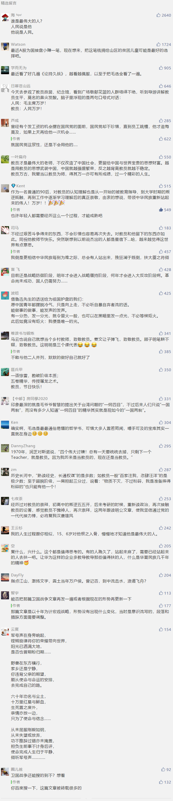

##正文

>...德国的希特勒上台之后，苏德必有一战....那么，在美国的“普特勒”上台之后...

>...所以德国必须在负债到期前发动战争，只有这样...才能实现德意志帝国的“Great Again”...

>《即将到来！伟大的经济卫国战争》 by 顾子明 2017年

相信很多老读者都会记得，2017年下半年我写的《卫国战争》系列，这篇以游戏为引子的文章，不仅解释了过去的一些事情，也提前半年预测了特朗普掀起的中美贸易战。

记得我写文章的那个时候，主流的经济学家们都认为2018年将是一个大牛市，而那时的我，却在不厌其烦的告诉大家，我已经注销了我的股票账户，呼吁大家要手握现金来过冬。

这不仅仅是针对于股市，甚至对于当时火热的火热的P2P、虚拟货币和一二线地产，我也都建议大家赶紧撤离，对每一项更是都给出了精准到月份的逃离时间点。

而且，不同于一般的“预言家”，文章中针对这一次还没开始的战争，我在战术方面给出了“发展中西部”，“建设特大城市圈”，“加强金融国家队”等一系列具体的方案。

而战略方面，更是将这场持久战划分为初期的战略防御阶段、以“家电汽车下乡”“开发中西部”为代表战略僵持阶段、以及“组建国军五大主力”为代表的反攻阶段。

随着卫国战争系列数十个预测的一个个兑现，让很多读者都在夸我“神”。

**对此，有一点我还是要坦白的，这套《卫国战争》系列，其实是“洗稿”得来的。**

而“洗稿”的对象，就是毛泽东同志的《论持久战》，所谓“卫国战争”所有的准备，其实都是按照当年毛泽东应对抗日战争来的。

就像贸易战中我不断的用“抻”字那样，仿照的，就是毛泽东同志一开始就认为只有靠持久战才会取得抗日战争的最后胜利。

而我的《卫国战争》战略三阶段，也是原封不动的复制了《论持久战》中的防御、僵持、反攻的三个阶段。

至于发展中西部和“家电汽车下乡”，就是所谓的发动农村发动农民，而“国军五大主力”，思路就是直接照搬了我五大野战军。

更不要说最近几个月，我带着一群兄弟在“弹性防御”搞“为国护盘”，也是向毛泽东同志在论持久战中提出的游击战致敬。

当然，也不能一味的自我吹逼。

一旦我跟当年那些国军将领一样，得意之际忽略了毛泽东同志的《论持久战》，对日本谈判盲目乐观的时候，自然也就会犯错，譬如在18年年中的时候，就一度认为会阶段性停火。

所以，某种程度上来说，我不过是学了一点毛泽东理论皮毛的一个搬运工。

今天，是毛泽东同志逝世43周年，就不写啥文章了，也不想搞什么抒情，就跟大家理智的分享一点我的心路历程。

记得有人说过，“看山是山，看山不是山，看山还是山”是人生境界的变迁。

我很小的时候，由于接受家庭的教育，使得我对神话了的毛泽东同志极为崇拜。可是随着慢慢的长大，叛逆期的我又把他放在了自己的对立面之上。

可以说，小时候有多崇拜，叛逆期时的落差就有多大。

但是，随着年龄的渐渐增长，对事物理解的不断加深，就像对刘备、诸葛亮、曹操、嬴政、刘邦等人认知的过山车一样，我对他也重新崇拜了起来。

只不过，这种崇拜并不是对人，而是对他留下来的思想宝库。

作为一个在哲学、政治学、经济学等领域都只浅尝辄止的我，在学会运用毛泽东同志的理论之后，很快就能迅速透过了迷雾，看到事物背后的逻辑，之后更是能开始向其他陌生的领域进军。

不得不慨叹，中国这几千年以来，只有毛泽东同志一个人把他毕生的所学，全部明明白白的用大白话剖析给了大家。但是如今大家反而更喜欢去付费学那些由成功学包装出来的知识付费。

也许是因为免费的，使得很多人反而错过了这位中国最厉害的老师。

这不禁让我回忆到，当年林彪给他封了“四个伟大”（伟大导师、伟大领袖、伟大统帅、伟大舵手）时，毛泽东同志说，他只要“导师”一词，其他统统去掉。

用他自己的话说，“我历来最乐于做的事情就是当教员。”

今天，是教员同志逝世43周年，朋友圈里面也看到了很多纪念他的文章。

我想，如果教员泉下有知，也许并不希望大家去歌颂他的功绩，也不愿意大家去缅怀他的伟大，而是希望更多的华夏子孙，把他的思想理论吸收，用在当今的社会之上。

如今，中国已经发展成为第二大经济体，未来之路势必不能再像以往那样一帆风顺，合作与斗争，统战与群众路线，各种矛盾的交织，都将成为我们习以为常的事情。

此刻的我们，应该抛开历史和意识形态上的分歧，将教员留下来的理论财富消化吸收，让更多的学生共同参与，推动中华民族的伟大复兴。

相信，这才这位教员想要实现的毕生梦想。

最后，千言万语归结成一句话：教员，祝您9月10日教师节快乐！

##留言区
 

