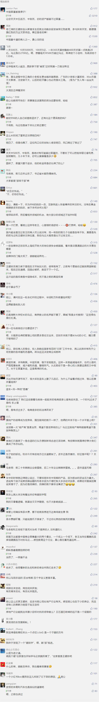

##正文

一年前的9月10日，中国首富马云以“教师节快乐”为题宣布：一年后的今天，他将不再担任阿里董事局主席。

今天，日子到了，阿里并没有任何公开活动来纪念马云的离开。相反，在晚间举办一个内部派对来庆祝其成立20周年，来迎接阿里巴巴的下一个新阶段。

 

虽然从网上流传的照片来看，最后一天上班的马云高兴得像一个孩子，不过中国的互联网上，很多媒体还将马云的“卸任”解读为了“退休”，甚至也掀起了一大波看衰阿里的热潮。

不过，稍微有点脑子的都会明白，中国互联网未来一段时间的趋势将是寡头化，几家超级巨头将形成行业的垄断。

甚至未来90%以上的规模化互联网公司都可以成为两大类，一类是两位“马爸爸”已经入股的，一类是两位“马爸爸”正在谈判入股的。

而马云今天的“卸任”，虽然很多人都没有明白，但政事堂敢说，再过两年，众多互联网大佬都将学着马云一起玩“卸任”。

马云卸任的背后，是随着中国互联网时代的人口红利增量时代结束，整个中国互联网变成了一片激烈竞争的红海，甚至今年掀起了“抨击互联网996”的本质，背后也是寒冬之下工资停滞增长甚至裁员的一个缩影。

资本往往也比人更敏锐，早在程序员们开始抱怨的一年前，海外上市的那些中国互联网公司股价就开始了集体的下滑，马云马化腾掀起的互联网购狂潮也突然停滞。

不同于一根筋的雷军还在质疑“小米怎么就值这几个钱？”，以及依然觉得共享单车未来市场无限的戴威，比他们敏锐的马云，就像资本比员工们更敏锐那样，早就知道中国互联网下半场的竞争，“功夫在诗外”了。

之前听过的一个段子，某金融公司老总召集部下开会，问公司最有价值的是什么，大家纷纷说是公司的人才，结果被老总骂了个狗血喷头，说人才市场到处都是人，公司真正的价值是手上的牌照。

同样，中国互联网公司也是如此，就像去年腾讯和网易股价的暴跌背后，本质就是被暂停了“游戏牌照”；互联网的二线TMD中，滴滴和美团的打车业务也是因为牌照不合规马上就要被赶出上海，头条去年也被干掉了好几个项目；甚至制约着超新星的小红书和华尔街见闻等APP发展的，依然还是牌照。

如今，随着中国互联网多年来的高速发展，无论是技术还是用户都到达了一个瓶颈期，说白了就像遍地开营业网点的银行类似，就像前几天大火的ZAO马上遭遇了大量的山寨那样，没有什么对方能做的抄袭不了。

就像前些年中国共享经济的代表，摩拜和ofo的共享单车，如今其公司价值并不是账面上有多少的“废铜烂铁”以及有效用户，而是在各个城市拥有的单车配额。

未来各大巨头之间，未来发展有多远，甚至市值的高低，很大程度上取决于能否获得更多的行政“牌照”。

所以，从这个角度，就会理解马云的“退休”了。

在目前互联网已经成为红海的情况之下，商业的ToB和消费的ToC生意都没有了足够的增长点，需要马云把精力放到蓝海的政府ToG上面，去拿各类牌照。

因此，马云同志不得不向他的老对手王健林同志，学习房地产商们在土地开发过程中，跟地方政府打交道的套路。

所以，马云一方面必须从公司的日常工作中解脱出来，“卸任”部分职务，这样才能把精力投入到阿里更需要的地方；

而另一方面，马云又必须继续以阿里集团的第一人身份频频出席各类国内国际的重要事务，所以阿里必须要坚决否认马云“退休”，而只是“卸任”。

这也是为啥一贯高调的马云，在今天卸任搞的非常低调，甚至无论境内境外有媒体说他是“退休”，马云旗下的媒体都要怼回去，说只是“卸任”部分职务。毕竟，哪有地方领导会跟已经“退休”的马云谈合作呢？

所以呢，马云接下来的主要精力投向泛慈善领域也能够理解，就像他的老对手王健林又是在南京捐大报恩寺，又在丹寨建扶贫小镇，这些年向各个地方政府捐赠了50多亿。

而这些慈善并不是没有回报，在全国各城市优质地段的地皮上，盖了几百个广场的万达，可以说是全国土地领域招拍挂“牌照”最强势的公司。

所以，注定了要为阿里全家桶推动“慈善”事业的马老师，自然就会根据自己的兴趣爱好，搞起了乡村教育。

 

而随着马云向王健林学习搞慈善，曾经跟马云交替争夺中国首富的老对手王健林如今也在向马云学习。

近日，万达集团发布内部公告称，万达商管集团原总裁助理等4名管理人员索贿，金额巨大，已涉嫌犯罪移交司法。

 

据说，这次廉洁大会上，王健林非常生气，发表了时长半个小时的讲话。同时他表示，要求全体员工坚守廉洁底线，采用科技信息化手段堵塞漏洞、防治腐败。

就像去年阿里反腐干掉了优酷的总裁那样，往家里也开始学马云铁腕反腐了，而且还要向科技公司学习，搞科技信息化反腐。

原因也很简单，老读者都应该都了解，目前中国的去杠杆路径，已经由货币去杠杆向财政去杠杆过渡了。

在货币去杠杆期间“断臂求生”的万达，作为一家房地产商，在财政去杠杆期间必然还会再挨一刀，成为了国内两轮去杠杆全部中招的惟一巨头，论惨的程度几乎无人能及......

 

因此，过去整个行业高速发展，集团有人有点不干净，王健林从大局考虑还是要忍一下的，毕竟如果逼得太紧，很多高管就会被新城之类的后起之秀高薪挖走。

但是，随着财政去杠杆周期的展开，房地产集体被锁死了融资通道，整个行业进入裁员周期，万达的劲敌新城更是因为老爷子进去了导致公司风雨飘摇。

因此，这个时候本就“压力山大”的王健林顺势就率先开启了内部反腐。

而此次王健林也选用了武汉万达这个万达广场的全国一号旗舰店“杀鸡儆猴”，这下全集团上下自然也就不寒而栗了。

可以说，在中国当过首富的人可都不是白给的，**王健林必然也会趁此良机打着信息化的反腐牌子，来大幅压低公司的各项成本，来过冬。**

可以说，这一招比那些把裁员说成是“人员优化”的互联网公司，水平不知道高到哪里去了，不得不慨叹，这才是中国首富的真实水平。

 

当然，就像阿里开启了互联网反腐潮，之后各大互联网公司开始“人员优化”那样，政事堂估计万达也将开启中国房地产领域的反腐潮，接下来**不少公司的大老板也会照着王健林的模样开始内部反腐，然后顺势压低内部各项成本。**

大概，今年是码农们哭喊“抵制996”，明年就是地产员工们揭露“5+2”“白加黑”惨无人道的剥削了。

毕竟，就像政事堂之前预言的，明年年中，将是众多吃财政饭大佬们的一次大考，为了活下去，大家什么手段都得使用。

而就像未来寡头化的互联网公司一样，之后，经过财政去杠杆周期的洗牌，中国的房地产行业也将进入到几个超级巨头垄断的时代，一线的地产巨头们势必就像阿里腾讯那样，对二线玩家们开启大规模的并购重组。

而那个时候，相信未来规模进一步扩大的王健林们，也会像今天的马云那样，卸下部分公司的常规性工作，携手一起“跑部前进”~~~

 

##留言区
 

