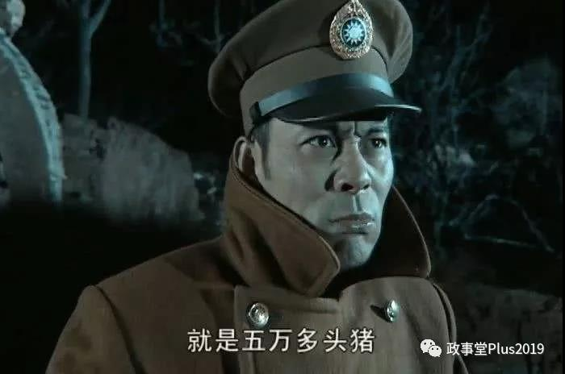

##正文

“内战内行”的国民党，再一次验证了其悠久的历史。

今早，国民党荣誉主席连战、现任党主席吴敦义及台湾地区前领导人马英九等国民党31人在报纸刊登亲笔签名的声明，呼吁郭台铭与高雄市长韩国瑜合作。

可是声明刚发完，郭台铭就通过其幕僚蔡沁瑜发表声明退出国民党，不仅把那31个人损了一通，还称“我知道我正在做一件对的事情，一件将翻转“中华民国”命运的大事。”

 

那么，这件将翻转“中华民国”命运的大事会是什么呢？

政事堂认为，接下来郭台铭并不会消停 ，而是会与柯文哲联合竞选。

原因很简单，作为一个政客和一名首富级巨头，郭台铭在进行选择的过程中必然要考虑到自身的利益。

可以预见的是，此次郭台铭跟国民党决裂，不仅将影响韩国瑜的竞选，更将极大的冲击台湾地区“立委”选举。

且不说韩国瑜的选举，由于国民党的党产被民进党立委查封，曾经富庶的国民党一夜变穷鬼，党内众多大佬一直想通过2020拿回立委，“解封民族资产”，因此郭台铭只要脱党，就必然会从私人角度得罪一大批国民党大佬。

作为一个全球超级商人来说，正常来说，他没有必要任性把自己置于危险之地，他敢于得罪国民党的大佬们，就意味着他未来将对国民党足够的反制措施。

而最佳的反制措施，就是脱党跟柯文哲联合竞选。

 

 
今年8月6日，柯文哲成立了台湾民众党

从政治的角度来看，郭台铭与柯文哲之间，有着巨大的互补。

柯文哲这边，由于政党新立，在党员数量、党产以及涉外关系方面都非常缺乏，柯文哲自己竞选台湾地区领导人几乎毫无胜算。

但是，作为台湾首富，拥有数十万员工家属，在美国和内地都有投资的郭台铭，恰巧能够同时弥补党产、党员以及涉外关系这三个柯文哲最缺的东西。

而且，拿到台湾地区领导人对于柯文哲来说并不奢望，他的民众党此次的保底目标，是拿下足够多的的“立委”席位。

而从全球的经验来看，一个政党政党是否参与大选又对“立委”选举有着决定性的影响，因此，柯文哲需要一个像郭台铭这样的大佬在台前冲锋。

而新成立的民众党由于缺乏资金又必须依赖于郭首富的现金支持，不会像国民党那样出尔反尔，因此郭台铭也放心将个人的资产往党内注入，以获取对民众党的控制力。

因此，可以说郭台铭和柯文哲可谓是珠联璧合。

所以呢，可以预见的是，离开国民党的郭台铭将与柯文哲联合，一边在民众党的支持下竞选台湾地区领导人，一边挥舞着人民币帮助民众党的“立委”们抢占宝贵的立法院席位。

而且，对于郭柯组合来说，不同于之前只有拿下大选才算胜利，因此只要拿到了足够多的的立法院席位，他们就稳赢了。

由于左翼的民进党和右翼的国民党意识形态差距本来就巨大，再加上党产案两家几乎就是不死不休之局，因此绝无可能联合。

因此，只要郭柯的民众党在明年的立委选举中拿下台湾地区第三大党的位置，并使得民进党和国民党无一取得半数以上的席位，那么走在中间路线民众党就可以利用蓝绿两大阵营的敌对，玩好两家的平衡，就能以小博大，使得自身成为立法院实际的控制人。

而这样，大本营在台湾的郭台铭就算输了大选，也不用担心国民党会“秋后算账”。因为在立法院上，国民党的大佬们为了拉拢民众党，抻到最后，就得跪着求郭台铭.....

 

而政事堂的上述分析，台湾很多老油条不可能想不明白.

因此，很多蓝绿阵营边缘化的大佬，也会趁机加入到台湾的第三股势力“民众党”，在接下来的合纵连横之中，他们能够将自身的在原党的人脉网和资历发挥到极致。

而接下来加入“叛逃”行列，应该就是原立法院院长王金平，这位被马英九排挤出局的国民党元老，而随着三巨头的齐聚，估计还会有不少的蓝绿阵营重臣陆续加入。

可以预见的是，原本支持率遥遥领先的韩国瑜，在如今支持率连续走低的情况下，还将进一步遭受重创，他战胜蔡英文的可能性将进一步降低。

而之前在六合一选举中打得民进党“生活不能自理”的国民党，接下来大概率将丧失控制立法院半数席位的可能，遭遇一场惨痛的滑铁卢。

一场惨败对于普通政党来说没啥，但是国民党就不一样了，没有控制立法院就无法解冻党产，接下来的四年国民党的委员们不仅又得再饿四年的肚子，而且跟郭台铭闹翻了之后，也不能去郭首富那里“领工资”了......

而且，韩国瑜想要赢，在蔡英文打出杀手锏之后，此次光靠内部怕是够呛了，只能靠外部力量不惜血本的投入，而外部力量是否干涉，也不是他和国民党能够单方面决定的了。

如果明年国民党豪赌的韩国瑜再输了的话，瞬间陷入内部博弈的国民党必然产生巨大的撕裂，在看不到增量的情况下，更多的人将选择离开，未来国民党将面临崩盘，这个崩盘还将是无解的。

哎，这一套推理其实很简单，不需要多深厚的功底就能推理出来，因此这也是我一直未能理解的，为什么国民党的一众大佬们明明能看到后果，却还是把一副好牌，活活下成了死棋，甚至临到最后，也没有一个人去做试图挽救。

也许，这就是人性，也是历史的惯性吧。

就像71年前解放战争的三大战役，战前几乎所有人都对拥有绝对优势的国民党信心满满，可是几个月的时间，陷于内耗的国民党就兵败如山倒，然后千里转进到台湾......

每次都能把一副好牌能被打成了一坨屎，不得不慨叹，这伙人还真心是猪改不了吃屎......

 

##留言区
 

