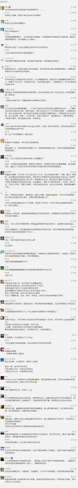

##正文

中国金融圈有个著名的预言，是成功预测了次贷危机的“周期天王”周金涛给出的，他认为：

40岁以上的人，人生第一次机会在2008年，第二次机会在2019年，最后一次在2030年附近，能够抓住一次你就能够成为中产阶级。

 

因此，在2018年~2019年，随着中美贸易摩擦带来的股市下行，很多人都认为，这就是周金涛说的2019年的危机+机遇。

看到这里的时候，我经常会慨叹，中国的应试教育虽然大幅提升了识字率，并规模化的生产出来大量的人才，但就像中国武术一样，能够很好地照模样展示，但是却不能将其用于实战。

而最直接的效果，就是很多中国嘴皮上牛逼哄哄的经济学专家们，真的下场之后，就像一个个武学大师一样，只能轮起来“王八拳”，以至于目前市面上所有对周天王周期的解读，几乎没有一个是对的。

周金涛去世于2016年12月，因此他对于2016年年底之后的所有推测，都需要根据现实情况进行一定的修整，如果不调整，那就叫做“教条主义”或者“本本主义”。

其中最大需要调整的，就是2017年特朗普就任总统，如果政事堂没猜错，这种政治事件，完全超出了周金涛的经济周期判断。

而特朗普上台以后，一直都在逆着经济周期来做事情。

首先，特朗普启动了大规模的减税，以美国政府负债激增为代价，对市场释放了巨大的流动性。

然后，又逼着美联储从加息周期强行逆转至了降息周期，以扼杀美联储货币政策弹性为代价，继续向市场释放巨大的流动性。

纵观特朗普这两年多的执政，就是不断的财政政策加杠杆配合货币政策加杠杆，不断地向市场注入流动性，而这两个政策的本质，都是用来应对金融危机最主要的两个手段。

换句话说，就是周金涛预言的经济危机还没来，特朗普就已经提前开始全力救市了，周预判的2019年提前就被特朗普给扼杀了......

所以，如果忽略了全球最有权力的美国总统个人对于全球经济的影响，还继续按照周金涛的周期理论去强行按图索骥，那基本上就是学迂了的书呆子。

对此，举一个相反的例子，就像我在2018年说的，根据特朗普为了2020年的选举中连任，在2020要降低中东的政策性危险，所以只能在2019年在能源上做大动作，得出了2019年油价要涨，2020年油价要跌。

虽然今天上半年博尔顿又是搞伊朗又是搞委内瑞拉，一度把国际油价大幅拉升。但是能在2019年预测博尔顿下台时间的我，在2018年的时候并不会知道他什么时候能下台，因此政治逻辑推演的经济必然也要随之调整。

毕竟，很多事情也是事在人为，2018年认为博尔顿会把伊朗变成“上党”的我，不可能知道2019年博尔顿连着把几个事儿都办得稀烂，导致他在年底前就提前失宠，更不会知道不断改期的阿富汗大选，这个博尔顿下台的导火索会定在哪一天。

譬如“2019年不买跌，2020年不买涨”这个预测，随着今年六月开始博尔顿的失宠，就要开始调整，而博尔顿近期的下台，也就意味着这个判断的拐点已提前。

因此，无论是我对油价的判断还是周金涛对经济的判断，本质是一个周期的战略性判断，如果真的想要将其付诸于经济实践，就需要根据现实情况进行不断的优化和调整。

用一句俗话解释，就是大方向要看历史的进程，其中的微调要看个人的奋斗。

如果想要按照周金涛的周期理论，抓住人生的机遇，则也必须要根据目前的国际形式以及特朗普的诸多动作来进行调整。

康波理论是告诉大家，经济基础决定了有一场风暴要在2019年到来，但并不是告诉大家就一定会在2019年爆发危机，像特朗普这样手握大权的政治人物可以通过一系列的手段，拖迟、缓解，甚至消除这一次的危机。

而明白了这个道理的逻辑，才能够真正用得上周天王的理论。

我们只要看懂了改变康波周期的特朗普，是想推迟、缓解，还是消除危机，就会**明白接下来会发生什么，然后选择如何应对以使得自己利益最大化。**

目前来看，消除危机的方式是生产力或生产资料的大幅提升，这是中国目前正在努力的方向看；缓解危机的方式是全球各个国家一起努力维持平衡，这是欧盟德法目前正在努力的方向。

而特朗普既没有发展高质量的新经济，也没有联合其他国家寻求稳定，他这几年就是不断的通过财政政策和货币政策来放水，因此，**特朗普的战略是在推迟危机的爆发。**

而明白了这个逻辑，就会明白**特朗普不过是把周天王的康波周期人为的延后了。**

**这一场周金涛预言的危机，根本就没有到来。**

所以呢，短期内是特朗普打败了周金涛，但是只要把时间拉长，在历史进程之下，特朗普终究要败在周金涛之手。

##留言区
 

