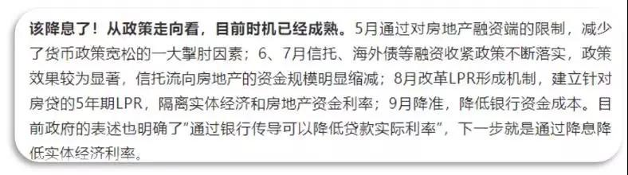
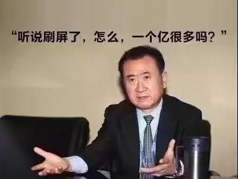

##正文

昨天的文章《周金涛大战特朗普》中，有一位读者留言，大概意思是说，那些不能准确预测到日期的经济学家屁用没有。

我想了想，决定还是需要解释一下，经济学家究竟是什么样的一种生物。

目前，国内曝光度最高的经济学家，大概是恒大集团的首席经济学家任先生，这位拿着年薪1500万的业界大佬。

说起来，自从任先生2017年履新恒大之后，几乎每次都在研报中判断央行要降息。

 

 

 

结果呢，别看任先生多么信誓旦旦，央妈连一次息都没有降......

 

大概，换任何一家企业的首席经济学家连续两年不停的判断错误，还在一条错误的路上越走越远，脑子稍微正常的老板早就把他切吧切吧炒鱿鱼了。

 

但是，恒大许老板不仅没有炒了这个网红经济学家的鱿鱼，还继续对他委以重任。

当然，不要以为这位宇宙最大的开发商老板脑子进水，人家一天欠下的债，你们八辈子都还不起。

跟人家玩心计，被卖了还抢着排队给人家交钱，想着尽快摇到自己呢......

 

大老板选择用高价养着“总说错话”的经济学家，自然是有其利用的价值。

目前，宇宙第一房企恒大总负债至少为1.6万亿，如果按照任先生说的降息，就算按照最低标准降25个基点，那么恒大每年直接减少的利息就有400亿.....

更不要说，降息可以杠杆化的压低实际利率，使得恒大可以借新还旧进一步压低利息支出。

而且，就算央妈没有降息，但是市场在经济学家们的鼓吹之下，认为央妈可能会降息，也会各大地产商降低市场上的实际融资成本。

这可都是真金白银啊！

怎么说呢，就算拿着恒大给任先生支付的1500万年薪，秦始皇活到现在也攒不下400亿.....

 

因此，整天高呼着降息的任先生，不过是宇宙第一大房企的许老板割韭菜的工具，而所谓的1500万高薪，不过是人家九牛身上的一根毛。

 

虽然只是许老板身上的一根毛，但是相比于全国人均年收入的三万块钱，任先生一年的收入，相当于一个普通的中国人“向天再借五百年”........

 

因此，拿了高薪的任先生自然就要“拿人钱财替人消灾”，不停的帮老板在市场上塑造降息的氛围。

毕竟只有央妈降息了，人家才能借到更多的钱，去割掉更多的韭菜.......

 

而公开1500万的年薪，本质和小鲜肉们公布恋情一样，都是吸引流量的方式罢了，只不过大家卖的东西不一样。

当然，光有流量是不够的，如果想要让市场相信自己吹下的牛逼，任先生要让市场相信，自己是政策的传声筒。

于是，近年来任先生总是不经意的流露：“2009年,我刚到国务院发展研究中心,跟着刘主任参与了一个很重要的研究课题”......“我很佩服刘主任他们这些老一辈学人”......

分明是在暗示自己是如今制定中国经济政策“权威人士刘主任”的学生......

但实际上，当时国务院发展研究中心当时还有一位名为刘世锦的“刘副主任”......任先生玩了非常漂亮的一出“以假乱真、鱼目混珠”之章法。

 

当然任先生也没有撒谎，毕竟国研中心的确有一位“刘主任”，至于此刘主任是不是彼刘主任，虽然我不信，但还是有不少人信了......

 

扯了这么远，就是要告诉大家，市场上的主流经济学家大部分都是有自己屁股的，尤其是那些领着高薪的，屁股早就坐在了他们老板那里。

而那些动不动给自己今天“定一个小目标”，“先赚他一个亿”的房地产大老板们一个个都是人精，他们花着几百上千万的年薪养着的经济学家，自然是要让他们产生价值的。

商人们做生意赚钱靠的就是信息不对称，因此，这群重金聘请的经济学家们给大老板们的私人报告绝不可能被公之于众，否则老板们怎么利用市场赚钱？

 

而那些公开并被广泛传播的研报，很显然都是“镰刀”们想让“韭菜”们看到的，每一篇报告的背后，都是“经济学家”与老板们一次性 交易之后的产物。

所以不要轻信那些貌似权威的经济学家，尤其是那些领着企业高薪的。

不过呢，虽然我们不能轻信，但也不应该指责他们，他们要是不去上班，你养他们啊？

 

##留言区
 

