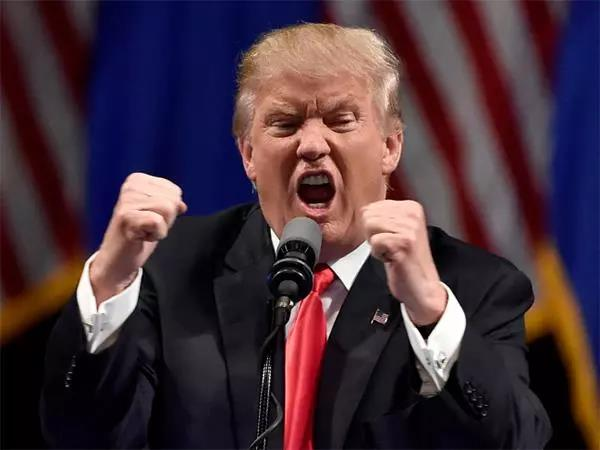

##正文

最近中东悬疑大剧《空袭沙特的幕后主谋》果然出现了大逆转，就在美国政府和媒体将轰炸的矛头直指伊朗之际，“原告”沙特和“法官”特朗普，哥俩一起“反水”了。

沙特官方表示，美方没有足够的证据可以断定袭击是由伊朗发动的，他们将邀请联合国专家进行调查，等调查结果出来。

而特朗普更是向媒体否认了之前要求伊朗负责，并表示“希望避免”与德黑兰发生军事冲突。 

 

就在美国军方、政府和媒体都在不停地呼吁对伊朗开战之际，“色厉胆薄”的特朗普却又一次“放鸽子”了，让美利坚演出了一场“臣等正欲死战，陛下何故先降”的剧本。

甚至随着当事人的集体转鸽，一度暴涨的油价也没撑过第二天，掉头就往下跌。

不过，在中东问题上一贯“鸽派”特朗普，在国内经济问题上却是坚定的“鹰牌”。

明天凌晨两点，美联储就要公布9月利率决议，不出意外，这篇文章发完没多久，大洋彼岸的特朗普就会对美联储“大炮开兮轰他娘”，对美联储进行降息的施压。

 

虽然随着最新公布的经济数据，令市场对降息与不降的判断维持在50:50，不过政事堂看来，在中东问题上一贯犹豫不决的特朗普，在推动降息方面，却会不惜一切代价。

虽然很多国内媒体都将特朗普的降息归结于为了收集贸易战的筹码，但政事堂认为，推动美联储降息对于特朗普来说，是其争取连任最重要的手段。

就像我上周六刚写了《不要轻信经济学家》的降息，第二天一早中国薪水最高的经济学家就发了一篇“该降息”推文.......

 

对此，我们要理解，拿着杠杆套杠杆的房地产大老板的高额薪水，自然就要替自家的老板说话，毕竟降息对于房地产这类杠杆企业能够大幅的降低成本提升利润。

同样，特朗普不仅自己是美国一线的地产商，随着目前进入竞选周期，到处演讲给自己争取竞选资金的特朗普，必然也要跟“经济学家”们一样，要为给自己掏钱的大老板们提供服务。

而共和党的金主爸爸们普遍都是重资产运营的“老钱”，降息对于他们来说能够直接降低成本；更不要说绝大部分美国人身上都背着房贷，这是美国人最大的支出。降息能够直接给特朗普带来充裕的竞选资金和坚定的支持者。

所以政事堂看来，那些凭借经济数据来判断是否加息的经济学家，可能要多读一点政治经济学。

同样，特朗普会对伊朗的妥协也是类似的道理，毕竟此次挨打的是沙特，美国人民并没有痛感。而美国又是一个轮子上的国家，交通支出是除了住房外美国人最大的支出项，一旦中东开战必然导致油价上涨，导致绝大部分美国人民的不满。

而这也就是我去年说的，原油期货2019不买跌，2020不买涨的逻辑。2019伊朗这个“上党”随便就能爆你的空仓，而2020的特朗普会让做多的朋友见识到可怕的“庄家做空”......

而除了房屋按揭和油价之外，另一个牵挂着美国人民的就是美股的股价了，美国人普遍没有什么储蓄，未来的养老金基本都放在股市里面，

自特朗普上台以来，通过大规模的减税启动了一轮美股大牛市，而巨大赚钱效应的美股牛市，也为特朗普带来了强劲的支持率。

不过，减税只是通过流动性刺激起来了股价，本质只是一针兴奋剂，并没有推动美国国内生产率和科技的提升。

因此，随着减税兴奋剂效应的逐步减弱，特朗普为了保证赢得2020选举，就必须为美股寻求一个新的兴奋剂——降息，来继续推动美股的牛市。

 

否则当初那些在股市中赚了钱的选民一旦大规模赔钱，就会调转枪头支持特朗普的竞争对手。

而对于民主党来说，如果特朗普此次拿下大选，那么从美国建国以来就一直维持平衡的大法院，就可能出现长达数十年保守派占据绝对优势的局面。

因此，民主党狙击特朗普的杀手锏之一，就在资本市场给特朗普来一记“918式”的突击，通过做空打掉特朗普的大牛市。

而从这个角度来看昨天文章《索罗斯又在香港栽了》，香港媒体大公报曝出的索罗斯联合港毒Fake News媒体做空香港资本市场，似乎也在向筹备谈判的特朗普释放一个重要的信息。

对于我们来说，索罗斯是一个威胁，但是对于整天谩骂Fake News的特朗普来说，擅长跟媒体一起做空的索罗斯，这个民主党的铁杆支持者，很可能就是他明年竞选期间最危险的毒药。

因此，从这个角度就会明白咱们国家队的牌打得有多漂亮，接下来特朗普很可能对我们展示出更多的善意。

毕竟，“敌人的敌人就是朋友”。

##留言区
 

