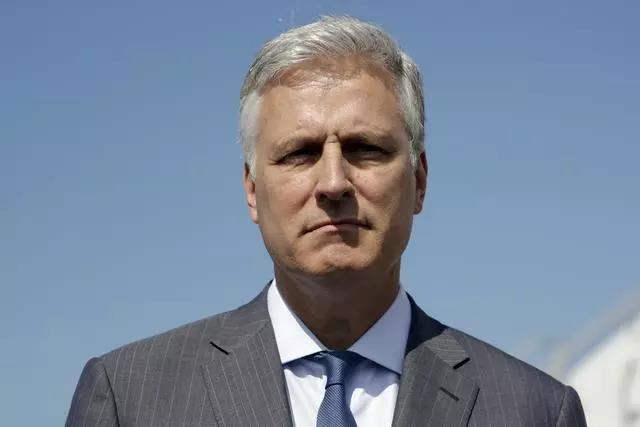
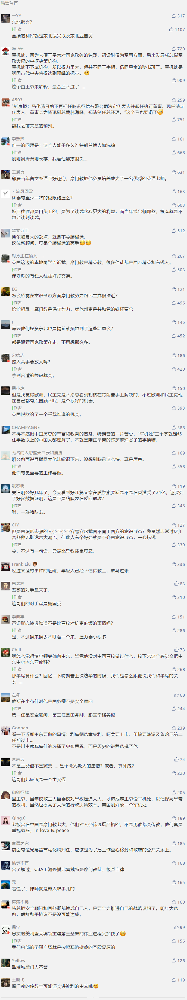

##正文

 

昨天夜里，美国总统特朗普在推特上宣布，将任命奥布莱恩为他的第四任国家安全顾问。

而这也意味着，**美国对外战略将出现巨大的调整**。

国家安全顾问领导的美国国家安全委员会，是美国政府讨论和研究重大战略决策的核心组织。该组织起源于1947年美苏冷战，通过解决美国各部门间决策协调不畅，以抵消苏联集中力量的体制优势。

因此，**在很多历史的转折点期间，国家安全顾问的权力，往往比美国国务院的一号人物、分管外交事务的国务卿权力还要大，甚至直接决定了美国的国家战略转向。**

譬如肯尼迪、约翰逊时期的邦迪，一手推动了美国的战略重心从欧洲向亚洲转移，从此美国深陷越南十余年，间接促使了日本、韩国、台湾地区的崛起。

尼克松时代的基辛格，瞒着国务卿和国会开启了对中国的秘密外交，让中美化干戈为玉帛，一举逆转了冷战两大阵营的势力对比。

卡特时代的布热津斯基，其一手推动了中美建交，在与东方力量的秘密勾兑下，不仅干掉了苏联最强的小弟越南，还令苏联深陷阿富汗，奠定了美国冷战胜利的基础。

甚至老布什时代的斯考克罗夫特一手挑起了海湾战争，小布什时代的赖斯协调美国的鹰派们打起了伊拉克战争.......

可以说，**只要是美国的国家战略出现转向，那么必然就跟国家安全顾问有着密不可分的关系。**

这是因为美国的“民主”体制，各方各部门利益的掣肘，使得其决策成本极其高昂，往往内部利益还没有扯完，新一届政府就要换届了。

因此，这就使得负责统筹军事、情报、外交、金融等各个重要领域的国家安全顾问，有办法统筹五角大楼、各大战区、CIA、国务院甚至金融机构等分属不同条线的个股力量，为了一个共同的目标而努力。

甚至美国的内阁成员，也由是否有资格参加国安会，分为了以副总统、国务卿、国防部长、财政部长为代表的重要成员和其他的普通成员。

因此，考虑到美国国家安全委员会是为了冷战而成立的部门，国家安全顾问也成为了所有美国的主要竞争对手最关注的职务。

尤其是特朗普时代，随着美国总统的权力进一步集中，一旦特朗普连任成功，其领衔的“国安会”将越来越像中国历史上的“军机处”。

因此，了解新任的安全顾问奥布莱恩对于我们来说非常重要。

 

不过可惜的是，由于奥布莱恩“知名度”不高，美国媒体普遍对这位新任总统国家安全顾问缺乏了解，因此我们只能从一些细节中去探寻。

而探寻的两个主要方向，一个是特朗普为什么选择奥布莱恩，这个能看到特朗普背后的战略方向变化；另一个是奥布莱恩背后势力的政策倾向，这个能判断出奥布莱恩接下来的工作重心。

首先，据美国国务院网站介绍，奥布莱恩毕业于加州大学伯克利分校，曾任律师，小布什政府时期在国务院任职，从2018年5月起担任美国国务院分管人质事务的总统特使，负责要求别国释放关押的美国公民。

而通过新闻对比我们能发现，奥布莱恩不负众望，他刚上任，朝鲜就释放了三名人质，让特朗普在国内大出风头，支持率直线飙升。

 

后来，奥布莱恩又成功的从土耳其拯救了牧师布伦森，以及在也门被绑架的石油公司工程师伯奇，又为特朗普争取国内巨大的支持率。

可以说，奥布莱恩不仅是一个“谈判高手”和“捞人高手”，还是特朗普形象工程与支持率的重要推手。

考虑到特朗普马上就要进入大选周期，一个擅长谈判的鸽派国家安全顾问，能帮助特朗普争取谈判桌上的利益，因此，把这个统筹安全事务的重要职务给一位美国外交界“平平无奇”的边缘人，也就能够说得通了。

而且，特朗普选择政治背景清白的奥布莱恩代替美国军方利益代表的博尔顿，也意味着他要把国安会变成一个忠于自己的“军机处”。

这样，特朗普才能够在接下来的朝核、伊核、巴以、美俄、亚太等地缘交易，牢牢的握在自己的手上，来施展“交易的艺术”。

因此可以遇见的是，接下来美国的国家安全战略将出现巨大的变化，**特朗普的美国将在大选年开启全面的战略收缩**，这对于所有美国的战略竞争对手来说，都是莫大的好消息。

其次，从奥布莱恩的背景来看，这个美国外交界边缘人物最重要的标签，是摩门教徒，甚至奥布莱恩之前就是摩门教一哥罗姆尼的外交政策顾问。

提到摩门教，绝大部分中国人第一反应就是那个允许一夫多妻的宗教.....甚至由于摩和魔字相近，很多人甚至会把他们跟邪教弄混，但实际上，这是全球最富裕的一个宗教，而且传教意识是基督教中最强烈的。

为了向西部印第安人传教，当年摩门教教徒顶着高温夏日在沙漠中艰难地前行。费尽千辛万苦后，他们来到了有沙漠绿洲之称的拉斯维加斯，把这里建成了在中国最知名的美国城市。

如果你在西方，被身穿黑西装白衬衫胸前还会挂一块黑色小牌儿的人拦下，用一口地道的美式英语主动跟你搭讪，那么恭喜你，你被摩门教传教了。

基督教分支要求学生们在完成一年学业后，就要踏上了为期两年的传教之路。譬如著名的前驻华大使洪博培，就曾经到中国台湾传道，在这里，他学会了流利的普通话并熟悉了中国的历史文化。

而摩门教教徒热诚地拥抱犹太人和犹太信仰，他们相信摩门教与犹太教在历史和教义上的关联。因此如果政事堂没猜错，特朗普女婿库什纳这个犹太人在决定国家安全助理人选上起到了决定性的作用。

因此，可以预见的是，**与犹太势力关系密切的摩门教势力，会促使国家安全顾问奥布莱恩在接下来的工作重心，向中东转移**，以协调各个部门去推动库什纳负责的巴以和平进程，力争在明年为特朗普献上一个重要的政绩。

明年美国国家安全的重心，很可能会向中东转移，亚太各国很可能会获得一个宝贵的交易期。

而重视意识形态传教的奥布莱恩执掌美国国家安全委员会后，大概率也会和摩门教大佬罗姆尼、洪博培等人类似。**对华方面的重点，在于推动意识形态的开放以便于“传教”，对于地缘争夺甚至贸易冲突的兴趣相比于前任均会大幅下降。**

因此，之前博尔顿那种盯着华为下黑手，以及在朝核谈判中暗中使绊子的行为，很难再出现，黑天鹅的概率将大幅降低。

这也意味着接下来的朝核与贸易谈判，均将迎来一片曙光。 

##留言区
 

