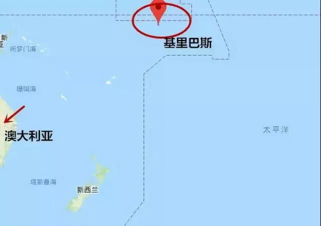
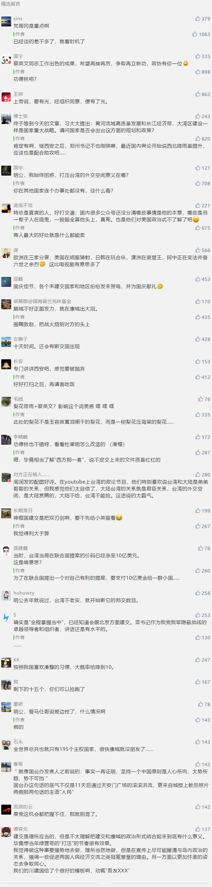

##正文

“基里巴斯外交关系的变化，全程掌握当中。”

今天上午，蔡英文信誓旦旦的对内打气，表示对这个“友邦”胸有成竹，可话音刚落，基里巴斯这个南太平洋岛国下午就宣布与台“断交”了。

 

其实，蔡英文不过是强忍着“不哭”，今年3月，她“出访”太平洋所谓的“友邦”，访问基里巴斯的行程就因为“技术问题”最后取消，到底什么原因心里没点数么？

而且，此次“友尽”，是继四天前所罗门群岛“断交”后，本周第二个与台“断交”的“友邦”。

就像政事堂上个月判断的，我们接下来的重点将从“鹅城”转向“康城”。本周的所罗门群岛和基里巴斯不过是开始，如果台湾局势继续，蔡英文很可能要一边抹着眼泪，一边看着南太平洋和加勒比岛国们一个个的提分手。

而且，民进党当局遭遇的不仅是“友邦断了又断”，接下来还有更多的悲惨剧情会让蔡英文“梨花带雨”。

这是为什么呢？对此，我们还是要回顾一下两岸的“友邦”争夺战的历史。

1949年新中国成立，千里转进台湾的蒋介石也把“友邦”纷纷带了过去，当时联合国只有59个成员，蒋介石当局的“友邦”就有47个。新中国建交的国家只有10个，还几乎都是靠着苏联老大哥的“授意”，可以说，当时台湾相比于大陆有着绝对的优势。

甚至在之后的20年，随着西方列强殖民地的解体，大量的第三世界国家纷纷获得独立，台湾在美国的帮助下仍然大肆增加“友邦”，截止1969年，台湾仍然以70:50的优势继续领跑。

而转折点出现在上世纪七十年代。

随着联合国驱逐台湾当局，并恢复了共和国的一切权利，中美关系也随着联合公报得以恢复，在这十年里，几乎所有的主流国家争先恐后与台湾当局“分手”，以至于1979年美国与台湾当局“分手”后，台湾的“友邦”突然就只剩下22个弱鸡了。

因此回顾历史我们就会明白，令台湾被“分手”最主要的因素，一个是联合国的大国地位，没谁愿意去得罪“一票否决权”；而另一个则是美国的态度，美国势力范围内的国家再想跟新中国建交，没有美国老板的点头也不敢逾越雷池。

目前，一方面太平洋上的那些岛国，都指望着五常的中国能在推动碳排放上坚持住，而另一方面，蔡英文任期内“分手”的七个台湾“友邦”，很巧合的也全部集中于特朗普胜选之后......

嗯，再继续回顾历史。

两岸的“外事博弈”到了八十年代，由于小平同志积极争取蒋经国这个“校友”，而且蒋经国也坚持“一个中国”，因此两岸在外交上比较和平，台湾“友邦”数量基本就维持在二十来个。

可是进入九十年代，由于全球意识形态的竞争结束，外交开始讲究实际，尤其是随着李登辉上台，谋求重返联合国和国际组织，主动开启了与大陆的“友邦”争夺战，当时，台湾当局在联合国提案的价码已经涨至10亿美元。

因此，不少小国在美元攻势之下，出现了在两岸之间的摇摆，当时中国的建交国几乎每年都会被台当局挖去一两个，台当局一度使“邦交国”突破30。

不过进入千禧年之后，一方面随着大陆进入WTO经济取得了迅猛的发展，另一方面追求“台毒”的陈水扁上台招致大陆的全面反击，一鼓作气让陈水扁损失了10个“友邦”。

本来，对台的外交施压应该一鼓作气的，不过2008年马英九上任后，由于其主张两岸间“外交休兵”，大陆方面也很默契的没有“宜将剩勇追穷寇”，甚至冈比亚于2013年单方面对台宣布“断交”，大陆方面也没有复交。

更不要说在国际事务上，台湾当局的国际参与度也在大陆的默许之下达到了历史性的高度，不仅参与了大量的国际组织，在50多个国家新建了办事处，甚至还以观察员身份加入世界卫生组织的方式，重返了联合国......

好了，回顾完历史之后，我们就会知道，近年来台湾外交政治空间的大幅提升，是大陆给予的，我们在国民党时期赐给你们的，在民进党时代也都能随时收回。

 

尤其是在特朗普主导的美国战略收缩之下，台湾当局更是在国际上没啥能指望的。

目前摆在台面上的“断交”仅仅是第一步，接下来台湾在全球一百多个驻外机构也将面临巨大的压力，只要我们玩起马云式的“二选一”，两岸巨大的实力差距会迫使台湾的驻外铺子纷纷“关门大吉”。

而且，由于联合国2758号决议确认我们是联合国所以组织唯一的合法代表，以及中国安理会五常的决定性地位，过去台湾在大陆默许之下参与的那些国际组织，接下来更将面临一锅端的威胁。

看着自家一个个的机构被国际友人“扫地出门”，蔡英文同学，请做好心理准备，咱们说好不哭......

 

就像国台办发言人之前说的：事实一再证明，坚持一个中国原则是人心所向、大势所趋、势不可挡。顺应这一时代潮流，是绝大多数国家的选择......目前我们与178个国家建立并保持外交关系，**这一趋势还会发展。**

##留言区
 

