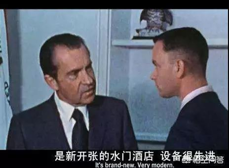
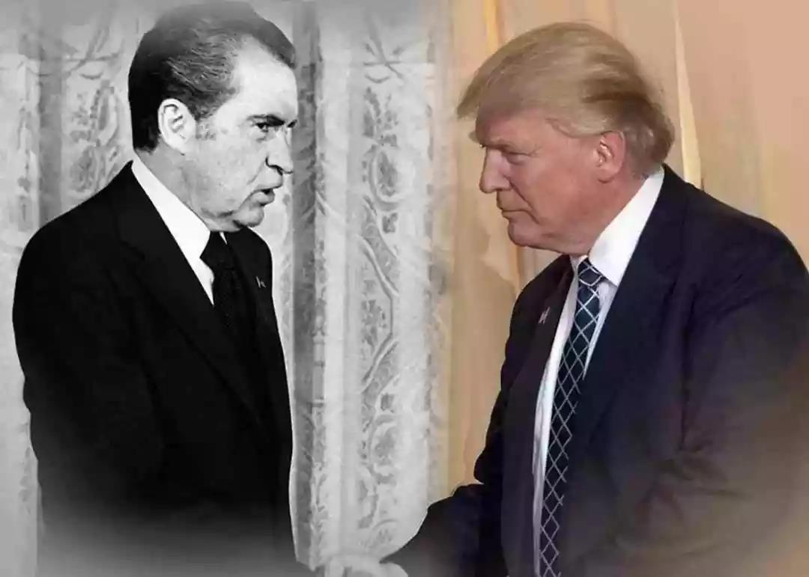
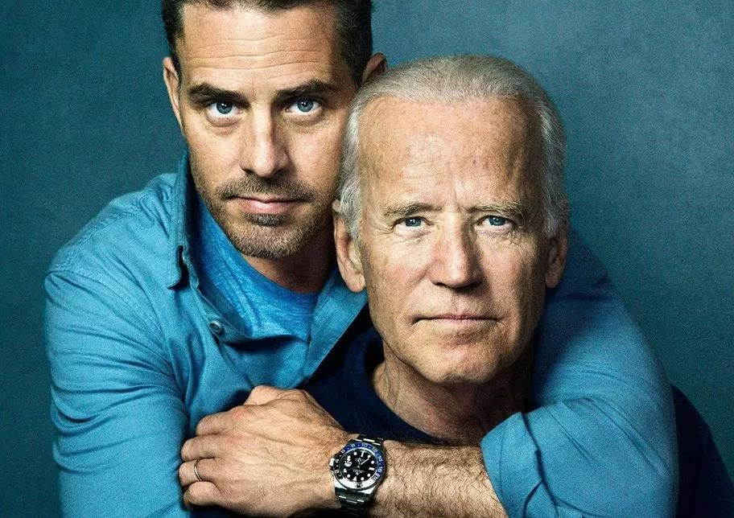

##正文

27年前的美国总统大选中，为了打赢民主党，时任总统尼克松的安全团队潜入民主党总部的水门大厦，在安装窃听器并偷拍有关文件时当场被捕，而水门事件的爆发，也让尼克松成为了美国历史上首位因丑闻而辞职的总统。

 

而27年后，又有一位共和党总统遭遇了相似的麻烦。

近日《华尔街日报》和CNN等多家美国权威媒体爆料，特朗普在今年7月对新上任的乌克兰总统泽连斯基连续八次施压，敦促其调查民主党总统竞争对手拜登的儿子，否则就将取消2.5亿美元的军事援助。

新闻一出便在美国政坛掀起轩然大波，一方面这是主动要求外国政府介入美国大选，从美国人民手中抢夺选举的权力，而另一方面，这也意味着特朗普在用美国国家利益为自身谋求利益。

甚至之前强烈反对弹劾特朗普的众议院议长以及情报委员会主席等人，都强烈暗示，如果查明特朗普在与乌克兰总统的谈话中触犯了法律，那么就将启动弹劾。

 

那么，特朗普究竟有没有跟乌克兰做交易呢？

其实只要看一下乌克兰的官方网站就会知道，特朗普和泽连斯基在7月25日的通话中探讨了乌克兰需要通过完成“腐败调查”来改善声誉，从而排除乌克兰和美国互动的“障碍”。

而所谓的“腐败调查”，普遍被认为就是乌克兰检方目前正在对拜登儿子出任董事的Burisma公司进行的调查。

 

作为美国近代最近几十年首位只谈利益从不干涉他国内政的“好总统”，突然对乌克兰的腐败感兴趣，很显然是醉翁之意不在酒，而在于民主党支持率最高的总统候选人，希望能够让儿子扯了老子的后腿。

小拜登就职的Burisma是最大的私营天然气公司，业务涵盖乌克兰3个重要的油气盆地。而拜登担任奥巴马副总统时，曾在2016年儿子刚刚出任董事后，就勒令正在调查该公司的乌克兰总检察长辞职。

这么明显的关系，自然会让人直接想到幕后巨大的利益交换。所以被“通乌门”困扰的特朗普以及蓬佩奥等人对此还开始了反击，大肆呼吁应该调查拜登。

对此，政事堂预测，如果明年拜登仍是特朗普的主要竞争对手，也许有些国家的金融系统也遭遇特朗普类似的施压.....

当然，这种利益的交换，在国际顶级政治家之间都是很正常的事情，布什家族、克林顿家族都通过总统的宝座获取的巨大的财富，这些事情大家都是心照不宣的。

而特朗普挑着这个行业潜规则来打，让很多国际评论家都认为这是一场两败俱伤的斗争。

不过，政事堂却觉得此事并不简单。

拜登的儿子是耶鲁法学毕业的，有着大量顶级律所和投行的校友，有着他老爹这个美国副总统的资源，这些年小拜登通过非常复杂的资本运作方式，利用各国的上贡的资本在全球大肆的跑马圈地。

因此，一贯在金融领域和高科技领域赚杠杆受益的小拜登，没有必要在乌克兰这种地缘政治复杂的地方搞见钱慢而且风险还巨大的传统产业。

而且，总是躲在后面玩资本游戏的小拜登，在其他领域藏的都特别深，此次在乌克兰能源公司完全没必要非要自己冒头当董事。

毕竟乌克兰是传统的俄罗斯势力范围，真要是收了乌克兰方面的政治献金，很容易被俄罗斯潜伏在乌克兰的情报机构抓到把柄。

要知道，拜登在乌克兰颜色革命过程中，发挥了巨大的作用，因此丢了乌克兰的普京对拜登绝对是咬牙切齿，必然会派遣安全部门盯着他爷俩，一旦抓到把柄必然会大肆利用。

更不要说拜登作为民主党的主要候选人，更没有必要公开为了儿子作为董事的公司站台，以副总统的身份用停止10亿美金的援助来威胁乌克兰，强行干涉司法系统，给自己留下这么大的政治污点。

因此，只有一个可能，那就是拜登在乌克兰的问题，事先挖好了一个坑，就等着特朗普往里面钻。

而要理解这个坑是怎么回事儿，就需要对东欧的地缘政治博弈有一定的了解。

众所周知，乌克兰是俄罗斯天然气的消费大户，经常被俄罗斯用天然气卡着脖子。但很多人并不知道，乌克兰是仅次于俄罗斯的天然气大国，国内一片大平原的乌克兰开采成本也非常低。

而乌克兰天然气工业没有发展起来，原因就是俄罗斯为了地缘上控制乌克兰，大肆亏本销售天然气，直接打压了乌克兰的天然气工业，而且还通过天然气腐败，扶植起来一大批倾向于俄罗斯的乌克兰官员。

俄罗斯的这一系列经济政策，这使得乌克兰国内虽然一直想要投靠北约，但是被俄罗斯天然气捆绑上战车，大量的利益集团死死的替俄罗斯守着，甚至一旦乌克兰出现倾向于北约的领导人，俄罗斯也会通过天然气通胀把他送下台。

而这个模式，直到2014年在美国的策划下爆发了颜色革命才被破解，这一波洗牌之后，乌克兰境内亲俄罗斯的势力土崩瓦解。

但是对于美国来说，经济基础决定上层建筑，由于乌克兰距离俄罗斯实在是太近，稍微理智的乌克兰领导人都不会想要把俄乌关系搞的太差，因此，想要让乌克兰彻底的从地缘上脱离俄罗斯，必须要从经济上彻底摆脱俄罗斯的控制。

因此，拜登和他的儿子小拜登，作为民主党的顶级家族，自然就亲自下场极力推动乌克兰国内天然气能源的发展。通过打击俄罗斯扶持的乌克兰天然气腐败集团，扶植亲美国的天然气开采集团，所以才有了拜登用副总统的权威迫使乌克兰更换总检察长。

所以呢，可以预见的是，小拜登在乌克兰天然气领域，不会存在腐败问题，如果特朗普继续挖下去，反而会“暴露”出一个爱国者来，不仅证明拜登家族的清白，甚至会通过特朗普的流量，让美国民众看到拜登家族为了国家利益做出的贡献与牺牲。

而特朗普在与乌克兰总统的勾兑，以及力推对拜登家族的调查，搞不好就会留下不光彩的证据，届时，就会成为被攻击的靶子，引发民意的大逆转。

嗯，政事堂还真不希望特朗普就这么中招了。

而这招并不是像洛佩西说的那样要搞弹劾，近期民主党叫嚣弹劾特朗普的言论，其实都是烟雾弹，明年就是大选了，搞起复杂的弹劾，换总统速度恐怕都没有选举速度快。

更不要说目前是共和党控制参议院，民主党的弹劾毫无胜算，真搞起来恐怕还是给特朗普送选票，并导致民主党在参众两院丢分。

而这颗雷最大的威胁，并不是明年，而是特朗普连任之后，其实就跟当年尼克松大选之前爆发的水门事件，并不是阻止特朗普当选，而是作为特朗普一旦当选埋的一个后手。

目前，共和党需要特朗普帮助他们赢得大选，并带动参众两院，在这一点上，共和党不可能与民主党做任何交易的，他们必须要全力支持特朗普。

但是，只要特朗普当选总统之后，对于共和党建制派们来说，他的利用价值就大幅下滑，双方矛盾还会进一步激化。

而因此，这个时候埋的雷就可以诱发作用，就像当年干掉连任成功的尼克松是共和党与民主党联手那样，这次乌克兰交易以及之前的通俄门等事件，也可能成为未来搬到特朗普的“水门事件”之一。

而且，这些埋着的伏笔，也会让目前全球正在跟特朗普交易的国家掂量掂量是否应该押注特朗普，在大选前与其达成交易。

可是，这些外部力量的交易，又在特朗普明年大选中起到至关重要的作用。

哎，看着民主党这一环套一环的连环计，不得不替特朗普说一句：

我太难了.....
 
##留言区
 

