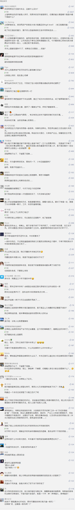

##正文

今天凌晨，主流数字货币集体出现断崖式下跌，单价长期横盘10000美元左右的比特币一度跌破8000美元，进而引发整个虚拟货币的“大崩盘”，连带的是无数爆仓的账户，今天整个币圈一片血海。

而于此同时，今天凌晨蔚来汽车也一度暴跌超27%，股价跌破2美元，创下了2018年上市以来的历史低位。大家纷纷调侃，特斯拉花了大约15年的时间才达到50亿美元的亏损幅度，蔚来仅花了4年。

就在币圈和新能源汽车圈都乱成一团之际，连房地产也不忘捣乱，社交媒体上曝出，桂林某开发巨头突然“骨折价”售房，引发外界一片哗然。

对此，政事堂看来，三个手拉手的“跳楼”看似分属不同维度，但是逻辑上却有着惊人的相似。

还记得政事堂上个月《救救炒币的80后，90后都去炒鞋了》这篇看衰炒币的文章么？

这应该是政事堂第三次提前预判虚拟货币的拐点了。

 

 

 

 

政事堂说过，自己是从来不从市场角度考虑问题的。

至于为什么判断应该从币圈“撤退”，大家看看昨天央行的表态就知道了，就像易刚行长在国庆活动发布会时说的，五年前就已经开始筹备的中央军，“目前取得了积极进展”。

同样，蔚来的主要竞争对手，特斯拉在上海临港的超级工厂正在以鬼斧神工的速度建设，未来不远的时间，目前国内市场尚无对手的蔚来，也将面临“美械中央军”的直接打击。

而房地产领域也是如此，就像昨天文章论证的那样，在央行咬紧牙关不降息的大背景之下，廉价的信贷必然要向中心城市和一流的企业这些效率足够高的地区汇聚。在这种情况下，信贷越来越困难的房地产公司，自然也要跟着钱走，将重心重回中央城区。

包括最近网易割肉卖考拉给阿里也是同理，说得通俗一点，就是在目前信贷不放松的大趋势之下，各个领域的缺医少药“杂牌军”面对弹药充足的“中央军”，都会出现有心无力的局面。

长远来看，如果不改变的话，靠着股权融资烧钱蔚来拿什么跟用着低息贷款的特斯拉竞争？

消耗巨额算力还没有硬通货储备的虚拟货币，拿什么跟用黄金和外汇做储备，而且还没有成本的数字货币竞争？

教育医疗就业等各个方面都被甩在身后的偏远城市，又拿什么跟一二线城市竞争呢？

不要觉得今天的“三连跳”有多么惊人，只要央行守着不降息，接下来很长一段时间都会有不同领域的不同玩家跟着“跳”。

这也是为什么任大教主整天神叨叨的预言降息，向大众表示未来房地产会涨得很猛；但是手握大量现金储备，而且随时还能从银行借到廉价资金的万科却在整天鼓吹，争取在寒冬里面“活下来”。

同一事情态度截然相反的背后，是大家都有着不同的屁股。

不过，如任大教主这类的大喇叭，对于所有的“杂牌军”都有着不低的价值。

因为不对称的“战争”，想要破局，就需要不对称的打法，如果无法变成“中央军”，那么最好的方式就是资本不足宣传补。杂牌军虽然从资本方面争不过中央军，但是可以通过宣传的力量争抢其他杂牌军的资源。

但是前提，杂牌军们不能做过了，抢了中央军的资源。

譬如之前币圈请巴菲特吃午饭的那个哥们，做的实在是太过了，然后直接被中央军给干趴下了。

而最合适的做法，其实是上一轮洗牌中被清出“中央军”的那些牛人们玩的方式。

譬如互联网领域刘强东和章泽天的到处秀恩爱，造车领域贾跃亭老婆甘薇的明星姐妹团.......如果连个老婆都没有，那就学造手机的雷军那瘪嘴的英语或者英语老师罗永浩拼命抽自己嘴巴.......

总之，各路英豪们要么跳大神，要么跳楼，接下来吃瓜群众们有的是好戏看了~~~ 

##留言区
 

