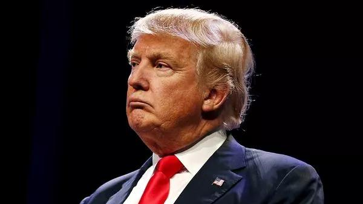
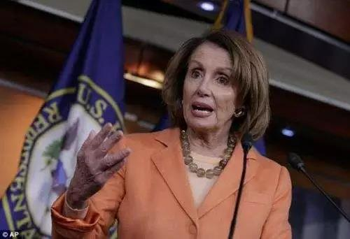

##正文

今天，伴随着美国众议院启动了对特朗普的弹劾调查，受迫于“通乌门”压力，特朗普也公布了与今年7月乌克兰总统的通话记录。

于是，国内一群不懂政治的媒体开始纷纷炒作特朗普的弹劾。

想要弹劾特朗普，需要美国100名中67名的支持，而对于目前共和党绝对控制的参议院来说，民主党就算搞定了自家所有的党员，还需要共和党约1/3的党员叛变。

而此时背叛，这对于明年选举中还要依靠特朗普给自己拉票连任的共和党参议员们来说绝无可能。

 

那么，民主党为啥明知不可为，却还要启动弹劾调查呢？

正如那位教员所说的，政治就是要把朋友搞得多多的，把敌人搞得少少的。

民主党不会真的去弹劾特朗普，因为讨厌特朗普的人无论民主党推谁上来，都会投民主党。

可是一旦启动弹劾，会导致大量中间选民看到特朗普遭受的迫害，因此成为他的铁杆，把自己的敌人变多了。

作为政治老油条的洛佩西不会不权衡利弊，此次一反常态要开始调查，很显然是因为调查的过程中，能给民主党争取到更多的朋友。

政事堂在之前的一篇文章中《弹劾危机？特朗普遭遇了水门事件！》解释过，拜登公子就职的乌克兰能源公司根本没什么油水，大公子不会傻到挣不到钱还去蹚浑水，这只可能是拜登这个老油条在给自己未来的竞争对手挖的一个坑。

而特朗普很不幸的，踩到了这个坑里面，还带出来的别的泥。

而这也让特朗普的死对头，众议院议长洛佩西兴奋不已，“总统先生，你可落到我手里了。(come into my wheelhouse)”昨天，佩洛西在和特朗普通电话时如是说。

 

那么，特朗普到底是怎么落到别人手里了呢？

今天公布的通话记录给了大家答案。

很多人的关注点，都在特朗普让乌克兰总统去调查拜登，或者去调查民主党雇佣的网络安全公司，以及谈话中很多被隐藏的关键词。

这些的确都会对特朗普造成不少的威胁，但顶多是拜登之前给竞争对手提前挖的坑而已，特朗普只要静心对待，还是可以见招拆招的。

但真正令特朗普最危险的，其实反而是那些大家视而不见的东西。

通话中，乌克兰的新总统泽连斯基就像一位正在被“百分之一千正确”的伟大导师所接见的学生，汇报着自己按照“特朗普思想”在国内革命中取得了胜利，甚至还要对乌克兰政坛来一场“大清洗”。

 

美国民众对此不会觉得有什么不妥，这都是乌克兰的内政，但是对于美国两党的建制派以及政府官员们，以及美国的盟友们来说，这展现出特朗普正在打造一个世界新秩序。

所以，一直反对弹劾特朗普的洛佩西，突然转变了态度，启动了对特朗普的弹劾调查，因为这位从事着25年情报工作的大佬知道，挖下去，会让自己的潜在盟友越来越多。

在传统的西方世界秩序中，职业政客们和政府官员一边斗争一边妥协，形成了一个斗而不破的政治利益体，所有人在这个体系中寻求自身的利益。

 

 
而靠民粹上台的特朗普，却把所有的权力集中到了自己的身上，本来呢，这属于美国的内政，其他国家虽然跟特朗普大大谈谈，但也都没怎么当回事儿，美国的很多职业官僚也只不过是指望民主党出手尽快干掉特朗普。

可是随着像乌克兰总统泽连斯基这样模仿特朗普依靠民粹上台的政治素人陆陆续续开始在全球各地执掌权力之后，就像共产党宣言中说的那样：为了对这个幽灵进行神圣的围剿，旧欧洲的一切势力，教皇和沙皇、梅特涅和基佐、法国的激进派和德国的警察，都联合起来了。

过去，西方主要国家各个利益集团虽然看不上特朗普，但基本上面子上还过得去，只是希望民主党尽可能把他搞下来，而不愿意自己出力，毕竟对美国总统出手是要付出巨大代价的。

而此次特朗普与泽连斯基的对话放出来后，面临生存危机的欧洲的旧势力们则要考虑在明年联合起来，对特朗普进行围剿，否则未来四年的世界天晓得会不会轮到自己。

尤其是洛佩西的调查，很有可能公开或不公开的释放出特朗普跟其他几个民粹领导人的通话记录，会进一步加强西方盟友们的决心。

更不要说是美国的全球资本家以及白宫经济领域的高级官员们，倘若全球领导人都换成了直接跟特朗普做交易的泽连斯基，他们怎么再做跨国生意呢？

因此，这个全球反特朗普联盟很有可能会偷偷的成型，而他们打击特朗普最好的手段，就是在明年的大选年诱发一场全球的金融海啸，让到处贸易摩擦的特朗普来背黑锅。

所以，接下来能够拯救特朗普的只有两件事情，一个是逼着美联储主席鲍威尔加速降息，通过大规模释放流动性打爆那些空头。

另一个则是与某些重要经济体尽快达成默契，在需要的关键节点上，让自己拥有绝地反击的资本。

对此，政事堂不禁想起了当年贾谊的一句话，“仁义不施，而攻守之势异也”。

##留言区
 

