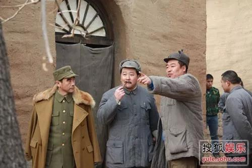
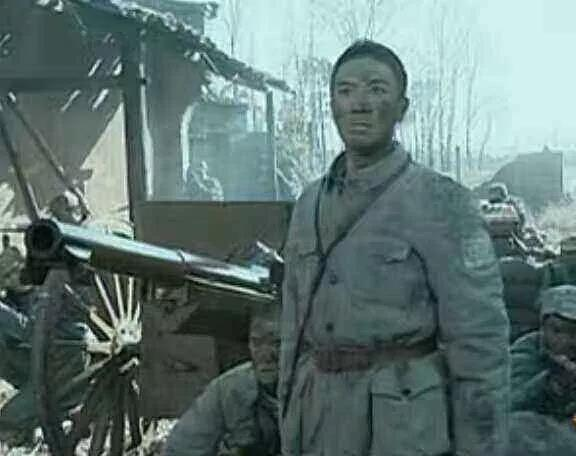
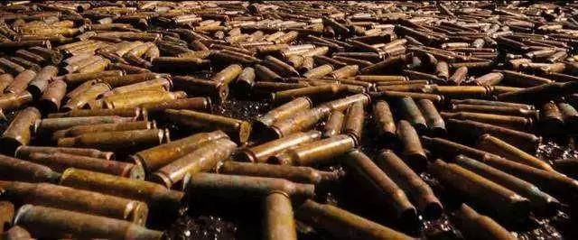
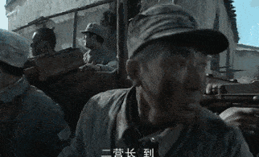
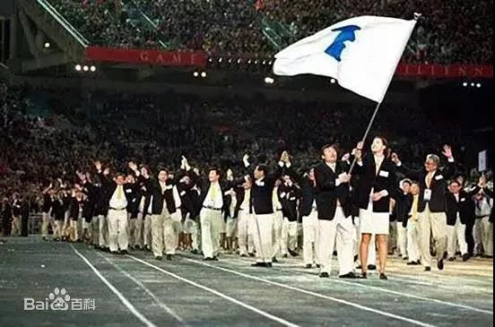
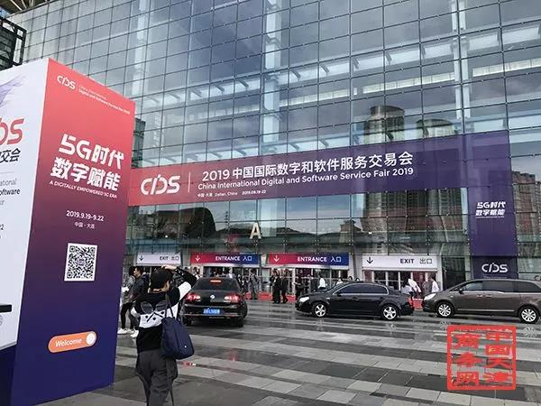

##正文

 
一、东北亚的支点

1904年，大日本帝国与俄罗斯帝国启动了最高级别的动员，围绕着大连陈兵百万，开启了一场国运之战。

最终，日本以损失十余万士兵为代价，全歼了沙俄的太平洋舰队以及赶来援助的波罗的海舰队与黑海舰队，从沙俄手中夺取了这颗东北亚皇冠的明珠，获得了东北亚的制海权。

随后，日本的关东军以大连为支点，从经济、政治、文化等各个领域不断的蚕食朝鲜、东北以及华北，国力突飞猛进，迅速崛起成为了东亚霸主。

而动员了百万预备役，却依然丢了东北亚支撑点的沙俄，国内直接引爆了“1905年革命”，不仅令横扫欧罗巴的“欧洲宪兵”从此成为历史，废墟中也诞生了那个令西方世界恐惧了半个世纪的苏维埃政权。

40年之后，一场复仇之战来了。

1945年8月8日，就在长崎落下原子弹的一天前，根据雅尔塔密约，苏联从美英手中拿到了接管大连的承诺后，正式对日本宣战。

瞬间，百万钢铁洪流席卷了中国东北，也占据了东北亚最重要的不冻港，那个令几代俄国人魂牵梦绕，并付出巨大代价的大连。

在获得了大连这个东北亚最重要支点后，北平、天津、上海、平壤、汉城以及长崎，这些东亚最重要经贸城市全部匍匐于老大哥的注目与武力威胁之下。

这也意味着忍辱40载，毛熊终于从日本手中重夺了东北亚之霸权。

 

 
二、共和国的转折点

就在苏联夺取大连之后，这颗北方明珠又成为了共和国乃至乃至东北亚命运的转折点。

当时，抗日战争还没结束，蒋介石便要将最精锐的全美械部队——“中国远征军”从中南半岛通过海运投送至中国东北，以抢占这个当时亚洲最强大的重工业基地。

 

 
 机械化的中国远征军坦克部队

可此时占领着东北的苏联，却拒绝载着国军的运输船在大连登陆。

这几个月的空白期，毛泽东电令中共指战员们从大连登陆，迅速填补了苏军逐步撤退后留下来的空隙，把东北打造成整个解放战争中，第一个我军占据优势的区域。

而我军通过大连港快速抢占的东北，也成为解放战争中倒下的第一张骨牌，凭借着东北强大的工业制造能力，林彪率领着后勤充足、装备精良的东北野战军，以摧枯拉朽之势，从北到南打穿了整个中国。

 

 
执掌东北大权的林彪穿皮草，分管陕北后勤的贺龙穿棉袄

 
三、解放战争之王

作为东北亚最好的深水不冻港，大连的意义并不仅是一个港口。

在抗战时期，我军每个士兵战前只能分到几颗子弹，在缺少炮弹和炸药包之下，日军一个碉楼就能卡得我们死死的。

就算《亮剑》中被称为“富得流油”的李云龙团，也不过才有一门75MM的“意大利炮”。

而有了这门炮，李云龙就敢去打一场“平安城格勒”战役，搅乱了整个晋西北。

 

当然， 即使这一门炮也是杜撰的，整个抗战时期我军都没有类似的重炮，就算有炮也搞不到炮弹。

甚至别说平安城了，李云龙的那位旅长，曾领着几千人围着个碉堡打了整整一天，伤亡极其惨重，可对面才死了四个人。

 

不过，随着我军拥有了大连这个“战争之王”后，一切全都改变了。

作为苏联进军东北后唯一没有被洗劫的城市，我党进入大连后，将现有的炼油厂、化工厂、炼钢厂、钢管厂、轴承厂等组成“克虏伯式”的军工联合体。

在这里，规模化生产出了其他解放区根本无法想象的重型装备与大口径炮弹，这使得在解放战争三大战役期间，曾经穷怕了的咱们，几乎就没有把弹药打光的时候。

 

更不要说随着大规模“大连造”的加入，我军战术也从意大利炮式的点射游击战，变成了数百门重炮无差别覆盖的一路平A，追着国民党军队胖揍。

 

现代化战争比拼的就是后勤。老蒋虽然有大量美械的105-155毫米大口径榴弹炮，但当时国统区并没有生产弹药的能力，部队刚交火就会把弹药打光。

而我方的弹药却用之不尽，就像战神粟裕说的，华东的解放特别是淮海战役的胜利，离不开山东民工的小推车和大连的大炮弹。

哪怕是蒋介石嫡系王牌整编74师，这支全美械部队在孟良崮上面对“大连造”的狂轰滥炸也撑不住几天。

更不要说淮海战役中，那些国军王牌部队，不管谁只要跑得慢了，被咱们的炮兵追上，面对无尽的炮弹倾泻.......

别说什么“千里驰援”了，如果不想“成仁”，就只能选择投降。

 

 
四、中国最早的特区

在解放战争中起到关键性作用的大连，跟香港、深圳一样，最早都只是一个小渔村。

当年用北洋水师的巨舰重炮在长崎逼着日本赔款，在汉城平定朝鲜兵变的李鸿章，为了确保大清在东北亚的制海权，以及对朝鲜和日本的战略威慑，不惜重金将大连的旅顺口打造为亚洲第一军港基地。

可惜，甲午战败，北洋水师全军覆没，根据马关条约，大连被割让给了日本。

谋求东北亚制霸的俄国并不甘心，拉着德国和法国在三国联合干涉下，把大连抢了回来，并将旅顺港命名为“亚瑟港”，将大连港命名为“达里尼港”，意为俄语的远方，希望以此为跳板控制东北亚。

不过占领大连不到十年，俄国又被意图大东亚共荣的日本击败。亚瑟港更名为回旅顺，“达里尼”更名为大连，日本将两者组成了历史上著名的“关东州”。

伴随着沙俄与日本先后的殖民统治，大连也成为了东北亚唯一中日俄三国文化与建筑交错的城市。

 

为了控制东北亚，日本将整个东北亚的机构，从军事上的关东军司令部，到经济文化上的殖民机构“南满铁道株式会社”总部纷纷放到了大连，将这个小渔村迅速建成了大都市。

而且，在“大东亚共荣”思路下，日本人将大连定义为自由港与特区，就像香港和后来的深圳那样，进出口商品全部免税，使得大连成为当时亚洲物价最低的也最有活力的城市，大量的日本企业也主动向大连转移。

甚至为了发展大连，日本的“国营南铁”不惜进行巨额的运费补贴压低货运成本，将大连打造成为当时全世界最自由开放的港口之一，吞吐量一度占据了整个中国的四分之一。

就像几十年后的香港和深圳陆续成为中国对外的窗口那样，日本治下的大连不仅成为当时整个东北对外的窗口，也成为了日本与全球贸易的重要港口，连日本从东南亚买回来的石油都要在大连进行炼化。

凭借着特区式的政策优惠，以及背靠东北和日本两个超级市场，大连很快在在城建、交通、工业、商贸、收入等各方面成为东亚最发达的地区，并建成了东北亚最先进的工业体系。

看着大连的蓬勃发展，当时骄傲的日本人甚至出版的地图中，介绍大连是继东京、大阪之后的日本第三大城市。

不过，随着1945年日本战败后，这一切都成为了泡影。

大连被完整的交到了苏联人的手里，而准备长期驻扎大连以控制东北亚的苏联人，并没有洗劫大连，而是继续推动发展，希望利用大连来控制整个东北亚。

 
五、第一次的发展停滞

在解放战争中，大连庞大的工业人才储备和完整的工业体系不仅帮助洗劫后的东北迅速恢复了工业生产能力，更为接下来的抗美援朝奠定了坚实的基础，成为了中朝贸易的重要通道。

而且建国之后，由军工厂转为民用之后，东北庞大制造业源源不断的通过港口运送至南方，不仅打赢了建国初的那一场经济战，更是迅速推动了中国从农业国向工业国的转型。

可以说，同时拥有港口加重工业体系配套的大连，是当时中国最闪亮的明星，直辖市的大连不仅是中国第二大沿海城市和工业基地，人均GDP也与上海、天津、北平同属第一梯队。

而且，大连一直都是东北亚地缘政治最重要的支撑点，甚至当年中苏交恶的导火索，就是因为赫鲁晓夫提出了要在大连港建立联合舰队与海防基地，被走独立发展道路的毛泽东坚决拒绝。

可是，这么一个各方觊觎的重要工业港口，建国后却迎来的他的第一次发展停滞。

不同于俄日两个国家占领大连时，都是进行积极的战略扩张姿态，建国之后，尤其抗美援朝后，我们在东北亚地缘上就开始了的战略收缩。

因此，作为东北亚中心与战略扩张先锋的大连，重要度迅速下滑，不仅直辖市身份被取消，丧失了半个世纪的全球自由港地位，连贸易起家的国际港，运货量也在直线下滑。

大连发展的停滞，有着显著的历史背景。

对外，50年代之后，随着西方国家的封锁，大连与资本主义阵营贸易几乎断绝，而进入60年代，随着中苏关系的破裂，大连与东欧的社会主义阵营贸易也断崖式下跌，大连的贸易优势迅速弱化。

对内，随着对中央将大连的工业拆分进行各地的援建和转移，大连的工业集中度迅速下滑，而伴随着全国各重工业基地的迅速兴起，一度紧缺的重工业迅速饱和，大连工业的优势也在日渐凋零

而且，作为苏联进兵东北之后唯一没有洗劫的工业城市，大连留下了一整套完整的日本工业体系，使得中国自一五计划后，156个苏联援建项目虽然集中于东北，但大连只有扩建，却没有新建一个工厂。

这使得以日本工业体系为基础的大连与援助的苏联工业体系出现了一定的排斥反应，大连很难融入到全国的产业供应链之中。

更不要说，作为曾经中日之间最重要的贸易港，随着二战之后，中日分属不同阵营，大连的对日贸易几近断绝。

这就使得建国后全国各个城市都出现了日新月异的气象，可曾经遥遥领先的大连却没有什么大的变化。

直到改革开放这个历史的转折点出现后，大连才迎来了他的第二个春天。

 
六、历史的转折点

1978年年初，虽然改变中国的十一届三中全会还没有召开，可一支以国务院副总理谷牧领衔的“国务院经济考察团”就已悄然出访西欧。

考察团返回后，向中央汇报，就像当年的“大连自由港”那样，提出把一块地方围起来搞“经济特区”，能吸引外商投资办工厂，获取当时中国急需的资金和技术。

年底，改变中国的十一届三中全会如期召开，小渔村深圳，也成了国家第一批开放的经济特区。

深圳刚成为特区不久，时任辽宁省委书记任仲夷就向中央领导汇报，提出继深圳之后，要将曾经的自由港大连也打造成为特区。

相比于当时还是小渔村的深圳，大连不仅有着良好的港口和雄厚的工业基础，地理位置也有利于跟周边的日本、朝鲜、韩国、苏联进行经贸合作，更有机会成为冷战期间打通东西方的一个重要通道。

不过，就在谷牧、任仲夷以及日本专家们把方案定下来，刚要提交中央讨论之际，胡乔木从特区的深圳返回，忧心忡忡的向中央汇报：“深圳什么都变白色了，只有国旗还是红色的”......

由于大连是占据的东三省的出海口，更是京津门户，在冷战尚未结束之际，仍有大量的驻军要保护首都的安全，于是，大连特区的方案只能被束之高阁。

而力推大连作为特区的任仲夷随后被小平同志点将，出任广东省委书记，掀起了深圳改革开放的序幕。

大连和深圳，两个小渔村的命运，也从此开始了走向了不同的轨迹。

深圳开启了面向全国和国内的全面开放，而拖了几年才开放的大连，虽然拿到了中国第一个国家级开发区，但却没有恢复当年的自由港。

冥冥之中，大连错过了80年代日本那一波疯狂的海外投资。

 
七、大连的第二次辉煌

1999年，也许是大连的辉煌的“巅峰”。

那一年，大连万达队在国际足联排名中位列亚洲第一，国际第29，保持了各项赛事主场57场不败。

那一年，大连软件园举行了开园庆典，在整个东北陷入蓝领下岗剧痛之际，一大群提供高薪白领工作的国际企业先后入驻大连。

那一年，前来参加第十届大连服装节周华健不禁感慨：大连是中国大陆最漂亮的城市。

令周华健震惊的不仅有美丽的城市，在这一场服装盛宴中，他看到的国内外嘉宾中，有人大委员长的李鹏，美国前国务卿黑格，以及国际奥委会主席的萨马兰奇......

而此时，就在大连看似璀璨的时刻，靠着“三来一补”起家的深圳特区，却走到了发展的十字路口，大量新建的写字楼遭遇空置，大量的企业关门破产，唱衰深圳之声不绝于耳。

值此困境之际，时任深圳市委书记带队，开启了建市以来规格最高的一次学习考察，而考察的重点，就是中国大陆上最早的自由港——大连。

当时，大连国际服装博览会是国内三大博览会之一，看到了大连服装行业的蓬勃发展后，深圳市委领导下了一个壮士断腕的决定，停办深圳一年一度的荔枝节，向大连学习，通过办理国际展会，让深圳成为世界与中国交流的平台。

于是，承载着深圳产业转型和可持续发展使命的高交会于1999年推出。

不过，深圳并没有像大连那样，邀请联合国秘书长，美国国务卿，欧盟委员会主席、日本首相、澳大利亚和意大利总理，奥委会主席这些“地球级”的领导。也没有邀请刘德华、周润发、周华健、张信哲、范晓萱这些炙手可热的港台艺人。

深圳的领导们很务实，他们邀请了一大批科技企业与投资机构。

 
八、深圳与大连

1999年，准备了一年的深圳高交会终于召开了，一位刚刚从深圳大学毕业，拿着20来页商业计划书跑遍各个场馆的年轻人。

这一场高交会没有白来，他得到了IDG和盈科数码的青睐，拿到了公司发展史上第一笔220万美元的风险投资。

也许IDG和盈科数码都非常后悔他们后来卖出股份的决定，20年后，他们曾经的那笔投资，价值已过万亿......

没错，当年那个跑遍高交会各个场馆的年轻人，名字叫做马化腾。

当时为了吸引观众，马化腾烧制了1000只企鹅陶瓷储钱罐当礼物派送，而选储钱罐为礼物，也许就是因为当时腾讯因为缺钱已经到了“至暗时刻”，整个团队因为QQ已经“倾家荡产”。

死马当作活马医的马化腾，却没想到在深圳的高交会上拿到了救命的钱。

对此，马化腾曾感慨：“我们在第一届高交会拿到风险投资，那时候深圳也非常难，互联网所有的VC、PE全都在北京，没有VC过来深圳。没有深圳举办的高交会平台，小企业非常难接触到这些资本。”

其实不止腾讯，包括朗科、比亚迪、金蝶、大族激光、三诺、迈瑞、奥比中光等一大批国内知名科技企业，最初都是在深圳高交会上获得项目或风投、产业资金的支持。

承载着深圳产业转型和可持续发展使命的高交会，为深圳、也为中国高新技术产业发展打开了一片新天地。

而此时的大连，却依然沉浸在服装节万国来朝的美梦之中，没有想到自己即将错过一个时代，更没有想到辉煌的巅峰之后，是长期的停滞不前。

 
九、失去的二十年

曾经的北方明珠，在90年代末后，经济增速就像大连足球一样，排名开始了迅速下滑，迅速被一众曾经看不起的城市甩在了身后。

大连最近二十年的发展停滞，原因众说纷纭。不过对比同为开放窗口深圳，也许就能找到大连发展停滞的原因。

大连和深圳作为两个开放的样板，都在利用特区的政策，纷纷搞起了“三来一补”，只不过深圳承接的是香港的转移贸易，大连承接的是日本的产能转移。

大连的国际服装节之所以办得辉煌，而且能够请来村山富市、海部俊树、宇野宗佑、桥本龙太郎等日本首相们，背后是随着七十年代中日建交，日本开始向大连大规模转移服装产能。

而大连在90年代末发展停滞的原因，也是因为产业上与日本过度绑定，譬如大连重金打造的软件园以及软件行业，看似收入很高，但本质做的是对日软件外包。

随着90年代日本广场协定之后出现了经济泡沫的崩溃，日本国内消费迅速下滑，直接导致大连服装行业的也进入了低谷，日本对于海外的投资也开始大幅下滑。

反之在看其他城市，随着进入WTO，中国全境对外开放，美国迅速取代了日本成为了中国最大的贸易伙伴，大连对日贸易垄断的优势迅速弱化。

而且，2000年后的日本完美错过了互联网时代，也导致了锚定与日本的大连虽然有着国内最强的软件业底子，但也没有赶上全国风起云涌的互联网风口。

回过头来看，大连发展停滞的二十年，背后其实是日本“失去的二十年”。

而此时还未摆脱东南亚经济危机的深圳，看似艰辛，却获得了幸运女神的青睐。

就像刘鹤在《两次危机》中说的那样，危机不仅有破坏性，还具有强烈的再分配效应，它将导致实力的转移和经济秩序的重大变化。

90年代爆发危机的日本，坚决放弃了金融和房地产，痛定思痛的选择重新回归高端制造业，使得90年代向大连产能转移的日资企业纷纷折返日本本土。

而97年东南亚金融危机爆发之后，被中央庇护了的香港民众却用脚投票，选择了放弃高科技，全力发展金融与房地产，而把香港在电子领域巨大的先发优势，免费让给了一关之隔的深圳。

所以，如今深圳人民最应该感谢的，是那些让香港脱实入虚的摘瓜巨头。

深圳应该感谢谁不难理解，但大连人民往往并不知道真正阻碍大连发展的是谁。

改革开放之初，日本以大连为中心，进行大规模投资和产能转移的背后，是GDP正在超越美国的日本，意图推动东北亚一体化，与美国分庭抗争。

为此，日本主张建立亚洲货币基金（亚投行的原型），以及东亚共同体的虚拟货币（明白央行为什么要搞虚拟货币了么？），来推动东北亚的经济一体化。

相信足球爱好者都会对2003年在日本东京举办的首届中日韩A3冠军杯有印象，甚至两千年初的时候，各类奥运比赛中，朝韩两国都在高举半岛旗入场。

 

有着共同文化基础的东亚各国，都在默默的用体育外交来化解历史上的隔阂，推动经济领域的合作。

可惜，在美国的干涉下，韩国的卢武铉被美国人搞的跳崖，汉城改成了首尔，汉字从韩语中被剔除；日本连续几任的亲华首相纷纷被东京地检干掉，伤害中韩感情的靖国神社重新开始大行其道。

伴随着钓鱼岛、萨德以及独岛竹岛的纷争，中日韩三兄弟渐行渐远......

而东北亚一体化的终结，也就意味着各方交织中心的大连，退出了镁光灯的中央。

 
十、大连的再次崛起

回顾历史，大连无论是从小渔村成为国际大港，还是在改革开放前期的一枝独秀，背后都是都赶上了东北亚整合的历史进程。

 

大连作为中日韩朝俄东亚五国的中心点，无论是满清、沙俄、日本、苏联，还是新中国，任何一个国家想要制霸东北亚，那么大连必然成为各方瞩目的中心，都必须要在这里注入巨大的资源，使其成为各方汇聚的中心。

**大连的崛起，是李鸿章、是伊藤博文、是斯大林、更是毛泽东这些最伟大的战略家得出的结论。**

未来，作为二战雅尔塔体系最后的枷锁，半岛问题一旦在特朗普任内解决，那么随着北极能源航道的开通，日本、朝鲜半岛、中国东北以及俄罗斯远东的经济、文化将全面打通，整个东北亚将爆发出惊人的活力。

届时，作为东北亚地缘中心的大连，在各方力量的博弈下，必将重新回归舞台的中央，汇聚各方的力量。

只不过当年的大连是日本建立大东亚共荣圈的跳板，而未来的大连，将是人类命运共同体在东北亚最重要的基石。

 

当然，历史进程的背后，必然也需要个人的奋斗。

未来的大连将不再是列强进入中国的窗口，而是我们出征东北亚的前哨站，连续错过了互联网和移动互联网两个时代的大连，必须在5G数字时代实现翻身，对自身进行一次痛苦的转型。

就像20年前的深圳，深圳市委主要领导痛下决心，将召开了十余年的荔枝节停办改为高交会，从此孵化出腾讯等一大批互联网公司。

今年的大连市领导们，也正进行了一次痛苦的壮士断腕，不惜将举办了十余载的“国际软件交易会”改为“国际数字交易会”，誓要在数字与智能制造奋起直追。

 

虽然历史上，大连错过了互联网与移动互联网两个时代，但是在未来工业数字化领域，大连却拥有着得天独厚的优势。

不同于北方其他的兄弟城市，大连是唯一与日本、韩国、朝鲜、苏联均有着工业体系传承与文化联系的城市，也是东北亚的港口中心与地缘中心。

未来，随着明年春季的中日两国元首破冰访问，以及朝美谈判半岛和解，尘封已久的东北亚必将开始一轮的高度整合。

届时，随着工业数字化时代的到来，大连的工业基础不仅可以成为中国未来数字化改造的先驱。凭借着与东亚其他国家产业体系与文化的关联性，率先完成工业数字化的大连，更将成为中国在东北亚产业融合的先锋。

就像曾经空壳停泊在大连湾多年，时刻等待着祖国召唤的辽宁号，如今已经满载着战斗机带领着庞大的舰队为祖国巡航。

如今，祖国已华诞70载，中华民族的伟大复兴正在向我们挥手。蒙尘已久的大连也将洗尽铅华重装上阵，成为构筑东北亚命运共同体中，那颗最璀璨的明珠。
 
 

##留言区
 

