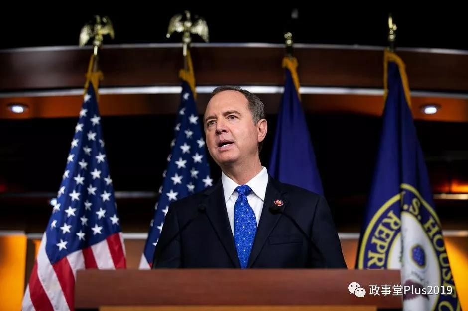
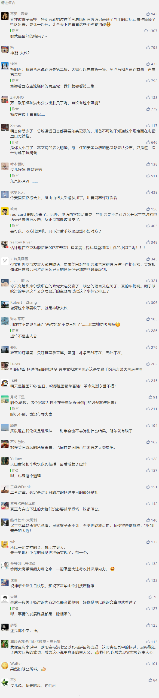

##正文

针对特朗普的第一个杀手锏，终于使出来了。

继“通乌门”，美国众议院启动针对特朗普的弹劾调查之后，真正令特朗普恐惧的杀招，国会要求特朗普公布与普京的通话记录，终于如前文所料，使了出来。

据路透社报道，众议院情报委员会主席亚当·希夫9月29日表示，国会考虑获取特朗普与普京等世界领导人的通话记录。

 

而与此同时，大量的乌克兰民众也在线请愿总统公开与普京通话记录。

很显然，乌克兰民众没事儿折腾这玩意干啥？背后就和当年在乌克兰事件中民主党扮演的角色一样，都是有组织的预谋。

当然，民主党开启的弹劾调查和乌克兰的运动，也不是为了在今年就把特朗普弹劾下去，而是为了开启调查，为接下来的博弈谋求更多的筹码。

按照国际惯例，国家元首之间的通话内容是要加密的，因为大国元首们之间是要进行大量交易的。

就像冷战时期，哪怕美苏之间进行着激烈斗争，但是在划分第三世界国家的利益方面，两国总统也都在电话里面进行着勾兑。

同样，哪怕是当年乌克兰事件中，撕破脸的美俄两国关系跌至谷底，奥巴马和普京依然可以电话里做交易，探讨如何划分两国在乌克兰的利益。

所以，别说是特朗普了，连奥巴马跟普京的电话录音都是不能公开的，否则“傻白甜”的美国民众根本接受不了这个丛林法则之下的黑暗世界。

就像之前的维基解密事件，即使是部分外交官员之间的密电，就令全球出现了一场“外交911”，搞的全球外交界焦头烂额。即使是很正常的国际行为，在民众的眼中就会成为与魔鬼做交易。

因此可以预见的是，大嘴巴的特朗普在跟俄罗斯以及沙特的外交电文中，能挖出来多少令民众瞠目结舌的内容。

而这也让特朗普陷入到了一个巨大的困境当中，这些通话记录肯定是不能公布的，公开了就意味着自己政治生命很可能将面临终结，无法拿下大选。

就像昨天文章中说的，由于特朗普在近年来与全球各主要国家的交往当中，围绕着自己连任进行了大量的交易。

可以预见的是，不仅特朗普与俄罗斯和沙特的通话记录里面内容必定劲爆，与英国首相约翰逊这俩“臭味相投”的恐怕也没少说其他人的坏话，更不要说特朗普跟安倍或者文在寅的通话记录中，特朗普都会把寻求连任在电话里面赤裸裸的说出来。

因此，这次民主党揪着通话记录打，不仅会令特朗普只能封锁电话记录被动挨打，还有可能让日本韩国等已经跟特朗普达成的政治交易，出现变数。

更不要说，那些还没有跟特朗普达成交易的，更是要掂量掂量，一旦跟特朗普的电话谈判内容公开，可能会引发的轩然大波。

不得不说，在昨天文中特朗普费尽心机，取得的全球政治格局逆转，民主党轻轻的一招，又把局势重新扳了回来。

所以呢，这场美帝博弈的大戏才刚刚开始，真正有实力下注的大佬们没必要过早登场，在双方互斗力竭之际出手才是他的机会。

就像金庸小说中，欧阳锋与洪七公以死相拼最终力竭，这时夹在其中的杨过，最终融汇了两大巨头的武功，成为这小说中真正的主人公。

 

##留言区
 

