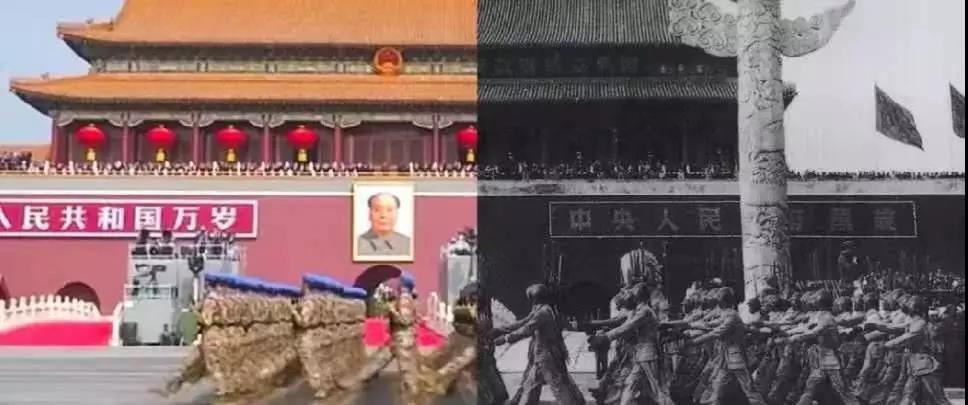
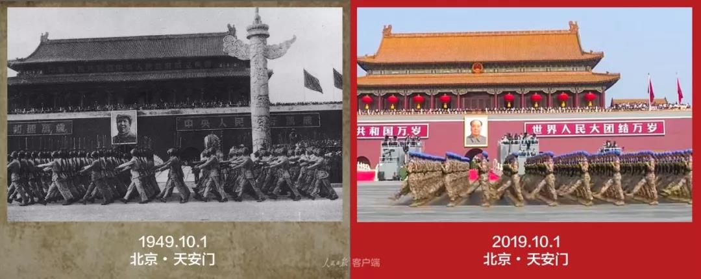

##正文

1949年10月1日，天安门广场。

早上六点左右，国庆阅兵受检阅的部队，便已抵达了长安街。

此刻，受阅军队与长安街上的数十万民众，都在急切的等待着新中国成立这神圣的一刻到来。

可是，大家看着太阳从东边转到了西边，到了快下午两点，整个长安街上依然没有动静。

没有人知道具体几点钟举行开国大典，因为时间必须严格保密以防止国民党的空袭。甚至连开国大典的举行日期，也是在四天前的9月27日，才在第一届政治协商会议上通过的。

没办法，当时的新中国没有制空权。

就在开国大典之前的几个月，国民党空军的数次轰炸都对北平造成了巨大的伤亡，其中针对南苑机场那次，不仅摧毁了我军宝贵的四架战机，还导致了数百件房屋被烧毁。

以至于最初开国大典的方案，是定在了南苑机场，因为那里地形开阔，民宅稀少，万一遭到空袭也便于疏散和隐蔽。

不过最后，周总理下了决心，将仪式与阅兵选择在了天安门前的长安街上。

选择天安门就要承担相应的风险。

阅兵总指挥聂荣臻在最后一次排练时，甚至对受阅部队下达了死命令，“参加开国大典时要一切行动听指挥，如遇国民党军队空袭，要原地不动，天上下刀子也不能动，要保持原队形。”

没办法，我军能够参与开国大典的飞机，却只有十七架。相比于之前盟军在诺曼底登陆的时候，第一个24小时内，就出动了飞机约1.5万架次，新中国的空军实力，实在是太弱了.....

同样，靠着十几个国家淘汰的旧品的“万国牌”陆军，也不“省油”，阅兵途中一辆装甲车开到天安门西侧时，因机械故障熄了火，幸亏后面车里的战士急中生智，踩着油门从后面把这辆装甲车顶走才没扰乱秩序。

这一切，天安门城楼上的毛泽东与周恩来都看在眼里。

他们没有责怪任何人，而是严肃的注视着台下，希望有一天，中国能够摆脱贫困落后的面貌，让这支从长安街走过的人民军队，能够向全世界展示，中国人民不仅站起来了，而且也强起来了，他们有能力捍卫自己的利益。

 

在开国大典现存镜头中，毛主席是很少出现笑容的。

直到广场和城楼上爆发出了如雷的掌声与欢呼声，刚刚建成的解放军空军编队飞过天安门广场上空之际，他的脸上才露出了久违的笑容......

当时，除了中央军委的少数领导之外，大家都不知道新中国还有这么一支空军编队，尤其是天安门东侧的东交民巷，西方国家的领事们对新中国空军露脸更是大为惊诧！纷纷给各自国家发回了急电。

因此，很多老人们在追述开国大典阅兵式时，都会说最令人兴奋的就是新中国空军首次露脸，这是中国人的高光时刻！。

甚至为了向西方展示新中国，周总理还表示，我们飞机不够没关系，那就飞两遍！

 

很多人都认为，飞两遍只是为了看起来“体面”。

但是他们并不知道，这些参加演习的飞机中，很多都是实弹飞行，他们的飞行不仅是在给新中国人民打气，更是为了随时对抗可能前来的侵扰，守护建国大典......

一晃，70年过去了。

 

还是在那条长安街上。

曾经的“万国造”，成为了如今汹涌的钢铁洪流。

 

曾经的17架老式混编机队，变身160余架世界一流战机翱翔在北京的天空。

 

 

更不要说，东风41与巨浪2的亮相，都在震惊全世界。

 

 

就像大公报之前做的一张示意图，台湾与冲绳都在我方东风16的覆盖网里面，关岛与东京都在我们东风26的覆盖网里面，甚至美国全境都在我们东风5B的覆盖网里面。

 

如今，我们亮相了更为先进的东风41和巨浪2，不仅意味着这两款导弹已经开始大规模的战备值班，更意味着我们很快就可以期待下一款使命必达的“东风快递”了。

 

真理总在大炮的射程范围之内。

70年前，我们选定连开国大典的时间和地点，都要反复斟酌，以避免遭受打击，参加阅兵的空军甚至都要真枪实弹时时备战。

而70年之后，在一代代中国人的奋斗下，中国实现了天翻地覆的变化，几艘军舰就让我们签订不平等条约的日子早就一去不复返了，中国人民不仅实现了站起来，更实现了强起来！

凭借着今天长安街上展示的中国力量，我们有实力让大家冷静的坐下来，听听我们口中的真理是什么样子的。

建国大典上少有笑容的主席和总理，希望你们也能看到70年后的十里长街。

这盛世，如您所愿！

 

 

 

##留言区
 

