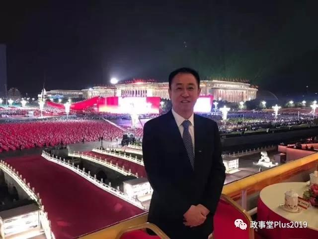
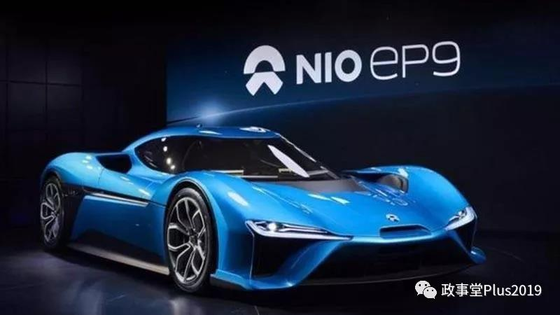
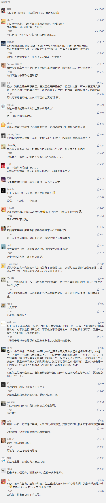

##正文

就在昨天的国庆典礼上，正在奋力造车的恒大老板许家印，令人意外的出现在了观礼台之上。

 

这位曾经的中国首富近期在多个场合表示，要在3-5年内成为世界规模最大、实力最强的新能源汽车集团。

不过，就在许家印的高光时刻，其新能源领域最强劲的对手蔚来却迎来了至暗时刻，连续多日股价跌跌不休，马上就要跌到退市边缘线的1美元了。

 

仅仅一年前，蔚来汽车的股价最高曾达到13.8美元。到最新收盘价已经跌了90％，

这家在纳斯达克上市，市值一度超过130亿美元的中国新能源巨头，没想到这么快市值只剩下13亿美金了。

政事堂身边不少朋友都在说蔚来是骗子，不过政事堂看来，相比于站在天安门上观看庆典的许老板，蔚来的造车才是真正的为人民服务。

首先，就像前些年的ofo和摩拜救活了濒临倒闭的飞鸽和凤凰等自行车厂那样，将造车业务都外包给江淮的蔚来，也被江淮这个一度经营困难的国营老厂焕发了生机，为无数家庭提供了就业与收入。

其次，在蔚来的铺天盖地的宣传攻势之下，很多像政事堂这种对车没有了解的人，听了蔚来老板的介绍后，都认为中国的江淮可以吊打德国的保时捷，对中国制造更加拥有了信心。

 

虽然很多人都在调侃，蔚来没有特斯拉的命，却得了特斯拉的病。其4年来损了50亿美元，相当于特斯拉15年的累计。

不过，在政事堂看来，大家都错怪了蔚来。

相比于不少高呼着爱国的老板们纷纷向国外转移财产，蔚来这些年哪有给美国的股东们分过红？

这几十亿美金的亏损，蔚来全部用于了超一流的体验中心与售后服务上面，
增强了消费者的体验，让中国将新能源汽车的逼格大幅提升。

尤其是在政府补贴退坡之后，蔚来接着扛起了政府补贴的责任，让每个购车人都享受到了低廉的价格。

而且，最关键的是，不同于对比贾跃亭搞汽车烧自己的钱，许家印搞汽车从地方政府搞钱，蔚来这些年亏得都是从海外融的美元。

因此，虽然如今蔚来市值从130亿美金跌到13亿美金，但人家一不偷二不抢，靠着真本事从美国的资本市场上忽悠来了美元，为中国人民提供就业，为中国新能源车培育市场，替中国政府支付补贴.......

你们说这不是爱国，那还有什么是爱国？

量老美之物力，结中国之欢心，这才是为人民服务的典范，这才是践行精准扶贫的劳模。

让我们向蔚来汽车的团队致敬~~~

 

好了，不开玩笑了，继前些天文章看空蔚来写完之后，好多朋友也在问我蔚来的未来怎么走。

其实，如果用政事堂“动能+基建”的逻辑，很容易看清楚蔚来以及整个中国新能源汽车领域未来的发展方向。

首先，随着特斯拉中国工厂的鬼斧神工，中国新能源汽车的供应链将迅速提升，可以预见的是，未来整个新能源车领域，不仅国内的竞争会非常激烈，国际上很多国家也会被中国的供应链优势所击垮，丧失成本比较优势。

其次，恒大号称同步研发15款新车型，10年内实现年产销500万辆的计划，虽然有很大吹牛逼的成分，但是人家的确有这个想法。

对于许家印来说，造车是基建，是不赚钱的，造房子才是赚钱的动能，搞造车基建，不过为的是借此拿到银行的廉价资金，并从地方政府手中拿到廉价的土地。

未来，许家印这位中国前首富的造车，根本就不准备赚钱，甚至准备好了大规模的贴钱的准备。

因为造车的数量与杠杆化的房地产赚钱挂钩，许家印在造车上亏的钱，未来都会在房地产上以杠杆化的方式赚回来。

这种中国模式之下，新能源汽车将迅速的从一个高利润的“动能”，被活活给打成了低利润的“基建”。

因此，所有将新能源汽车视为赚钱“动能”，而不接受其已经沦为基建的公司，未来的命运只有一个字，那就是“死”。

就像政事堂当年看空创造了国内IPO神话的顺丰那样，四通一达作为阿里的基建，利润必然会被大幅打压，必然导致了顺丰虽然贵为龙头，但很难赚到钱。

如今，随着阿里都快要沦为蚂蚁金服的基建，未来阿里可能都不挣钱了，更何况那些基建的物流公司呢？

同理，未来新能源车也是如此，只要马云和马化腾没有像之前两者在商超、外卖、打车等领域的入口竞争，炒高了基建的定价，那么未来各大巨头会把新能源车的价格打的非常低。

尤其是许家印，他只有卖出更多的汽车，才会从银行拿到更多的廉价贷款，从地方政府手里拿走更多的优质土地，才能够赚取更多房地产的超额利润。

因此，如今的蔚来有点像金融升级上步步迟缓的京东，如果无法将自身的基建基础上打造出来动能，那么未来就会变得非常堪忧。

而蔚来唯一的未来，就是找到一个愿意为这个不赚钱的基建，提供源源不断的资金支持的机构，希望利用蔚来的基建发展自身的动能。

纵观全球，能够让蔚来支撑下去的，全球也不过才有三家，除了两个“马爸爸”之外，就只剩下科创板。

因此，近期内怕是看不到什么利好消息了，因为如果能够少掏点钱低价退市，对蔚来来说，也许还是一个好事儿。

关联文章：

蔚来汽车、比特币、桂林房价，手拉手一起跳了

##留言区
 

