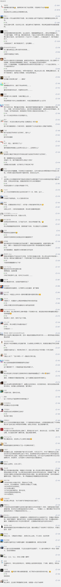

##正文

最近，政事堂花费了不少时间来写乌克兰事件，并对未来进行了大量的推演。之所以花费如此大的精力，是因为这个事件将是全球政治格局的一个巨大的转折点。

记得在2016年年中的时候，政事堂在《经略幽燕拓边西北》系列中，预测了特朗普的上台。而且还预言了，一个以全球“保守势力联盟”组建。

大家如今再拿来对照现实，就像前几天的文章《你想不到特朗普有多厉害》中说的，如今除了法德，全球能够影响到美国的主要国家们，基本都已经跟特朗普形成了战略联盟。（还有BBC刚刚公布的，澳大利亚总理也站队了特朗普。）

未来可以预见的是，特朗普领衔的“全球保守派联盟”，势必要与过去控制着全球政局的“全球建制派联盟”进行全面的对抗，因此，未来一段时间内，两个全球集团的冲突会越发激烈。

而这种两大集团的冲突，必然会导致全球那些重要的地缘重地，出现巨大的震荡。

所以我们就会看到，从朝韩的三八线到印巴的克什米尔，从中东霍尔木兹海峡到冷战分割线的奥地利，冷战时期全球的焦点，如今又迅速变回了全球的焦点。

这并不是巧合，而是历史的进程。

 

就像最近，奥地利总理库尔茨被迫辞职后，在刚刚结束的大选中东山再起，并获得了更多的支持率。

对此，政事堂在之前文章《新版"通俄门"爆发，全球政坛第一帅哥惨遭罢免》中已经提前推演了结果，并推测这件事儿的背后，是德国的默克尔搞的鬼。

此事不难理解，如果了解历史就会知道，冷战时期，全球最著名的间谍之都就是奥地利的维也纳。

作为冷战两大力量的最中间的地带，全球的间谍都汇聚于此，相互策反渗透对方阵营，是各方力量博弈之地。

因此，自古以来的欧洲间谍之都奥地利必然是出现巨大激荡的国家之一。

而从这个角度也就会明白，亚洲最大的间谍之都，在历史的进程之下也不会独善其身，所以懂了这个，就会懂未来的走势。

大家只要提高视觉维度看问题，就会觉得这个世界的运作其实很简单，事情的发生都有着其必然的逻辑，没有那么多的阴谋论。

毕竟奥地利历史上一方面是东欧与巴尔干半岛众多国家的宗主国，另一方面又是德意志民族国家，与欧洲霸主德国同文同种，地缘就决定了他永远是地缘博弈中，欧洲最先开始争夺的对象。

而沿着这个角度，大家自然就会明白，接下来作为英联邦中心的英国，作为全球权重最高的摇摆国，必将成为两股力量争夺最关键的的所在。

对此，全球的建制派联盟将会不惜一切代价去干掉特朗普最重要的盟友——英国首相约翰逊。

没办法，统治了全球几十年的建制派们，已经无路可退了。

过去的四年之前，这些建制派们一个个各扫门前雪，在英国脱欧和特朗普竞选的问题上，都毫无动作、毫无表示。

我们事后来看，英国脱欧和特朗普的上台，不仅出乎全球政客们的意料之外，而且“成功”也都是很侥幸。可如果当时全球的建制派们稍微出点力，何至于后期被英国脱欧和特朗普的反水，打得丢盔弃甲，引发了全球旧秩序的崩溃？

而特朗普上台之后，全球的建制派们才发现不对了，所有连白宫里面的共和党建制派们也都被特朗普一个一个的干掉了。

于是，英国建制派又是白头盔毒气又是双面间谍毒杀，法国的建制派们搞独立的欧洲军，德国的建制派们带头跟特朗普打贸易战......

甚至美国的建制派们更是利用沙特王储谋杀以及乌克兰硬闯俄罗斯领海，在全球建制派联盟的配合下，揪着通俄门盯着特朗普打。

不过，这些动作成本极大，但是收效甚微，根本阻挡不了特朗普。

可以，预见的是，全球建制派联盟知道有多痛了之后，必然会开始反击，不会再像四年之前那样的绥靖。

就像今年德国通过情报组织，在奥地利干掉了保守派势力那样，直到明年美国大选之前，全球的不少地缘上重要的保守派政党，都会遭受到打击甚至颠覆，而特朗普也会像去年对待沙特那样，为这些盟友想尽办法保驾护航。

接下来的一年，全球将会出现以特朗普与美国民主党为领衔的两大阵营在全球各处博弈，抢占关键的地缘位置，并在全球经济领域开始大打出手的场面，甚至两大集团不惜在资本市场放出毁灭全球经济体系的“古巴危机”。

这种危机是我们一定要想办法提前避免的。

而未来世界的走势，往往也可以从历史中寻找答案。

历史上，二战之后，只有东亚儒家文化圈各国抓住两大集团的冷战博弈，先后迈入了发达国家之列。

因此，可以预见的是，新的这一轮全球保守派联盟与建制派联盟的火拼，也将成为东亚各国历史上，又一次绝佳的良机。

##留言区
 

