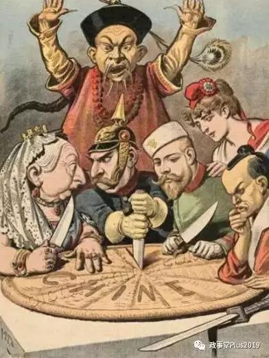

##正文

1842年8月29日，英国远征军旗舰”汗华“号上。

鸦片战争中失败的清政府被迫在此签订了中国近代第一个不平等条约中英《南京条约》，不仅割让了香港，也从此沦为了半殖民地半封建社会。

也是这一年，林则徐的好朋友魏源，在林则徐主持编译的《四洲志》的基础上编成《海国图志》，提出了“师夷长技”的思想，试图向英国人为首的西方为师，使中国富强起来。

这一思想后来成为中国之后一百余年一系列思想的源头，成为了后来洋务运动、维新变法、辛亥革命甚至新中国建国后一系列运动和改革的主线。

不过就像俗话说的，风水轮流转，172年后，曾经通过巨舰利炮来教育中国改革的英国人，也开始了“师华长技”，向中国学习先进经验了。

 

10月2日，英国首相约翰逊在中国国庆的第二天，向欧盟提出了“脱欧”最终方案，围绕着北爱尔兰这个英国的“香港岛”，约翰逊提出了“一国两制”的北爱尔兰特区方案。

在北爱特区内，将形成两个边界，一个是与英国大陆的边检边界，另一个是与欧盟的海关，将北爱尔兰变成兼容英国大陆与欧盟之间的“自由港”。

 

而且约翰逊也表示，这种制度“坚持4年不动摇”，未来北爱尔兰怎么走，是继续按照欧盟的法规，还是英国的法规。交给下一代人（北爱尔兰议会）来决定。

相信很多中国人看到这一段，都会想到要让这位大英中堂赶紧来交版权费。

这简直就是照抄当年97香港回归的那一套嘛.......

大英的老佛爷和中堂，在鸦片战争一百多年后，痛定思痛，终于也开始“师华长技以自强”，学习中国的先进方案了.....

而“中国方案”的提出，也让英国乃至欧洲都对这持续多年的脱欧难题看到了曙光，多名重磅人士表现看好，舆论纷纷表示对本月的脱欧谈判持乐观情绪，英镑更是在本周至今实现了四连阳。

虽然市场对约翰逊的方案非常看好，不过政事堂却对此次大英中堂的未来持悲观态度。

一方面是英国国内，约翰逊中堂看似获得了众多的支持，但实际上跟各方都想把他拉下马。

梅姨率领的保守党建制派以十余名资深议员被开除党籍为代价来狙击约翰逊，这么大的沉没成本，使得梅姨率领的保守党建制派必然会在关键时刻对约翰逊来一次反击。

而工党党魁科尔宾更是不会放弃这个千载难逢的机会，趁着保守党内斗，把约翰逊这位大英中堂拉下马，让自己有机会尝试一下权力的滋味。

更不要说北爱尔兰以及苏格兰的那些“独立分子”，更是要趁乱分一杯羹。

甚至之前被约翰逊利用了的英国女王，在关键时刻的摇摆中，也会倾向于干掉这位挟天子以令诸侯的“曹操”。

可以说，这位大英中堂看似大家都在追捧，但实际上却是四面楚歌。

而另一方面，则在于欧盟以及美国的民主党，别看他们都是表面上跟英国亲密无间的盟友，但私底下会非常乐意干掉约翰逊。

对于欧盟来说，内部已经风雨飘摇的这个联盟不能再出现有人脱欧了。

一旦大英中堂的强势方式给其他欧盟小弟们树立了一个样板，大家都用强势的方式逼着欧盟让步，必然会导致这个联邦分崩离析，因此无论未来英国脱欧如何，对于约翰逊这种刺头是必须杀鸡儆猴的，不能让其他人照着来。

对于美国的民主党来说，明年的美国大选已经到了冲刺阶段，乌克兰事件的爆发，更是令两党正式开始了全球的地缘争夺战。

英国作为整个欧洲的离岸平衡中心，以及英联邦各国的精神母国，其摆动都是足以左右两大阵营的胜负的决定性因素，因此，“全球建制派联盟”必须要团结一致，做个套搞掉约翰逊，以避免其与美国的特朗普形成“英美轴心”。

 

可以预见的是，别看目前市场都在看好，但全球的建制派们都会不分左右，一起练手来扼杀约翰逊这一轮的脱欧方案。

所以，就跟当年魏源提出“师夷长技”时那样，并不能阻止中国沦为列强们分割的蛋糕那样。如今约翰逊中堂的“中国方案”虽然看似很完美，但并不能阻止英国成为这一轮全球博弈的战场。
 
 

不得不慨叹，英国这根曾经的搅屎棍，如今已经沦为了那一锅的屎，在全球的小棍棍都在试图往里面搅一下的时候，再好的补锅匠也无法逆转局势。

那么，约翰逊完全没有机会翻盘了么？

其实也不一定，只要这位刚抄袭了中国的中堂大人，如果继续抄袭中国，他就依然还有一丝生机。

在面对全球建制派的围剿，约翰逊可以寻求中国人民在海国图志后花了一百年才探究明白的终极版解决方案。

这个方案就是发动人民群众，寻求人民的力量。

只要约翰逊中堂敢下这个决心，下载《学习强国》APP学习东方经验，在英国人民的汪洋大海面前，那群建制派就是一捅即破的纸老虎......

##留言区
 

