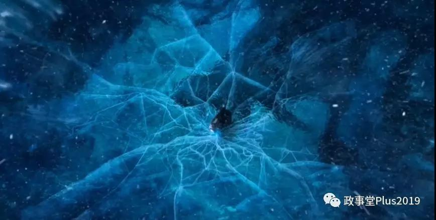

##正文

今天接着前天的文章，跟大家从一个更高纬度，来看一下如今的国际局势，并预判接下来的走势。

要认识世界，就必须要对自身有一个很清醒的理解，如果认为“老子天下第一”，那么就不用看文章了，安安心心的去当一颗茁壮的韭菜挺好。

而首先需要意识到的，则是目前的世界的霸权被美国所掌握。

正所谓天子以怒，浮尸百万，流血千里，因此，美国的霸权决定了其内部的任何问题，都会在全球进行杠杆式的放大。

而认识到了美国的霸权，才能因势利导做出决策。

所以，政事堂这么多年以来一直都在坚定的支持特朗普，是因为他的上台，美国霸权的冰封王座出现了巨大的裂痕。

 

这使得全球政治出现了混乱，自然也出现了阶梯。

尤其是随着中国的发展已经对传统的国际秩序产生威胁之际，这种混乱更将成为历史的重要进程。

幸运的是，随着特朗普的出现，将美国分裂成为两个意识形态不同的集团，开启了新一场冷战式的全球政局争夺，所有全球地缘热点上的国家，如今已经全部被无情的卷入其中。

 

千万不要以为大家能逃离这一场全球的政局大博弈，能够独善其身。

譬如，南亚的克什米尔，这个大英搅屎棍撤离后留下来的一颗老鼠屎，曾在冷战时期搅得中印巴三国一团糟；还有中东霍尔木兹海峡上的沙特、伊朗、伊拉克，他们两伊战争也一直打到了冷战结束。

本来，这些地区已趋于平静，但是今年开始，这些地区又被重新引爆并洗牌了，到处都打起了新的代理人战争。

在霍尔木兹海峡，伊朗带着小兄弟炸了沙特，美国控制的伊拉克爆发了内乱；在克什米尔，印度和巴基斯坦又一次开打了.......

就像冷战时期，苏联支持印度和伊朗，美国支持巴基斯坦和伊拉克，可是如今特朗普这位美国总统，不仅从亲美的巴基斯坦转向了支持亲俄的印度，还积极从亲美的伊拉克撤军默许亲俄的伊朗扩大影响力，甚至对国内鹰派们频频要打的伊朗也想尽办法维护.......

别说什么通俄了，从地缘角度来看，特朗普简直就是一个潜伏在美国的苏联老大哥，要跟传统的美国以及欧洲的建制派们打一场全球大战。

所以，从东西方交汇的土耳其伊斯坦布尔到帝国墓地的阿富汗，这些地缘中心又回到了大众的视线，而像委内瑞拉这类虽然有价值但，是地缘意义薄弱的国家则开始脱离大家的视野。

可以说，随着全球都陷入到了美国大选的博弈，这一场新型的冷战之中，所以全球的政局才会出现如此大之变化

而这一场全球大战首当其冲的，就是奥地利。

奥地利的哈布斯堡家族以维也纳为中心统治了欧洲近千年，不仅成吉思汗的大军止步于维也纳城外，梅特涅也在这里缔造了欧洲秩序，二战后更是成为了美苏两大阵营的博弈中心。

可以说，数百年以来，奥地利的维也纳都是欧洲情报与外交交易的中心，如今也是联合国的驻地之一，以及石油输出国组织（油价、中东）、欧洲安全与合作组织（北约Vs上合）和国际原子能机构（朝核、伊核）等国际机构的大本营。

两股势力想要在这一场新冷战中取得先机，必然就要先拿下这个欧洲的情报中心，于是就有了德国就通过特务组织和舆论力量，在奥地利搞了一场颜色革命，干掉了奥地利的保守派势力。

其次，就是乌克兰。

作为北约与俄罗斯博弈的中心，丢了乌克兰的俄罗斯不仅丧失了战略纵深直接面对北约，也丧失了进军欧洲的跳板。

无论是俄罗斯的黑海舰队还是天然气管道都卡在乌克兰，甚至自冷战之后维持了半个多世纪的雅尔塔体系，就是在乌克兰与俄罗斯之间争夺的克里米亚半岛上签订的。

所以最近乌克兰的局势才会这么乱，是因为乌克兰的走势，决定了俄罗斯这个全球最强大的地缘政治势力，是陷在乌克兰的泥潭中无法自拔，还是跳出乌克兰问题成为能够干涉美国大选的玩家。

因此倾注全力的各方在乌克兰差点打成了一团浆糊。

而明白了这两个国家的重要意义，就会对我们现在的情况有更深的理解。

无论欧洲还是俄罗斯，都是接下来美国大选中的超级玩家。

而明白了欧洲情报之都的维也纳，以及俄罗斯对外门户的乌克兰，这俩为什么会成为各方角力的焦点，就会明白为什么亚洲情报之都和对外门户的如今问题，背后究竟是怎么样的逻辑.......

政治的背后没有那么多的巧合，看一看这几个月的新闻就会明白，以特朗普为首的全球保守派联盟，都在提出同一个要求，就是打击拜登，而以民主党为首的全球建制派联盟，动作也都一样，都在试图搞颜色革命.....

所以，如果大家拥有了这个层级的政治视野，那么就不会有那些嘈杂的争论，也自然会明白了未来的走势。

这是一场百年未有之大变局，所有的参与者，首先要做到的，不是想如何去赢，而是确保不会输，以至于沦为棋盘。

譬如联合国五常之中的英国，从原本欧盟与美国之间搞平衡，两边收益，可是在双方对立后，瞬间沦为了棋盘，梅姨黯然下台，约翰逊上台被四面围攻，从棍子变成了一缸屎。

同样，在历史的大背景之下，五常之一的法国因为爆发黄马甲都差点丧失了做棋手的机会，执掌欧盟大权的默克尔，也因为移民问题让自己的大本营受到了重创。

所以，在危机重重的如今，任何的一个眼光长远的政治家，首先要做到的，不是学习英国那样去激化矛盾，把自己的国家变成各方力量撕扯的战场，其次就是尽可能不要去树敌，让自己成为矛头的中心，导致遭受打击。

其中最直接的例子就是印度的开国总理尼赫鲁，在美国与苏联因为古巴危机导致战争一触即发之际，竟然还敢来惹中国，使得当时全球最杰出的战略家毛主席都不禁慨叹：想了10天10夜，总想不通尼赫鲁为什么要来搞我们......

后来，一场漂亮的闪击之后，不仅让印度将第三世界老大的地位拱手让出，更是气得尼赫鲁中风突然去世，导致了印度此后陷入了长期的政治内乱。

所以呢，地缘政治的外部压力是无法避免的，但是内部的抉择也是可以靠个人奋斗改变命运的。

而印度的教训告诉我们，真正的政治家们，在两强争霸的大背景之下，一方面要尽可能避免过早站队，使得自己沦为打击对象，而另一方面如果遭遇到惹事的，则需要短促而强力的反击将敌人击溃，以避免对方得寸进尺。

而在这两者的基础上，最重要的，就是想尽办法给自己争取到更多的非两大阵营的“盟友”，以增强可对抗的系统性风险。

所以我们会发现，最近印度的莫迪和朝鲜的委员长已经来访中国多次；安倍以极大的诚意邀请我们明年春天去日；默克尔更是顶着国内巨大意识形态的压力访华释放善意........

这些全球最厉害的政治家们，在这个风雨飘摇的时候，都会将那张Red Card紧紧握在自己的手中。

只要我们不早站队，未来一年之内，与中国亲密度的提升幅度，将是衡量全球政治家水平最好的标尺。

可以预见的是接下来，接下来的一年，中国的朋友，会越来越多，来的越来越频......

关联文章：全球将陷入两大集团的对抗

##留言区
 

