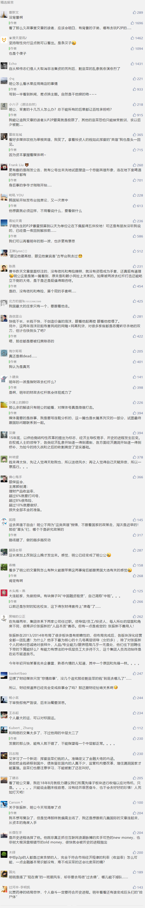

##正文

10月5日晚间，先锋集团发布了一则讣告：董事长张振新去世。

又一家类比明天、德隆系的巨型民营金融控股集团，倒在了历史的进程之下。

张振新，这位神奇而低调的资本大佬，在英国有好几个高尔夫球场，在法国有多个红酒酒庄，他的四架私人飞机令国内众多的顶级富豪都不禁汗颜。

更不要说他在短短几年之间，就打造了号称中国金融牌照最齐全的金控集团，拥有三家港股上市公司，员工规模超过两万，直接管理的资产规模更是高达3000亿.......

当然，摊子铺的越大，出事儿的问题也就越大。

几个月前，先锋系就已经出现了兑付危机，此番老板的去世无疑是数十万投资者的噩梦，未来究竟能拿回多少本金，怕是要听天由命了。

 

就像很多草鸡变凤凰的大佬往往都相信玄学那样，张振新对于风水的痴迷，到了连找助理都要请大师来算算八字是否相合。

而正是2014年的“好风水”，让毫无背景的张振新实现了人生的飞跃。

随着那一年互联网金融写入了政府工作报告，把全部身家压注互联网金融的先锋集团开始了异军突起，旗下的P2P公司连续获得了三轮融资，以至于有了钱都开始收购起了券商。

尤其是进入到2015年，在互联网金融的浪潮之下，拿着多个牌照进行混业经营的张振新更是进入到了策马狂奔的时代，大量的资金涌向了汽车租赁、区块链、网约车、休闲餐饮、物业、投资等多个领域。

张振新本人更是受邀参加世界互联网大会、出席中英互联网圆桌会议、G20峰会，以及“一带一路”高峰论坛......    信心满满的他甚至提出了未来15年要成为亚洲金融巨头。

不过，张振新就像很多已经栽在他前面的那些大佬们一样，没有发现2014年开始的那一波风水，到了2016年已经彻底的被逆转了。

随着中国进入到货币去杠杆周期，各路经济学家们信誓旦旦高呼的降息，从2016年开始就再也没有出现。

没有了预期的降息，资本大佬们渴望的资本泡沫就没有出现，他们从民间吸取高息收购的那些资产，价格并没有出现预想中的暴涨。

尤其是到了2018年，随着货币去杠杆周期进入尾声，大量的P2P进入暴雷周期，老百姓不再敢投P2P，没有新的韭菜涌入，张振新们的资金链也开始出现了问题。

可以说，在货币去杠杆周期内，先锋系的资产不仅没有增值，融资的难度却越来越大，融资的成本也越来越高。

而更最悲剧的是，先锋系在遭受了货币去杠杆的打击之后，又遭遇了一波财政去杠杆打击。

2015年，张振新把公司迁往了香港，开设了一家名为“古琴台”的私人会所。

古琴台取意高山流水，指的是俞伯牙于该处偶遇钟子期，在这个“天下知音第一台”，张振新常常招待香港的知己们。

而这个私人会所，就在华融香港的旁边，赖小民的主要助手白天辉，就是这里的常客。

对于张振新来说，有了赖小民这个香港最著名的接盘侠，资本自然是不愁了，几十亿的境外资金注入，简直令先锋爽的飞起。

不过很可惜，在去年开始的财政去杠杆的第一波浪潮中，赖小民团伙率先落马了，张振新期待的“钟子期”也遥遥无期了......

两拨去杠杆的梯次打击之下，张振新不仅丧失了资金源，也没有了产业的接盘侠，此时，他的命运就已经注定。

尤其是坚持刚性兑付的张振新，几乎就像两年前的贾跃亭，只会进一步的加速自己的死亡，拉着自己的身边人，死在别人的前面。

也许，原本不酗酒的张振新最终选择用酒精结束自己，也是一种解脱。

而张振新不过是众多草根巨头们崛起的一个缩影。江湖，不仅是少了一个大佬，而是这一批旧时代的大佬们都将被历史所淘汰。

在2014年互联网金融+降息的大背景之下，那些大放水之下盛开的鲜花，随着如今水流的干枯，他们的落幕也是一种历史的必然。

时来天地皆同力，运去英雄不自由。

##留言区
 

