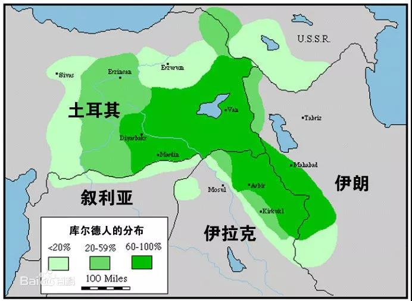

##正文

一场突如其来的战争，即将拉响。

土耳其总统埃尔多安本月5日发出公告，要挥军入侵叙利亚东北部，“用和平之泉浇灌幼发拉底河东岸”。

由于叙利亚东北部是美军盟友库尔德YPG的地盘，而且，埃尔多安不顾警告入侵叙利亚的行为，更会惹了叙利亚背后的俄罗斯。

因此，很多媒体都以为土耳其的这位苏丹，是在无脑的向美俄同时挑衅。

 

当然，中东的老油条埃尔多安可不会那么傻，虽然俄罗斯的外交部和美国的国防部都在指责土耳其，但如果从利益角度来看，美俄两国其实都是支持埃尔多安的行动，表达反对不过是在给婊子立牌坊......

此次土耳其打击的库尔德YPG，是的确是美国扶持起来的，作为打击“伊斯兰国”的盟友，库尔德战士们鞍前马后，为美国流了大量的鲜血，是打击俄罗斯扶持的叙利亚政府过程中最为倚重的“皇协军”。

甚至一身美械装备的库尔德女兵更是整个中东战场上一道靓丽的风景线，也成为了中东众多恐怖分子们的噩梦。

 

 

不过，很多人都把美国想成了铁板一块，岂不知库尔德YPG是奥巴马的美国政府一手扶植起来的，而奥巴马却是现任美国总统的死对头。凡是奥巴马支持的，特朗普都一律反对。

因此，特朗普上台后，围攻叙利亚政府军的各股反对派军援大幅下滑，原本摇摇欲坠的叙利亚阿萨德政权，突然就从ICU里面抢救了出来。

而曾经把气势如虹的叙利亚反政府军如今四分五裂，唯一一股还有战斗力的，就是寻求民族独立的库尔德武装了。

库尔德族是中东人口仅次于阿拉伯、土耳其和波斯的第四大民族，人口分布于土耳其东南部（约1,500万人）、伊拉克西北部（约700万人）、叙利亚东北部（约300万人）和伊朗西北部（约800万人）。

 

伊斯兰世界的传奇英雄，夺回圣城耶路撒冷、赶走十字军的萨拉丁，就是库尔德人。

 

但是二战之后，西方列强撤离中东，并没有遵守承诺让库尔德人独立建国，将一个三千多万人口的民族，分散在了土耳其、叙利亚、伊拉克和伊朗四国之中。

这导致了分布在各国的库尔德人都有强烈的独立建国倾向。当然，这也导致了四个国内分布着大量独立情绪库尔德人的国家，在遏制库尔德方面也有着共同的利益。

其中，叙利亚阿萨德政府这条命都是俄罗斯给的，伊拉克政府几乎被伊朗所控制，而伊朗又是俄罗斯的铁杆小弟。

因此，面对土耳其的武力入侵叙利亚，普京虽然嘴上说的不要，但身体却是很诚实的，搞不好还会给埃尔多安提供点军援。

 

而特朗普就更不用说了，去年在沙特记者案上，手握实锤的埃尔多安最终还是帮了特朗普一把，没有公开杀人证据。

这个人情（筹码）特朗普是记得的。

而且，随着乌克兰事件进一步的发酵，已经出现了第二名举报人，民主党与特朗普的撕逼大战迅速激化，特朗普已经开始在推特上盯着拜登和佩洛西大骂四方了。

而不巧的是，负责众议院情报工作的佩洛西和时任副总统拜登就是叙利亚库尔德武装的后台......

看到埃尔多安对叙利亚库尔德动手，此刻的特朗普，怕是都要从睡梦中笑醒......

因此，此次土耳其出兵叙利亚的背后，虽然看到的是各方都在反对，但实际上，这一战不仅有着特朗普、普京、埃尔多安三巨头的秘密协议，叙利亚、伊拉克、伊朗等利益相关方也都在翘首以待。

可以预见的是，接下来伊朗、伊拉克和叙利亚等国也会对中东的各股库尔德势力下手，届时的中东将会出现一场大混战。

这一战后，奥巴马时代民主党在中东埋伏的这一支希望能够重塑中东地缘的棋子，也将从此退出历史舞台了......

而整个中东以及伊核谈判，也会出现巨大的变化。

一方面，伊朗在围剿库尔德武装的过程中，必然要花费大量的资金和军火，而且消化伊拉克北部的库尔德区，更需要巨额的投入。在目前被美国封锁的情况之下，伊朗的财政将更加捉襟见肘，因此经济基础决定了伊朗谈判的意愿将迅速提升。

而另一方面，由于特朗普的主动退让，将美国的小弟库尔德人牺牲掉，什叶派大哥的伊朗不仅彻底守住了叙利亚，连伊拉克也更加稳固了，一个有着宗教宿命的什叶派之弧也随之建立了起来。

 

承了特朗普这么大的一个人情，在宗教和地缘方面巨大历史性意义的伊朗，在伊核问题上丢点面子，让特朗普获得一场“大胜”也不是不能接受的。

因此，看似剑拔弩张的伊核谈判，搞不好在特朗普牺牲库尔德的大背景之下，明年就将迎来曙光。

当然特朗普的牺牲并没有白费，弃掉了美国花费了大量时间和巨额资金在中东埋的这个楔子之后，中东四强的土耳其、沙特、伊朗、以色列，就都成为了特朗普的“自己人”。

这位喜欢做交易的美国总统，将曾经相互敌对中东各国都变成了自己的兄弟，也让自己成为了无冕的“海湾一哥”。

 

同样，我们把视角转回到东亚，也能看到特朗普正在照葫芦画瓢，试图通过朝核问题，把东亚四强也变成他的“自己人”。

 

当然，特朗普这种把国家利益转化为个人利益的做法，必然会导致民主党以及美国政治精英们的集体反制。

很快，掌握着全球媒体的民主党就会将入侵的土耳其军队描绘成杀人的恶魔。

甚至索罗斯等人的民主基金会，还会支持土耳其国内的反对势力搞运动，更不要说伊拉克发生的示威抗议活动引发的暴力冲突，美国的民主党就在其中扮演了很重要的角色。

可以说，在中东特朗普与民主党正在进行着一场不对称的战争。

未来可以预见的是，随着美国大选的临近，全球各个地区，在民主党资本与媒体所能涉及到的地区，有可能出现巨大的动荡，美国的民主党将会不惜代价与其扶持意识形态相似的政权。

此次率先跳出来的埃尔多安，搞不好就会成为接下来被狙击的那位。

而对于特朗普，就像近期的乌克兰电话泄密事件，他这一轮与普京以及中东巨头们的利益交换，说不定也会被泄露出来。

 

不同于特朗普在东亚跟安倍也就交换点诺贝尔提名什么的，此番他在中东跟土耳其的利益交换，很可能就会涉及到与埃尔多安有着过命交情的普京，以及沾着人命官司的沙特王储。

一场军事大战背后的政治大战，也在同时打响。

随着乌克兰电话泄密事件的愈演愈烈，这些特朗普引以为傲的地缘交易，很可能也会被爆出具体的细节，成为民主党针对特朗普的致命一击。

关联文章：

全球将陷入两大集团的对抗

冰封王座割裂之下的抉择

弹劾不算什么，还有更危险的等着特朗普

##留言区
 

