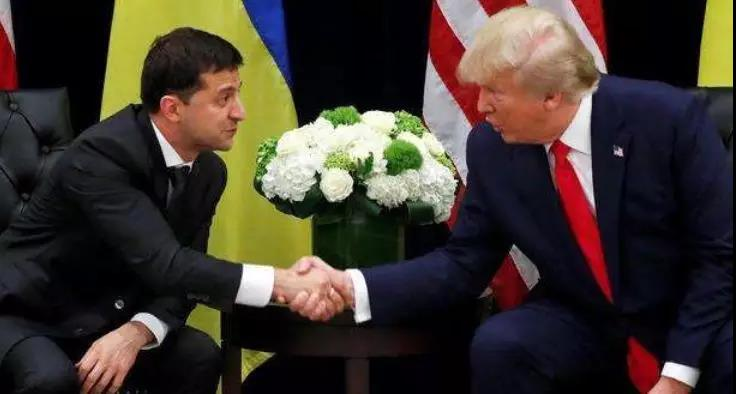
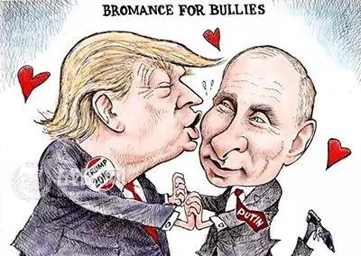
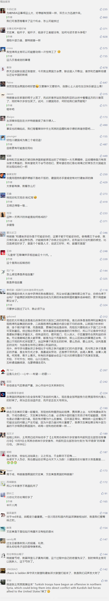

##正文

据CNN今天报道，10月7日，特朗普特意为安倍送上了一份生日祝福：“我想祝我非常好的朋友，日本首相安倍晋三，生日快乐！他今天39岁了。”

 

且不说安倍早已65岁了，这位处女座的日本首相生日是9月21日，距今已经半个多月，特朗普突然送出一个如此迟到的祝福，搞得现场所有人一脸懵逼。

且不说作为美国的重要盟友，白宫幕僚们肯定提前准备好了给安倍的贺电与礼物，上个月底安倍在纽约联合国大会上，跟特朗普进行了多次的会面，甚至当场敲定了贸易协议文本，为特朗普的连任送上了一份异常丰厚的大礼。

特朗普如果要公开祝安倍生日快乐，上个月在纽约就当面祝贺了，没必要等到今天。

因此，特朗普搞的这一出，大概率是把普京和安倍的生日记混了，这天特朗普真正想要祝生日的人，很可能就是正在西伯利亚丛林中过生日的普京。

 

政事堂推测，特朗普期初祝贺普京生日的想法，很可能被身边人强烈否决，但是他又不甘心，导致了他在随后的活动中，“生日快乐”一词在这位老年人的脑海中挥之不去，仿佛“我的眼里只有你”。

毕竟，今年刚刚缓和美俄关系的特朗普，却没办法祝福普京，如今他深陷通乌门，而通乌门的背后又与普京有着千丝万缕的关系，一群正在启动调查的民主党人眼巴巴的盯着特朗普犯错呢。

对此，普京的新闻官也间接验证了这一点，那一天全球与俄罗斯相关的国家大都以不同方式向普京表达了生日快乐，只有两个国家没有发来庆祝，一个是美国总统特朗普，一个则是把特朗普拽进通乌门旋涡的乌克兰总统泽连斯基。

也许，两个人都在避嫌.......

 

不过，虽然特朗普没有如愿向普京送上祝福，但是这一天，特朗普却给普京送上了一份厚重的生日礼物。

10月7日，特朗普在推特上宣布，撤军叙利亚，结束这一场“荒唐无休止的战争”。

美国的撤军意味着，普京的好哥们土耳其埃尔多安、叙利亚阿萨德以及伊朗哈姆内伊，很快就会联起手来，将美国花费十年心血在中东埋下的钉子库尔德武装彻底拔干净......

不仅亲俄的什叶派穆斯林将在中东组建一个“什叶派之弧”，整个中东的美俄力量对比也会出现巨大的逆转......

可以说，今年的生日，也许是普京过得最开心的一次，这是他上台以来，首次在国际地缘上取得的扩张，国内一度下滑的支持率也将因此重新攀升。

特朗普送的这份大礼真可谓是情比金坚。

 

不过，特朗普给普京送的这个生日礼物，却把自己推向了美国军方以及两党建制派的对立面上。

且不说之前的特朗普政府中的军方利益代表，前国防部长“疯狗”马蒂斯就是因为特朗普发布撤军声明而辞职的。

对于此次撤军，不仅民主党集体反对，连众多共和党巨头们也纷纷跟民主党站在一起，跟特朗普划清界限。

譬如共和党的参议院领袖麦康奈尔和众议院会议主席切尼，两位建制派巨头一边带头批判，一边鼓动议员们敦促特朗普取消撤军。

此时，共和党建制派的闹独立对特朗普并不是一个好消息，目前民主党正在积极启动弹劾调查程序，一旦共和党的建制派们倒戈过去，特朗普失去的将不仅仅是政治生命。

而很不巧的是，特朗普在乌克兰问题上的一系列动作，也正在将共和党的建制派们推向民主党。

政事堂在之前的文章中介绍过，拜登儿子在乌克兰能源公司虽然有任职，但这实际上是一个陷阱，特朗普一旦揪着这个问题打，会导致陷入其中无法自拔。

毕竟，如果拿不到巨大的利益，这些大佬们也不会把那么大的精力注入到乌克兰，在之前的乌克兰事变中，美国从军方到两党的建制派，都从中获取了巨大的利益。

此时，不按套路出牌特朗普选择把这个盖子掀开，几乎就是把美国大部分的既得利益集团推到了自己的对立面上，将使得他们迅速联合在了一起。

如果特朗普不采取什么措施，恐怕一个反特朗普的庞大利益集团，将在共同的利益驱动之下形成。

此时，特朗普想要杀出重围，只有两个选择。

要么跟共和党的建制派们妥协，把之前大量桌底下达成的协议撕毁；要么寻求外部力量，以获得美国民众的支持，来遏制美国国内庞大的建制派既得利益集团。

对比一下，美国国内弹劾之声此起彼伏，而国际上却有大量的盟友暗中支持，特朗普在巨大的压力之下，很可能会选择后者，利用外部力量的介入对抗国内各股势力。

若如此，这意味着，一份大礼将在未来出现，一个风起云涌的大时代即将到来.......

本文特朗普处理既得利益集团矛盾的问题，配合今天的三条《文在寅的结局》食用更佳，不过我倾向于有神秘力量最终会选择拉他一把，将矛盾转移。另，今晚小号大概率还有一篇。

关联文章：一场大战即将打响

##留言区
 

