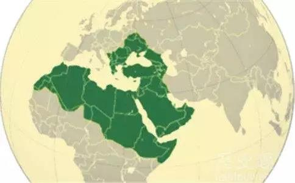

##正文

中东一下子乱成了一锅粥。

几年前，在美军的带领下，强悍的库尔德武装是叙利亚阿萨德政权的大灾星，不断的攻城略地，如果不是俄罗斯出手，阿萨德政权已经被库尔德武装打垮台了。

而今天，被美军抛弃的库尔德武装，在俄罗斯的调节下，跟打了好几年的阿萨德政权签署了协议，接受了叙利亚政府军的保护。

全球媒体们看得一脸懵逼.....

仿佛十八路诸侯讨董卓攻破了虎牢关，可一夜之间，诸侯们纷纷投降，成为了董卓的走狗。

直接原因很简单，那就是诸侯的盟主美国撂挑子了，联军开始了内部的厮杀，土耳其调转枪口，攻击库尔德武装了。

从外交来看，很多人会不理解中东的这一场混战，但是如果从全球地缘来看，中东的动作其实跟东亚、南亚一样，都是在特朗普进行美国的战略收缩之后，引发了各个地区主导力量的“大国梦”觉醒。

随着东亚各股力量寻求摆脱美国的束缚，开始了寻求民族复兴之路，南亚的印度也在试图甩开美国，整合印度次大陆。同样，土耳其也开始了寻求奥斯曼帝国的荣光，以复兴伊斯兰教的方式制衡西方基督教，并谋求中东的确地缘的主导权。

因此，这些年以来，土耳其埃尔多安政府一直都在将注意力集中于中东.

一方面，趁叙利亚内战，不断对新月地区增兵，甚至入侵伊拉克，并阿萨德政府和伊朗建立了阿斯塔纳会谈机制，增强对什叶派的政治影响力。

另一方面，土耳其不仅在卡塔尔新设了军事基地，还在沙特记者谋杀案中，手中紧握了沙特王储的杀人证据，并以此要挟沙特萨勒曼家族，以实现对逊尼派的政治影响力。

埃尔多安此举并非心血来潮。

土耳其的下一次大选是2023年，而这一年是奥斯曼帝国屈辱的解体100周年。

因此，土耳其的埃尔多安实际上是利用地缘上的扩张，来激发奥斯曼民族主义的情绪，这不仅可以转移国内的经济矛盾，也会为其竞选和连任带来巨大的民意支持。

于是，埃尔多安的动作，让中东出现了梦幻的局面，阿萨德竟然成为了库尔德的大英雄......

不过，政事堂对于埃尔多安此举并不是很看好，不同于东亚各国拥有强劲的经济实力，土耳其的经济非常脆弱，他在未来几年的地缘扩张的过程中，很有可能会遇到全球性的金融危机，会导致其功亏一篑。

而且，埃尔多安想要实现其奥斯曼复兴的梦想，就必须依靠特朗普，因此下个月埃尔多安访美必然会跟特朗普建立非常亲密的友谊，这必然会导致民主党的全球势力在土耳其国内惹事。

最重要的是，土耳其奥斯曼的地缘位置，是亚非欧三大洲的交汇之处，埃尔多安利用伊斯兰宗教整合原奥斯曼帝国的领土，对于基督教国家们从经济利益、地缘政治到意识形态，都有着巨大的冲击。

 

因此，埃尔多安选择走了一个九死一生的奥斯曼复兴之路。

不过，这对于东亚甚至南亚的大国们却是一个好消息，埃尔多安的奥斯曼复兴伟业必然会引得西方力量的集体围剿，给全球其他的热点地区迅速降温。

因此，不得不慨叹，每当关键时刻，总是有中东的兄弟们挺身而出。

##留言区
 

