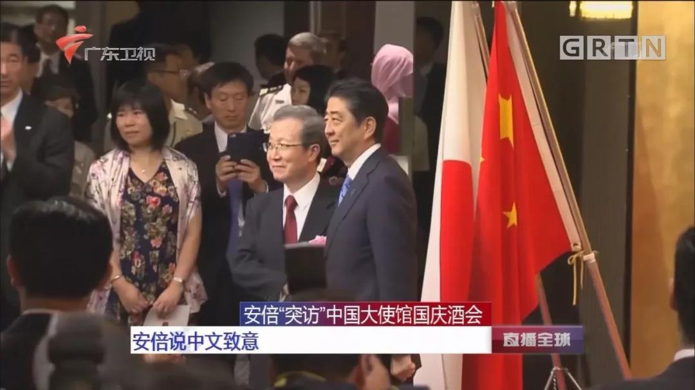

##正文

刚刚到家，终于可以休息几天了。

上周六，政事堂应读者要求，分享了一下政事堂是如何练就自己思维的的。客观来说，这是一个非常笨的办法，见效并没有那么快，但是基础却很扎实。

如果做一个比喻，那就像郭靖苦练降龙十八掌，每打出一掌，内力就增强一分。

 

这套模式非常适用于正在成长期的年轻人，通过正规的训练给自己建立一个强大的逻辑思维体系，就像郭靖徒弟武家兄弟练功夫那样，根基打好了，就算没有过人的天资，但假以时日，最起码能够成为一流高手。

 

不过，这种模式，对于思维体系已经成型的朋友来说，相当于要学习北冥神功那样，先要化去自身原有的功力，之后再重新练功。

因此，这是一个非常痛苦的事情，尤其是那些要打破认知途径，否定自己前半生的事情，换做是我也很难接受。

所以很多朋友私下也来问我，有没有办法不通过积累，就能迅速提升自己的分析和预判能力。

当然，办法也是有的，就像笑傲江湖中的令狐冲那样，如果不能从小好好练习气宗的功夫，还有一种办法就是学习剑宗的捷径。

 

当然，这种捷径有一个前提，那就是要找剑术最高的风清扬学习。

 

譬如说，科技领域的“风清扬”斥巨资搞蚂蚁金服的时候，谁都不明白，但是大佬们并不需要明白，腾讯和京东们只要照猫画虎，就能搞出一个千亿市值的互联网金融科技公司。

同样，风清扬搞云计算的时候，大家都在对其嘲笑，可是如今，华为和腾讯都在后悔自己的云项目启动晚了。

甚至一度跟马云交替领衔中国首富的王健林，在扶贫和去延安学习慢了几步，断臂求生之后，如今都被甩出了很远。

因此，现阶段真正聪明的大佬们，都应该跟着马云学“退休”，把重点放在toG业务上面......

可以说，很多时候，推演出结论并不需要完全知道整条推导的链条，研究明白该领域研究最透彻的那个人，他为什么要做这个就可以了。

而这就是政事堂很多时候，在缺乏足够线索的时候，推理所采取的方法。

记得特朗普刚上台的时候，那个时候半岛冲突正烈，将军和特朗普两个人骂战正酣，大部分媒体都认为战争无法避免，但那个时候，政事堂却逆势认为半岛必然会出现和平。

原因很简单，我们任何一个人，所获取的情报能力都是有限的，根本无法跟拥有者庞大情报机构的国家相比，决策力也不可能跟拿着久经沙场的政坛大佬相比。

因此，我们成功率最高的方式，并不是自己去判断，而是判断成功率最高的人的判断。

就像一个菜鸟可以在手机游戏智能的帮助下，下赢国际象棋大师，菜鸟的本事不是预判能力，而是借用了胜率最高人的帮助。

同样，东亚第一流的国际地缘政治家都有谁？

相信我说安倍，大家没有多少会反对的。

特朗普上台后的第一个中国国庆，安倍一反常态带着自民党大佬们一路狂奔，跑到我们的大使馆庆祝国庆，释放了巨大的善意，也创造了中日外交史上的第一次。

 

作为美国大选后第一个见到特朗普，也是见特朗普次数最多的东亚政治家，安倍对于特朗普的战略判断必然是东亚最敏锐的。

作为特朗普上台前美国围剿中国的马前卒，此次突然一百八十度的大转弯，必然意味着安倍看到了，特朗普上台后美国对于东亚会进行战略收缩，甚至与东亚各国达成交易的可能性。

因此，一方面是早已收集了大量机密情报，并与特朗普有了多轮亲密接触的安倍，另一方面则是只能看看媒体公开报道然后渲染一番的自媒体。

究竟相信哪个自然是一目了然。

甚至政事堂每一次预判中美贸易的阶段性停战，亦或者历次的朝美谈判，并不是依靠那些境外的信息，而是通过锚定关键的人来预判。

虽然他们也不是每一次都能正确，但他们掌握的大量非公开信息，远比那些缺少信息靠玄学的大仙们靠谱。

同样，对于中国经济而言，如果你相信对许家印很重要的首席经济学家，那么你最多也就是恒大这个公司的视野水平。

而这个视野水平如果能够实现，也是建立在资本家们没有把你当韭菜的基础之上。

因此，正能够预判中国经济，成功率最高的方式自然是锚定中国经济最权威的人士，他究竟有多重要，这几年来，大家心里难道没点数么？

所以呢，就像大家都知道的，政事堂懂政治逻辑，但经济方面却是小白，不过大家这些年跟下来会发现，我在国内经济领域的推测成功率，甚至不逊于我最擅长的国内政治领域。

如此不合理的原因，就在于政事堂在经济领域并没有学习“降龙十八掌”，而是选择了学习“独孤九剑”，直接锚定了中国经济领域的独孤求败们。

因此，掌握了这个规律，哪怕就是一个刚刚学会围棋规则的小白，也可以一个用着电脑阿拉法狗来虐中国第一的柯洁，更不要说那些经济领域所谓的首席们，“功夫再高也怕菜刀”......

那么，如何锚定那些独孤求败们呢？

嗯，下面又要进入广告时间了。

国内无论是时政还是财经这俩领域，能够获得大量第一手关键信息的公开媒体，排名第一的非财新莫属。

从前些年的反腐到近些年的经济改革，我们都能从财新中寻找到大量的线索甚至是提前的放风，跟政事堂类似，财新也属于“写谁谁死”那一类，躺在财新笔下的巨头们早已横尸遍野，甚至很多经济政策的转型，财新也经常能提前放出风声。

此次，政事堂与财新通达成合作，推出政事堂读者专享买一年增送一个月，外加赠送政事堂2018年以前文集的活动。

长按下图二维码，跳转至财新官方商城购买，一年的订阅费用是498元。（已经是财新通的用户，购买后增加13个月会员时长，其中1个月的赠送会稍晚显示）

 

 

购买后可扫描下方微信二维码添加微信好友，再将购买订单截图发予该微信。政事堂2018年以前文集，会打包发送到您的手中。

（文集会按照下单顺序发放，发送订单截图后请耐心等待，由于读者们大规模涌入，但微信却有每天加人限制，希望大家谅解，政事堂助理小迷妹正在加紧处理）

##留言区
 

