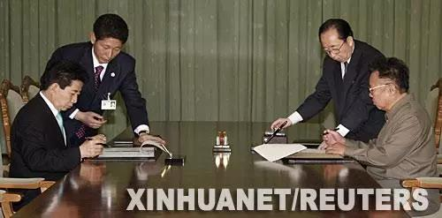
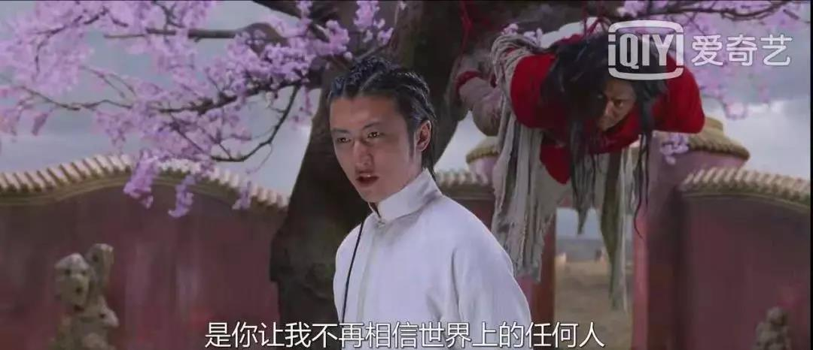
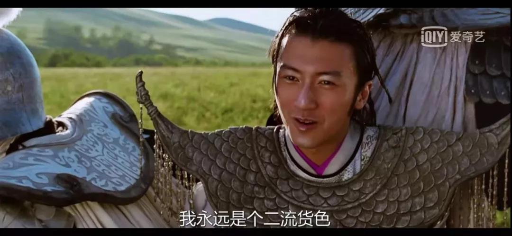
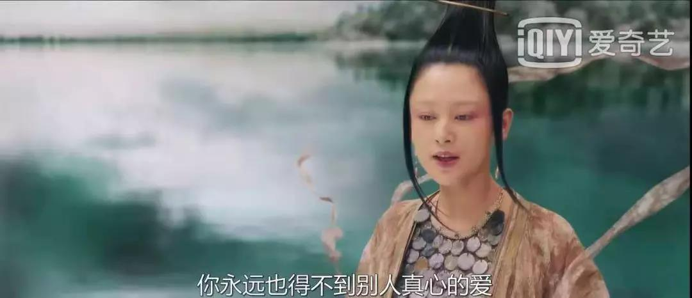
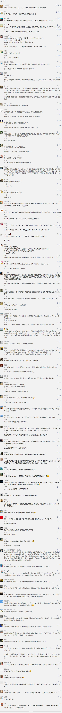

##正文

2005年12月，陈凯歌的电影《无极》上映。

很快，这部片子被誉为中国史上最烂的大片。

但是很多人并没有注意到。

就在电影上映的半年后，刚刚就任日本首相的安倍晋开启了破冰之旅，历史性的将日本首相的上任出访给了中国。

 

而电影上映的一年多后，韩国总统卢武铉徒步跨过了三八线，同朝鲜领导人金正日实现了历史性会晤，并签署了宣告半岛和解的南北宣言。

 

一连串的历史性会晤的背后，是东北亚和解的最好机遇。

中日韩三个国家都在共同从经济、政治、体育、文化上，推动东北亚的一体化。

而为了《无极》筹拍了六年的陈凯歌，也适时将这部试图构筑东亚共同精神的电影，推上了舞台。

从选角来看，这部电影的野心就很大，第一主角是韩国人张东健，第二主角是日本人真田广之，第三主角才是中国人的张柏芝。

这部片子不仅选用了当时韩国和日本最炙手可热的明星，甚至对这两位人物的形象刻画，也完全按照其国家的传统，颜色对比的冲击非常明显。

 

 

很显然，这部中国人拍的片子，并不只给中国人看的，而且，试图糅合中日韩文化的导演，更是试图走出一条新的艺术之路。

不过，这部片子播出后，却在国内烂评如潮，尤其是被“一个馒头引发的血案”改编之后，彻底沦为全国人民的笑谈。

 

在舆论的裹挟之下，乌合之众们脑海之中就只有了那个馒头，却没有注意到馒头只是线索之一。

开篇中，倾城（关晓彤饰）吃的馒头和昆仑（张东健饰）吃的肉，两者都有着同样的寓意，无论谁只要吃了，就将沦为主人的奴隶。

 

 

馒头和肉，成为了片中的两条线索。

明线索，昆仑（张东健饰）是大将军光明（真田广之饰）的奴隶；

暗线索，王妃倾城（张柏芝饰）则是满神（陈红饰）的奴隶。

 

 

甚至谢霆锋饰演的无欢，与刘烨饰演的鬼狼，同样也是主人与奴隶的关系。

 

而鬼狼确定自己奴隶身份的“馒头”，就是他身上穿的那件袍子。

 

因此，如果没有一些靠谱的影评人，大部分观众甚至无法把这些人物的关系理顺的

也更无法理解为什么张柏芝的一个馒头，就会把谢霆锋给搞崩溃了。

 

 

很多中国人看完电影之后，都在嘲笑陈凯歌笔下的无欢（谢霆锋饰），被一个馒头就毁了他当好人的机会。

但是，日本韩国甚至西方人却不会觉得这一段好笑。

因为在他们习惯了的封建制“无极世界”里，奴隶昆仑在最爱的女人和主人之间，必须一次次都选择无条件的为主人忠诚。

同样，能单杀光明的奴隶鬼狼，明明武功比无欢要好很多，但是在主人面前却只能引颈就戮。

 

所以呢，如果没有对历史的理解和看剧情的铺垫，单纯以现代人的眼光，是无法理解一个签署了契约的奴隶，却背叛了她的主人，会对这位小公爵的内心造成多大的伤害。

 

当然，如果没有足够的历史底蕴，更无法理解雪国的鬼狼和昆仑，实际上映射的是朝鲜与韩国这两兄弟。

 

大将军光明与奴隶昆仑的关系，则影射着历史上日本对韩国的殖民。

而无欢麾下的鬼狼，则是映射苏俄对朝鲜的控制。

至于被日本人真田广之、韩国人张东健以及从“极北之地”来的谢霆锋共同追逐的倾城，暗示的是谁，就不言而喻了。

毕竟，她是片中，唯一一个从小，就“起来不愿做奴隶的”人。

 

因此，对照历史，我们也更能理解为什么谢霆锋会对拿走馒头却不做奴隶的张柏芝，为何如此的愤恨了.....

而陈凯歌的整部片子，就像他说的，写的是东亚的未来那样，片中所有人的命运，都无法摆脱无极的束缚。

中俄之间的远东、俄日之间的北方四岛、中日之间的钓鱼岛，韩日之间的竹岛，就像片中最后的那一场角斗那样，张柏芝、张东健、真田广之和谢霆锋，陷入到了解不开的死循环。

 

片中光明和无欢他俩说的，“我们谁也不会相信谁”。

这不正是这几十年以来东北亚政局死结无解的根源么？

 

而且，在陈凯歌构筑的无极之中，所有人的命运，都早已被满神确定好了。

日本人光明渴望胜利，但峡谷之战后却不得不见证自己的一次次失败。

 

俄国人无欢渴望尊重，但他永远都无法获得对手的尊重。

 

韩国人昆仑渴望团聚，但他却被时间之墙阻隔，见不到自己的亲人。

 

中国人倾城渴望真爱，但她得到后马上就会失去。

 

在无极里面，满神就是大家的宿命，所有人都无法逃脱。

而很遗憾的是，就在试图融汇中日韩文化的无极上映后，一张宿命的大网也同时罩在了东北亚。

突然，韩国的监察系统突然开启调查卢武铉的亲信们。

与此同时，日本的监察系统也突然开启了对安倍的亲信们开始调查.....

随着卢武铉和安倍看着身边的亲信一个接一个的落马，这些一腔热忱的政治家们，看着曾经期待自己的人民，都成为了反对自己的先锋。

志在结束南北对峙的卢武铉，从山崖纵身一跃一纵，结束了自己的生命。

东北亚一体化的操盘手安倍，从靖国神社走出后，从此变得面目可憎。

而试图寻找东北亚未来的小人物陈凯歌，也从霸王别姬的神坛坠落，在国内却被千夫所指。

没办法，在无极的牢笼之下，乌合之众总是喜欢听媒体的引导，中国的老百姓并不比日韩的民众想得明白。

也许，这也是一种人性的悲哀......

如今，历史再一次的回到了十字路口之上。

文在寅接替了兄长他的卢武铉，迈着同样的步伐越过了三八线，实现了朝韩亲人的再一度和解。

安倍重新夺回了首相之位，又一次毅然的破冰访华，并邀请明天春天的再度相逢。

无极的哲学意思，一方面是混沌，另一方面是未来拥有无限的可能。

面对东北亚这座牢笼，面对十多年前中日韩三国政治家们共同努力后的那一次失败，电影中最后的那段台词，似乎正好可以描绘如今的这一片景色：

“命运可以改变，就像时光有时倒转，春天雪花飘飘，生命可以从头来。”
 
 

 

 

 

##留言区
 

