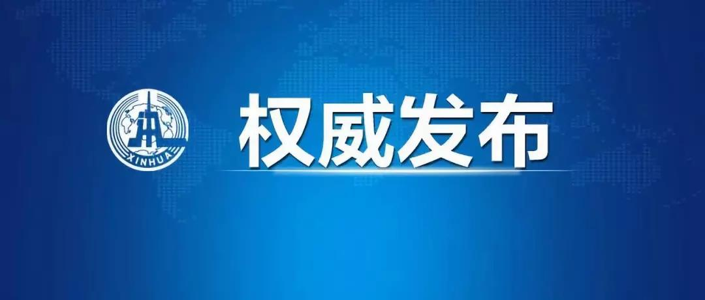

##正文

>由于我们目前体现出了对特朗普的支持，因此也会遭遇国际蓝对我们的打击，因此某些地方的乱局可能会在近期严重。

>顾子明，公众号：政事堂pro2019
>接下来我们最重要的，是走好自己的路。

 

外交部发言人耿爽16日就美国国会**众议院全会通过“香港人权与民主法案”**答记者问。

有记者问：据报道，美国国会众议院全会**当地时间15日**审议通过了“香港人权与民主法案”。请问中方对此有何评论？

耿爽说，我们对美国国会众议院执意通过所谓“香港人权与民主法案”表示强烈愤慨和坚决反对。

他说，当前香港面临的根本不是所谓人权和民主问题，而是尽快止暴制乱、恢复秩序、维护法治的问题。美国国会众议院罔顾事实、颠倒黑白，把肆意纵火、打砸商铺、暴力袭警等严重犯罪称之为人权和民主问题，是赤裸裸的双重标准，充分暴露了美方一些人在人权、民主问题上的极端虚伪和破坏香港繁荣稳定、牵制中国发展的险恶用心。**美国在香港也有重要利益**。如有关法案最终通过成法，不仅将损害中方利益，损害中美关系，也将严重损害美国自身利益。对于美方的错误决定，中方必将采取有力措施坚决反制，坚定维护自身主权、安全、发展利益。

“我想再次强调，香港是中国的香港，香港事务纯属中国内政，不容任何外部势力干预。我们奉劝美方认清形势，悬崖勒马，立即停止推动审议有关涉港法案，立即停止插手香港事务、干涉中国内政。”耿爽说。

##留言区
 无留言