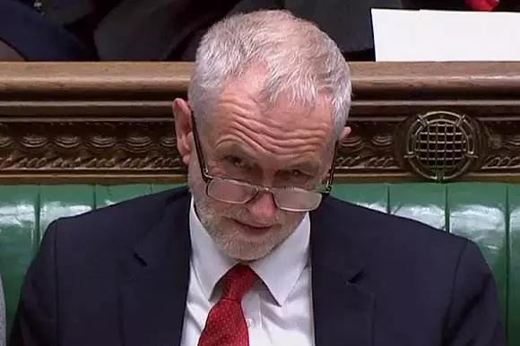

##正文

今天，欧盟委员会主席容克、英国首相约翰逊共同宣布，英国的“脱欧协议”终于达成了。

容克称这是一个“公平的、平衡的协议”，同时建议即将到来的欧盟峰会通过这一协议。

法国总统马克龙称，希望可以获得通过。

德国总理默克尔称，她对协议有望达成的信心更强了一些。

约翰逊则表示，这是一个“非常棒的新协议”，能够使得英国“拿回控制权”。

 

在加上本周一，英女皇在主持议会大典时表示，政府的首要任务是确保英国于10月31日离开欧盟。

一时之间，似乎这场马拉松式的分手，即将迎来大结局。

 

不过，很多人都没有考虑到，约翰逊还有一个巨大的难题。

他跟欧盟的新协议，必须通过英国国内的议会。

按照英国现有体制，政府如果无协议脱欧，那将是违法的。

不过很遗憾的是，随着多位保守党建制派们的叛逃，目前约翰逊领导的保守党政府已经丧失了议会中的多数席位。

要知道，当年即使梅姨领导的保守党尚且在拥有议会多数时，从布鲁塞尔拿回来的脱欧协议也连续四次被英国的议会所否决。

因此，约翰逊想要自己的协议被通过，难度将比梅姨更高。

更重要的是，前任首相梅姨就是被约翰逊组织小团体逼宫下台的，还有在本月，22名跟梅姨关系密切的保守党议员们因为反对约翰逊，被约翰逊开除党籍。

假设一下，如果约翰逊最终达成了脱欧协议，获得了巨大的成功，那么这22名资深的保守党建制派们，也将永久的告别英国政坛。

 

因此，可以预见的是，梅姨率领的保守党建制派们，在这一轮中必然会调动资源对约翰逊狙击，保守党将进一步分裂，约翰逊从党内肯定拿不到足够的票。

而对于约翰逊来说，唯一能够实现的，那就是让保守党的百年死敌工党调转过来支持自己。

可是对于工党党魁科尔宾来说，如果让约翰逊能够成功脱欧，那么兑现了承诺的工党必然将获得巨大的支持率，约翰逊将有机会成为一个特朗普式的英国首相。

这对于已经看过特朗普所作所为的工党来说，是不可忍受的。

而且，如果此次约翰逊退欧失败，那么大量保守党的中间派选民将转而支持工党。再加上保守党的右翼选民将转向支持退欧党，使得保守党的支持率进一步下滑。

这一增一减，将使得工党有机会在下次正式大选中成为英国第一大党，拥有组阁的机会，科尔宾本人也更将有机会成为首相，将其诸多的理想付诸实践。

 

此外，再加上一直希望留在欧盟的北爱尔兰和苏格兰，可以说，约翰逊起视四境，他几乎处于保守党建制派+工党+北爱+苏格兰的四面楚歌之中。

说服任何一股力量所需要付出的代价都不菲，更不要说需要让多个阵营出现大批量的倒戈。

因此，政事堂推测，本周六的英国会议，约翰逊的脱欧投票大概率会遭遇一场滑铁卢式的惨败。

不过，如此强势脱欧的约翰逊，敢于非要在10月31日脱欧，也许根本就没有想要赢得议会的支持。

他有可能是想通过一次“宪政危机”，进一步获取急于脱欧的英国民众的支持，以此对整个英国政局来一次洗牌。

因此可以预见的是，英国由脱欧带来的混乱将进一步加剧。

搞不好一个数百年的搅屎棍，最终把自己搅成一缸屎......

 

##留言区
 

