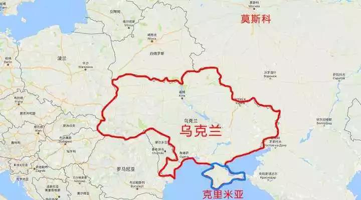
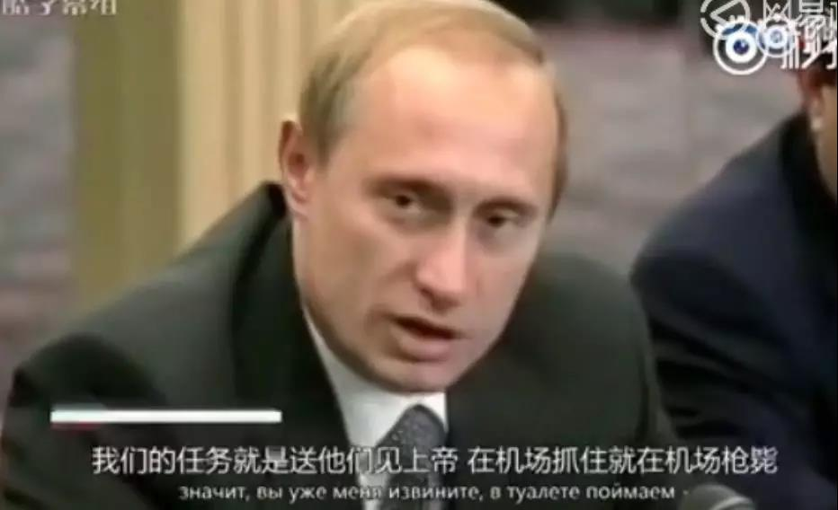

##正文

四年前，普京和他的俄罗斯遭遇了至暗时刻。

在地中海，俄罗斯唯一的支点，叙利亚阿萨德政府已经到了垮台的边缘，美国武装的反政府军几乎就要攻下了大马士革。

在中东，伊朗在亲西方的鲁哈尼政府下签署了伊核协议，接受庞大的西方投资，俄罗斯最重要的盟友开始向西方靠拢。

在欧洲，俄罗斯最重要的盟友和地缘腹地乌克兰被北约策反，毛熊漫长的国境腹地与软肋直接暴露，连地中海的出海口都差点没了....

 

此时，普京面临的不仅是盟友们一个个被挤在墙角，在国际油价不断走低之时，奥巴马还拉着盟友们进行全面的经济制裁，试图引发俄罗斯经济的休克。

甚至代表着全球列强身份的G8集团，也将俄罗斯除名........

虎落平阳被犬欺，被美国人压着打也就算了，俄罗斯就像明教被六大派围剿之后，海沙派、巨鲸帮等随后也骑在太岁头上动土。

2015年11月，俄军一架苏24战机被在叙利亚边境执行任务的时候，竟然被土耳其空军击落，飞行员被射杀，俄罗斯举国震惊。

而更令战斗民族愤怒的是，继战机被土耳其击落后，一架米8直升机在搜救时又被美军领导的叙利亚反政府武装攻击，又一名俄军被活活打死，视频更是被广为流传。

 

一时之间，全世界的目光都聚焦在了“有债必偿”的硬汉普京身上。

 

过去，无论是对待车臣、南奥塞梯问题，还是克里米亚问题，普京一直都是能动手绝不哔哔。

那句“原谅他们是上帝的事情，而我的任务是送他们去见上帝”堪称为他量身定制。

 

 

可是，这位超级硬汉面对国内愤怒的民意，顶着支持率的持续下滑，却选择了隐忍。

当然，普京的隐忍不是退却，而是在等待时机。

或者说，是在等一个人。

 

就在自家战机被击落，飞行员被击毙的四年后。

2019年的10月，这个月，是普京的庆生月，可是四年之前风雨飘摇的俄罗斯，如今在中东已经重现当年苏联鼎盛时期都没有的辉煌。

在叙利亚，阿萨德政府击溃了美国扶持的反政府军，连库尔德武装向阿萨德政府投诚。

在伊朗，伊核协议被美国撕毁，与西方普京的盟友哈梅内伊借此重掌大权，一度向西方靠拢的伊朗遭遇全面制裁后，认识到俄罗斯才是真正值得生死相随的盟友。

在伊拉克，随着美国力量在中东的退出，什叶派人口占据多数的伊拉克逐步被俄罗斯的盟友伊朗控制。

在卡塔尔，这个美国在中东反俄的大本营，被沙特为首的海湾国家集体围剿，并被开除出了阿盟。

在沙特和阿联酋，这两个美国中东最重要的盟友，刚刚邀请普京访问，并签署了大量的军事与经济协议。

以色列和埃及这俩美国的铁杆盟友，跟俄罗斯的自贸协定谈判也进展的很顺利，预计不久就会签署.

甚至北约盟友，陆军规模仅次于美国的土耳其，这个自冷战以来就处于抵抗俄罗斯第一线的国家，如今也跟普京混一起了，不仅帮俄罗斯抓捕了18名当年杀害飞行员的凶手，连土耳其的导弹防御系统都改用俄罗斯的了。

而几年时间，如此天翻地覆的变化，原因很简单：

随着特朗普上台后，在中东坚定的执行战略收缩政策，使得中东出现了巨大的权力真空与混乱。

过于，美国对中东的战略，是继承了英国表亲分而治之的策略。利用宗教、民族、政治派别，给各股势力制造足够大而又可控的矛盾，令美国成为众多矛盾的“总协调人”。

远如美国在中东只放了一个自生自灭的以色列，就把原本试图共同建国的阿拉伯国家分化瓦解掉，近如在库尔德武装中只部署几百人，但是却可以利用库尔德武装同时威慑土耳其、叙利亚、伊拉克、伊朗四个中东国家。

这些被美国用几根小棍子就搅成一锅屎的中东，原本都得依赖于离岸平衡的美国来协调各自国内巨大的问题。

 

但是，随着特朗普的主动撤出，过度支持以色列以及抛弃库德尔，使得整个美国几十年来建立的中东微妙平衡被打破，各股势力都在试图利用美国撤离的空隙给自己“解扣”。

埃尔多安的出兵库尔德不过是冰封王座裂开后打的第一枪。

而且，随着中东开始系统性的崩溃，无论是像土耳其、伊朗这样的试图解扣，还是像沙特、库尔德这样的避免被打击，都不得不选择主动依附中东新的“总协调人”——沙皇普京。

普京对于中东不仅不需要投入经济，反而会获得中东各国的大规模军事采购，变成了一笔赚钱的买卖。

而发生变化的，不仅仅是中东。

乌克兰新总统上台后，特朗普直接打掉话要求干掉那些当年带着乌克兰投奔美国的政客。

甚至特朗普还在主动的解除对俄罗斯的制裁，之前把俄罗斯踢出去的G8，如今又在邀请俄罗斯回来。

因此，把镜头调回到四年之前，那个时候风雨飘摇备受打击的普京，真的没有反击吗？

当然不是，他把所有的力量都用在了一个点之上，那就是帮助他的好基友——特朗普。
 
 

##留言区
 

