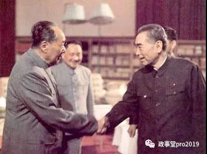

##正文

昨天上午的文章，讲的，是大政治家们的择时。

对此群里有读者问，似乎我们的“战略机遇期都是处于共和党执政之内”。

这句话既对，也不对。

准说的来说，**中国地缘的战略机遇期都靠共和党**，**但是经济的战略机遇期要靠民主党**。

由于涉及到几个阶段，因此还真的需要多篇文章才能讲明白。

回顾中美建交史，虽然中美是在共和党任期达成的联合公告，但是却在七年之后的民主党期间，才完成的建交，确立了中美之后四十年的合作框架。

中间隔了这么久，最根本的原因，就是一句话：

**经济基础决定上层建筑。**

共和党的金主们是聚焦于美国国内的老钱，

而民主党的则是控制国际资本的新钱。

立党之基不同，对外的国际战略就不同，给予我们的空间也就不尽相同。

国内大政府路线的民主党，在全球依然是大政府，就像千里转进之蒋公，在全球各个地方“拼微操”，因此力量不集中。

国内小政府路线的共和党，在全球依然是小政府，注意力往往过分集中于一个点，爆发力强，但也很容易出现“顾头不顾腚”的情况。

对此，我们以中美建交的过程就能看出来。

周恩来与基辛格合作推动的1971年破冰，对于共和党来说，是通过一次强势的民主集中，以扭转自越战以来，由于东亚的失血导致了冷战处于守势。

当时，美国的副总统、国务卿和参众两院，中国的101和人大政协事先都毫不知道，最后靠着几个少数的天才政治家们一起瞒天过海，才达成的这份联合公告。

从美国的角度，这份协议充分体现了共和党爆发力强的特点。

从我方的角度，也向全球展现出了，什么叫做真正的政治家。

基辛格破冰是1971年，尼克松访华是1972年，来了在现场，咱们就签了联合公告，根本不管当时台湾等核心利益还没有谈妥。

而更重要的是，在两次访问中间如此短的时间内，为了搬开最大的绊脚石，基辛格前脚刚走，后脚我们就把要101送上了天........

如此大的代价，如此果断的行动，并不是没有价值。

联合公告的一年之后，1973年第四次中东战争和石油危机爆发，美国被深陷于中东和经济危机，亚洲的重要度迅速下滑，“顾头不顾腚”的共和党对于中国的兴趣大减，即使基辛格做到了国务卿，后来的建交也被搁置了。

可以说，不管什么原因，只要我们晚了一年，窗口期过了，中美就将错过这一次历史性的和解机会，新中国的历史也将被改写。

而把历史上的事件联系到一起，站在一个更高的角度，看到了我们的代价，看到了我们的决绝，才能真正深刻的体会这些中国超一流战略家们的伟大。

 

##留言区
 无留言