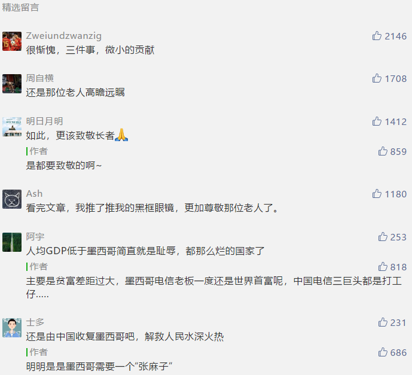
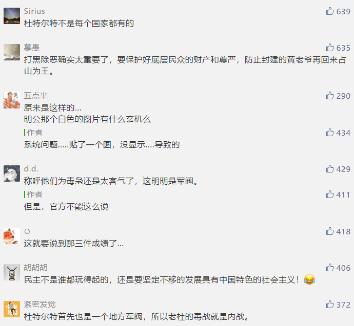

##正文

政府会向毒贩投降？

没看错，这事儿刚刚发生在GDP排名全球15，人均GDP超过中国的墨西哥。

本月17日，墨西哥库利亚坎市政府在逮捕国际大毒枭古兹曼的儿子小古兹曼时，遭遇了全城毒贩的强烈反击。

毒贩不仅劫持了8名安全部队人员，还在城市中发动了大规模袭击，市监狱也被攻陷，近60名囚犯越狱，看守也沦为了人质。

甚至当地的警察局也被毒贩们携带者重型武器包围了.........

最终，政府最终不得不“投降”，把小古兹曼释放了，终结了这一场政府与毒贩之间的战争。

对此，“怂包”的墨西哥总统还为之辩解：我们不想死人，不想战争发生。

作为中国人，是很难理解竟然毒枭还敢如此挑战政府权威，敢在咱们地界撒野？“战狼”、猎鹰、雪豹，分分钟就会让他们见识到社会主义铁拳的威力。

为啥墨西哥就不一样了？

墨西哥跟中国最大的一个差别，就是没有禁止军队和公务员经商。

由于墨西哥的军队是可以经商的，因此手握大量现金的毒枭们很快就把军队从上到下腐化了，以至于很多军人服役的时候通过军事通道运送毒品，退役后直接加入毒枭的团队。

同样，墨西哥也是鼓励官员们经商的，因此毒品的巨大利益自然就能够轻易腐蚀他们，往往剿匪的部队还没集结完毕，行动方案就很可能送到了毒枭手上，一方明一方暗，这仗根本没法打。

 

这使得剿匪的路上，你永远都不知道身边的战友们都有谁被收买了，冲在前面的还得小心后面的人放黑枪。

 

而且，墨西哥作为一个贫富差距过大的发展中国家，过度发展民主，反而会让民主成为黑恶势力的保护伞。

因此，就算贩毒真的捉到了，毒枭们也不害怕，因为“民主”对于毒贩也要讲司法公正的。

 

在审理的过程中，毒枭们杀了法官，案子就得搁置，杀了检察官，案子也得搁置，就算法官和检察官都递补了，毒枭们还可以杀证人，不仅有的是机会去消灭证据，还可以在羁押期间想办法劫狱出来。

更不要说，就算最终判了，也不怕，反正墨西哥没有死刑，在监狱里面也讲究人权。

 

就像小古兹曼的老爸古兹曼当年在墨西哥蹲监狱的时候，不仅可以在自己的豪华牢房里面看电视和随意点餐，甚至可以用手机遥控指挥贩毒集团。

 

监狱的高墙挡不住社团大佬们进来跟他开会，更挡不住他的老婆和情人们跟他在监狱里面玩Cosplay.......

可想而知，那些参与逮捕古兹曼的执法人员们，是不是活在恐怖的阴影之下呢？

而且，对于古兹曼这种级别的毒枭来说，监狱生活不过是一种体验。

美国要引渡他的时候，他都抢在引渡之前，连续两次从墨西哥安保程度最高的监狱中越狱而出。

 

如此赤裸裸的“放人”，可以说，墨西哥警方已经被“警匪一家亲”。

说起来，墨西哥毒枭能够做的如此无法无天，最根本的，就是“距离天堂太远，距离美国太近”

一方面，美国与墨西哥有着漫长的陆地国境线，而美国对于毒品有着巨大的需求，就像马克思说的，300%的利润会践踏人间所有的法律，因此单纯禁毒是没用的，总会有人为了巨额的利润去杀头的冒险。

另一方面，美国廉价的农业倾销使得墨西哥的农民纷纷破产，而墨西哥的工业又无法为这些破产农民提供稳定的就业，因此吃不饱饭的农民自然而然的就选择了站在毒枭这边。

毒品的巨额利润，以及大量的破产农民，使得墨西哥出现了一个政治结构上的特色，那就是军阀割据。

在墨西哥很多落后的地区，那些大毒枭当于中国古代的“州牧”或者“节度使”，不仅拥有地方自治的权力，财政和军队也独立于中央政府。

用《让子弹飞》的方式解读：墨西哥总统，就是四川的刘都统，库利亚坎市的古兹曼家族，就是鹅城的黄四郎家族。

而在此次交火事件爆发的库利亚坎市，就是“流水的市长，铁打的古兹曼”，麻匪和黄老爷实际上是一家的。

因此，很多墨西哥的“县长”都会跟黄老爷们勾结起来，而每一次县长真要去剿匪，就会有无数的汤师爷给黄老爷报信，以至于剿匪的路上，自然而然就会事故频发。

很多人不能理解墨西哥为什么能出现连续十几任市长被毒枭杀掉，但其实，这跟黄四郎干掉五任县长是一个性质，人家才是地方上真正的控制人。

所以，此次警匪之间爆发冲突，毒枭们的获胜并不意外，因为库利亚坎市就是古兹曼家族的大本营。

而墨西哥总统选择向毒枭认怂投降的背后，也不是真的不敢打击贩毒，而是不想为了一次缉毒行动而引发一场中央与地方的内战......

##留言区
 

 

 

 

 

  