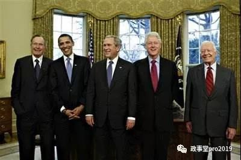

##正文

 

这篇，是本系列的第四篇文章。这个系列对于重构读者们的世界观有多重要，我就不废话了。

但是我的写法会不得不非常的零碎，希望读者们理解，而能理解多少，就理解多少吧。

书接前文，时间，也到了80年代到90年代。

跟着前面文章的推断，对应之后，我们会发现一个很有意思的事情。

里根+小布什执政的12年时间里，我们在国际地缘上是相当舒服的，不仅中日关系进入蜜月期，中韩也实现了建交，两岸的辜汪会谈更是一度令双方看到了和平统一的曙光。

但是，进入到克林顿的8年时期，我们地缘上迅速进入了被围剿的状态，不仅一度炙热的中日中韩关系变冷，走统一路线的李登辉也突然“露出台毒的本质”，海峡关系迅速激化，出现了时隔三十年以来才又一次出现的台海危机，而且一出现就是两次。

对比70年代在尼克松时期，中美实现历史性的关系逆转，大家会发现，“**中国地缘的战略机遇期都靠共和党**”，尤其是80年代末中国改革最为关键的时刻，在台上的是老布什而不是喜欢支持颜色革命的民主党，让我们顺利度过了危机，实现了破蛹而出。

而看90年代的克林顿执政时期，对比70年代末的卡特时期，我们就会发现“**经济的战略机遇期要靠民主党**”，虽然民主党执政时期我们的地缘压力特别的大，但是只要撑住了，都会带来巨额的回报。

卡特的建交给我们带来了重要的资金、技术和市场，启动了中国改革开放40年；克林顿更是强行按着美国贸易谈判代表签字，把我们送进了WTO。

因此，我们也会发现一个很有意思的事情，我们改革开放初期高歌猛进的80年代，虽然有美国共和党的保驾护航，但经济发展不仅不快而且还非常的不平衡。

但是进入到90年代，面对民主党的立体式围剿，中国的经济反而出现的高质且高速的增长，对美国的进出口贸易反而是一路激增。

尤其是在此期间，中美形成了互联网为主的经济结构战略绑定，大家可以细数一下，如今深远影响经济的龙头民营企业，大都是在克林顿执政期间发展起来的。

所以呢，从经济的角度来看，锚定美国的两党选举，才是推测中国宏观经济走向最好的标尺。

而经济基础决定上层建筑，每一次共和党和民主党的换届，也会同样深深的影响大洋彼岸的......

##留言区
 无留言
   