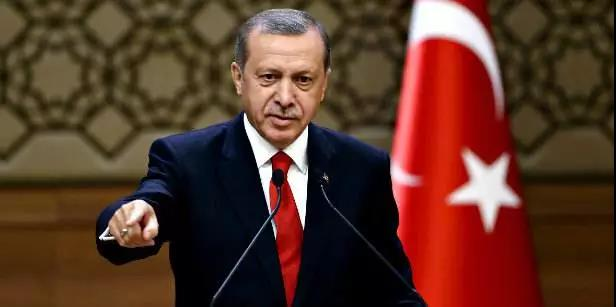
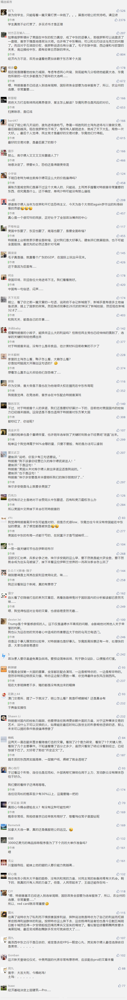

##正文

昨天下午，美国国务卿蓬佩奥公开表示，美国总统特朗普“完全准备好”在“必要时”对土耳其采取军事行动。

 

介于美国已经对盟友土耳其开启了经济制裁，因此，不少美国媒体开始认真的分析了美国攻击土耳其的可能性。

根据北约的盟约，对于组织成员的任何攻击都会被视为针对全体的攻击，因此美国如果攻击土耳其，那么会令北约盟友们陷入“自相矛盾”的境地。

不过，政事堂看来，连伊朗都不敢“摸”的特朗普怎么可能会去惹土耳其呢？

要知道埃尔多安可是捏着沙特王储谋杀的证据，随时可以对特朗普来一次“极限施压”。

蓬佩奥此次的表态，基本就是在作秀。

因为五天前，在特朗普副手彭斯的“斡旋”之下，美国国与土耳其宣布，土方将沿土叙边界设立纵深约32公里的“安全区”，库尔德武装可以于120小时内撤离“安全区”。

 

按照土耳其的说法，120小时的平静，只是临时按下“和平之泉”军事行动的“暂停键”，而非“停止键”，时间到了就将继续军事行动。

由于撤退期从17日晚上10时开始，所以会于22日晚上10时结束。也就意味着今天晚上，土耳其就将继续其军事行动，如果库尔德武装没有撤离的话，那么一场各方都下不来台的战争，恐怕就将不可避免。

所以政事堂判断，蓬佩奥今天凌晨发表的鹰牌言论，一方面是给美国民众看，白宫并没有放弃盟友库尔德人，甚至替主子对未来的停火揽功，另一方面也是替他的主子特朗普向土耳其传话，避免埃尔多安在今天夜里做出什么不冷静的动作。

 

说起来，近期特朗普跟埃尔多安的很多动作，一直令很多国际关系专家看不懂。

不仅特朗普团队释放出很多“矛盾”的信号，特朗普本人也一会儿表示让库德尔去听天由命，玩沙子去吧，一会儿又表示要保护这些曾经的战友，态度摇摆可谓比量子波动翻书还要快。

甚至，特朗普还给埃尔多安写了一封令人不知所云的亲笔信，里面一边开玩笑一边又居高临下的表示了“别做硬汉，别当笨蛋。”

而埃尔多安的动作更是令人莫名其妙，据BBC援引土耳其总统府的消息人士，埃尔多安彻底拒绝了特朗普的信，并将信直接扔进了垃圾桶。并表示，土耳其“不会忘记”特朗普的“无礼”来信。

俩人如此不合常理的把一场战争变成了一场闹剧，政事堂判断，很可能就是此次埃尔多安进军叙利亚，是之前已经与特朗普达成了秘密协定，特朗普以出卖库尔德人为代价，从埃尔多安手中交换某些非常重要的东西。

 

**不过，对于特朗普个人的承诺，我们还是要好好算计一下的，目前他对美国国内的控制力已经越来越弱。**

譬如此次，特朗普并没有想到民主党控制的媒体很快就把土耳其军队对库尔德的“残暴行为”，添油加醋传回了美国。

由于库尔德人是美国在中东打击恐怖组织的主要帮手，而美国人民又对911恐怖袭击有着彻骨之痛，库尔德人的遭遇很容易掀起美国人自己伤疤。

此时，妇女儿童死亡的画面传回美国，加上媒体铺天盖地宣传特朗普对库德尔盟友背叛，这会让道德感和使命感极强的美国白人产生巨大的触动，而这些白人恰恰都是特朗普的铁盘，将会直接影响到明年的选举。

更不要说，扶持库尔德不仅符合民主党的利益，更符合控制中东符合共和党的利益，在目前特朗普仍在乌克兰问题上面临弹劾的威胁下，同时惹了自家的选民和议员并不是一个明智的选择。

因此，特朗普只好先对不起与埃尔多安达成的抽屉下协议了。

 

不过，虽然特朗普在公开场合要对这位土耳其苏丹进行威胁，来换取国内支持率，但是基于之前俩人达成的秘密协议，特朗普的信只能含糊其词，信中不知所云。

而遭遇了背叛的埃尔多安自然也是愤怒不已，大军都已经启动了，此刻全世界都在注目着他，此时再灰溜溜的回去，家里的土鸡怎么看，鸭子怎么看，大鹅怎么看？

于是，这位土耳其总统决定找特朗普的“上级”沟通，今天在停火失效前，直接飞去了俄罗斯索契，向普京汇报工作.......

 

那么，接下来叙利亚的局势会如何走向呢？

面对特朗普的违约以及美国的经济封锁，使得已经大军尽起的埃尔多安一方面需要体面的让特朗普解除经济封锁，而另一方面又需要取得军事上的胜利来转移国内的矛盾获取民众的支持。

因此，在特朗普不靠谱的情况下，埃尔多安只能找普京帮忙，由普京去协调叙利亚的阿萨德政府，让刚刚投靠阿萨德的库尔德武装认怂，尽快退出“安全区”，这样，土耳其军队才能兵不血刃“取得一个又一个的胜利”。

因此，政事堂预测，今晚会是一个皆大欢喜的结局。

当然，这看似替特朗普解决了一个巨大的麻烦，可以继续完成与土耳其的交易，但是，此举对于美国来说却是一个灾难。

交换都是要付出代价的，美国包围俄罗斯的桥头堡土耳其将进一步跟普京靠拢，而且，美国扶持起来制衡土耳其、叙利亚、伊拉克、伊朗等中东四国的库尔德力量，由于没有了美援，为了避免被剿灭，也将因此靠拢普京以寻求保护。

可以说，闹来来去，随着特朗普的战略撤离中东，普京很快的填补上了中东的权力真空，正在取代美国成为中东的话事人。

看似一切都很美好，但是，美国的两党以及军政外交各界，会允许俄罗斯在中东对美国的全面反攻么？

也许，中东地区的一场人为制造的混乱，已经开始布局了。

##留言区
 

